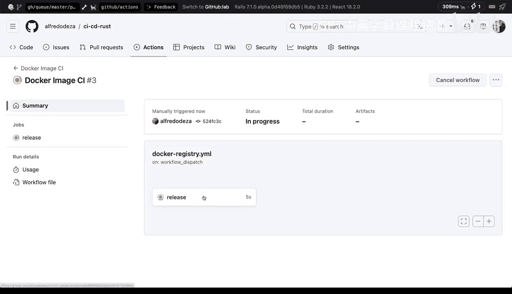
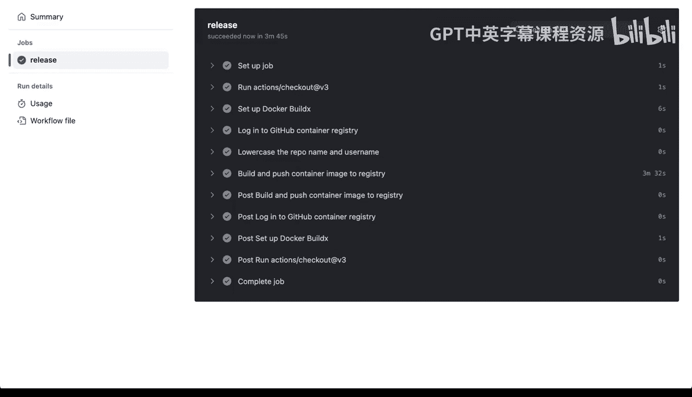
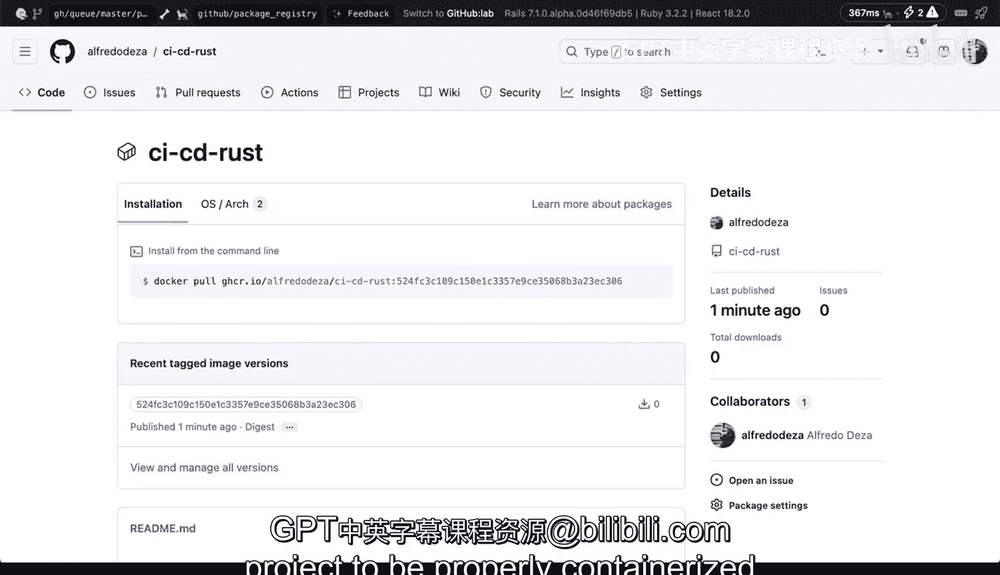

# 159：容器应用的打包与发布 🚢

在本节课中，我们将学习如何将我们的Rust项目容器化，并通过自动化工作流将其构建并发布到容器注册表。我们将使用GitHub Actions来实现这一过程，并最终将镜像推送到GitHub容器注册表。


---

上一节我们介绍了如何编写Dockerfile来容器化应用，本节中我们来看看如何自动化构建和发布这个容器镜像。

## 创建GitHub Actions工作流文件

为了实现自动化，我们需要在项目中创建一个GitHub Actions工作流文件。这个文件将定义构建和推送Docker镜像的步骤。

以下是创建该文件的步骤：

1.  在项目根目录下，创建一个新文件，路径为 `.github/workflows/docker-registry.yml`。
2.  我们将在这个YAML文件中定义我们的工作流。

## 工作流配置详解

接下来，我们详细解析这个工作流配置文件的内容和含义。

工作流由以下几个核心部分组成：

*   **触发条件**：我们配置工作流在手动触发时运行。
*   **任务**：定义一个名为 `release` 的任务来执行所有步骤。
*   **步骤**：包括检出代码、设置构建环境、登录注册表、构建并推送镜像。

以下是工作流配置的具体内容：

```yaml
name: Docker Image CI

on:
  workflow_dispatch:

jobs:
  release:
    runs-on: ubuntu-latest
    steps:
      - name: Checkout repository
        uses: actions/checkout@v3

      - name: Set up Docker Buildx
        uses: docker/setup-buildx-action@v2

      - name: Log in to GitHub Container Registry
        uses: docker/login-action@v2
        with:
          registry: ghcr.io
          username: ${{ github.actor }}
          password: ${{ secrets.GITHUB_TOKEN }}

      - name: Convert repository name to lowercase
        run: echo "REPO_NAME=$(echo '${{ github.repository }}' | tr '[:upper:]' '[:lower:]')" >> $GITHUB_ENV

      - name: Build and push Docker image
        uses: docker/build-push-action@v4
        with:
          push: true
          tags: |
            ghcr.io/${{ env.REPO_NAME }}:${{ github.sha }}
          file: ./Dockerfile
```

**关键概念解释**：
*   `workflow_dispatch`: 允许在GitHub仓库的Actions标签页手动触发工作流。
*   `${{ github.actor }}` 和 `${{ secrets.GITHUB_TOKEN }}`: 这是GitHub提供的上下文变量和密钥，用于安全地认证到容器注册表，无需硬编码你的个人凭证。
*   `ghcr.io`: 这是GitHub容器注册表（GHCR）的域名。
*   `${{ github.sha }}`: 使用本次提交的SHA哈希值作为镜像标签。在实际发布中，你也可以使用版本号（如 `v1.0.0`）。

## 运行工作流与权限配置

创建并提交工作流文件后，我们可以在GitHub上手动运行它。但在首次运行前，可能需要配置仓库的权限。

以下是运行工作流和配置权限的步骤：

1.  提交并推送 `docker-registry.yml` 文件到你的GitHub仓库。
2.  导航到仓库的 **“Actions”** 标签页。
3.  在左侧边栏找到名为 **“Docker Image CI”** 的工作流，点击它。
4.  点击 **“Run workflow”** 按钮，选择主分支，然后再次点击绿色按钮来手动触发工作流。

工作流开始运行后，GitHub会拉取代码、设置环境、构建Docker镜像，并将其推送到GHCR。整个过程可能需要几分钟。

**重要权限配置**：
如果工作流在推送镜像时失败并提示权限错误（403），你需要检查仓库设置。

请按以下步骤配置工作流权限：

1.  进入你的GitHub仓库。
2.  点击 **“Settings”** 标签页。
3.  在左侧边栏找到 **“Actions”** -> **“General”**。
4.  页面滚动到底部的 **“Workflow permissions”** 部分。
5.  选择 **“Read and write permissions”**。
6.  点击 **“Save”**。

此设置允许工作流有足够的权限将构建好的包（容器镜像）写入到你的仓库关联的包注册表中。

## 验证发布结果





工作流成功运行后，我们可以验证镜像是否已被推送到GitHub容器注册表。

验证步骤如下：

1.  回到你的GitHub仓库主页。
2.  点击顶部的 **“Packages”** 标签页。
3.  你应该能看到一个以你仓库名命名的包（例如 `cicd-rust`），这就是我们刚刚推送的Docker容器镜像。
4.  现在，任何人都可以使用 `docker pull ghcr.io/<你的用户名>/<仓库名>:<标签>` 命令来拉取并使用这个镜像。

---



本节课中我们一起学习了如何为Rust项目配置完整的CI/CD流水线，以实现Docker镜像的自动化构建与发布。我们创建了GitHub Actions工作流文件，定义了从代码检出到镜像推送的全过程，并解决了可能遇到的权限配置问题。最终，我们成功地将容器化应用发布到了GitHub容器注册表，为后续的部署环节做好了准备。