# 杜克大学《Rust编程2-3（数据工程、DevOps）｜Rust programming》中英字幕 p105 16_01_02_探索容器化概念.zh_en -BV11y411z7Dn_p105-

Let's explore some of the concepts of containerization in。

Essentially what we're going to do is talk about Docker in general and the containerization process using Docker commands and the Docker runtime engine let's start right here with a host server so usually when we're talking about containerization we're talking about a server or a host and this could actually be your own machine。

 this could be your own laptop or home PC where you're installing the Docker runtime a container runtime and that allows you to have。

All of these all of these images， all of these containers running in them Now what does that mean it is a sort of virtualization we're more used to or you might be used to virtual machines and talking about virtual machines where each one of these ones would represent like a a server within a server with some of the effects of virtualization and Docker and a container runtime allows you to have a virtualization of these machines living in a host server。

 so all of these will represent an image， a container image that will have several different aspects so right here in when we're looking at what that image that container image is。

These are effectively layers and these layers have each a specific a specific portion of the file system so the very foundational thing well have something like the operating system and the operating system each time that there's additional things added to it。

 then these layers will have for example， if you start with a based operating system image you might have packages installed and then those packages that are getting installed will create a new layer and then if you have an application that will create a new layer and we'll see in a little bit how those are all interconnected Now when whenever those are all of these components of these parts of the container image are。

Build like this， it allows you to have several different things so for example one of the nice things is that each of these layers will have a a checkum so a type of checksum or specific checksum that would allow you to pull to pull each individual layer on its own and the reason why this is important is that when you're pulling these images or you're building them if you already have like say for example these one that represents DOOS。

You don't need to redownload these right so then you will need to redownload E that already exists in the host and then you would only need the specifics like in this case the app and the installation extra installation processes so by layering it becomes a more efficient efficient engine or process rather and all this is possible by the Docker runtime and the Docker runtime there are multiple other container runtimes that based on Docker technology and that allows you to have this virtualization going on helping you create a really streamline process and it is kind of like similar to virtualrch machines but in some other ways it isn't。

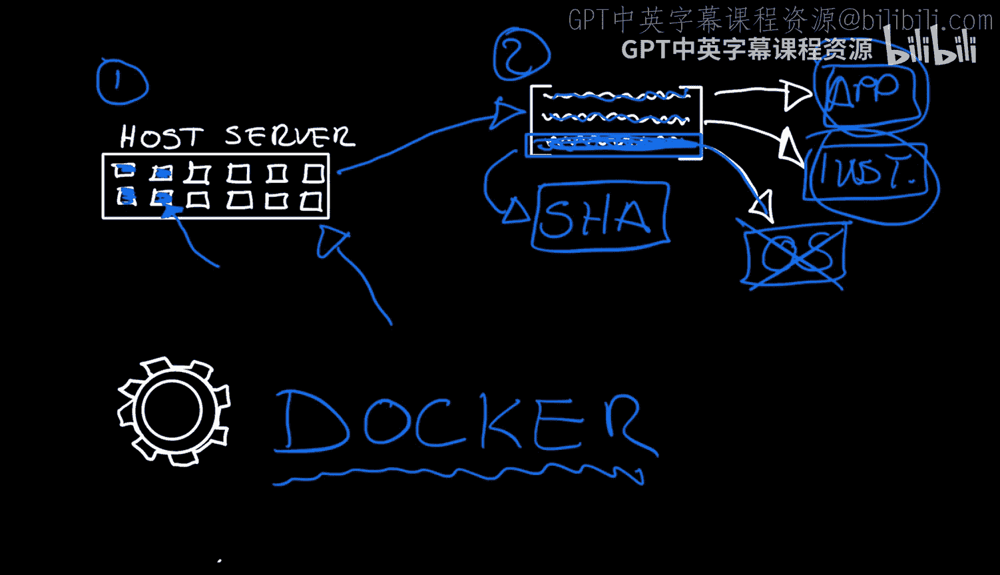

And the simplest way， although not 100% correct， the simplest way to explain it is like a super quick。

 super lightweight way of building virtual servers that will rely on some virtualization runtime like Docker in this case that will make it possible to produce these images and run them as if they were actual servers。

Now the foundational the foundational portion of these is that we rely on this Docker file right here。

 so this Docker file is like a set of instructions and it's a plain text file that will usually start the from image so this would be step number one and that from image means that what is the base layer where is this going to come from so say for example if it's a Devian base layer which is the Devviian operating system or perhaps someone else has provided you with an image that has everything you need for the NGX web server so that would be perfect and if they publish that image then you can build on that then say for example you want to run your application well that you could run some commands。

 install some packages usually if you have if you have something like is Devian based you will probably want to install some packages with the app package manager and each run command each one of these。

By the way， each one of these instructions will create a layer remember we're talking about layers before and usually at the very。

 you will have this command if you have like an application that is going to run you will have a command directive so all of these that from and run all of these are directives and these directives will create usually layers。

 not always but usually they will create each one of these will create a layer and the command is something to execute something to execute at the variant of the the process of the running or the building of the image so usually when you have these when you're creating that you will run a command called Docker build and a Docker build。

 one of the arguments is essentially the Docker file that we've already describe what it is so the Docker build will produce these images will get you to a place where you can actually configure how these build process。

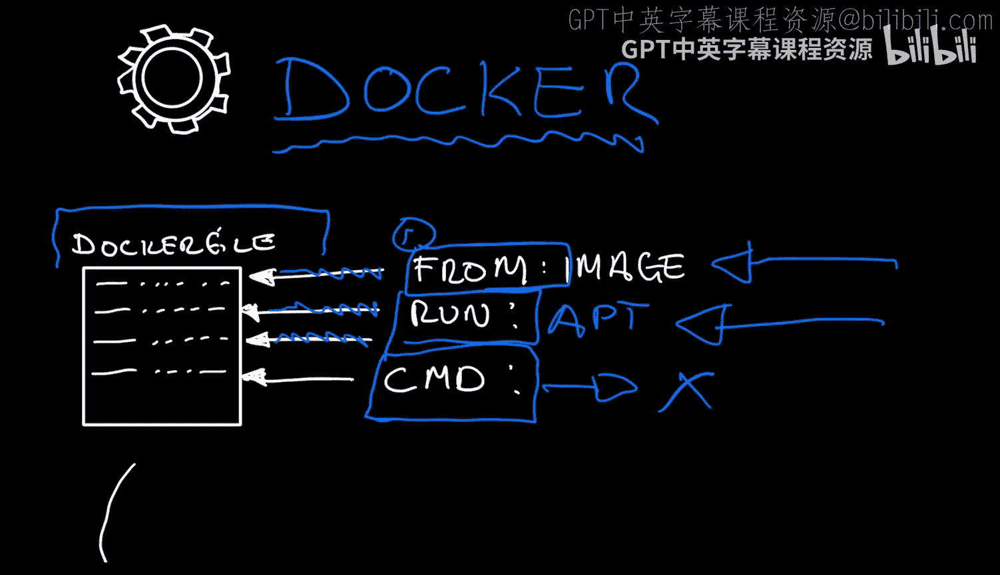

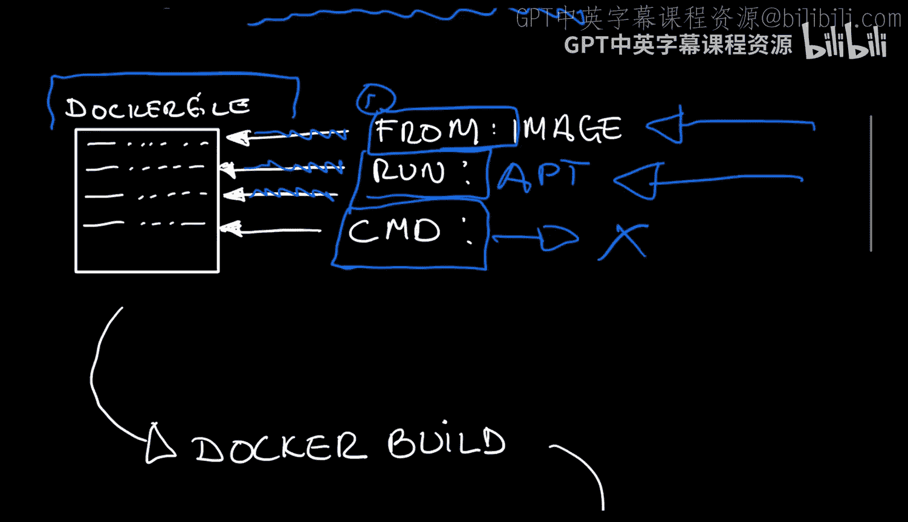

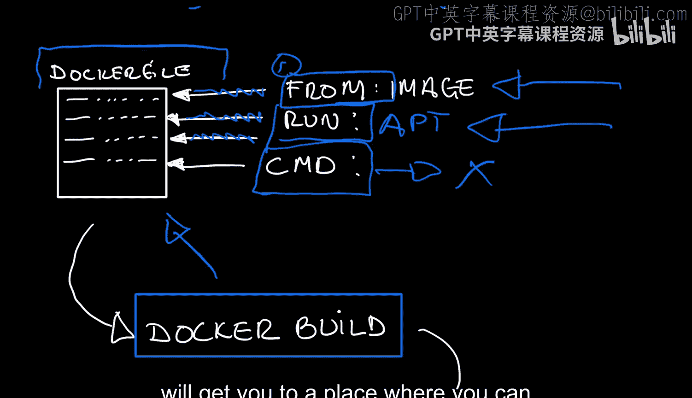

Download all of the layers， remember we're talking about layers。

 all of these things in step number two right here。

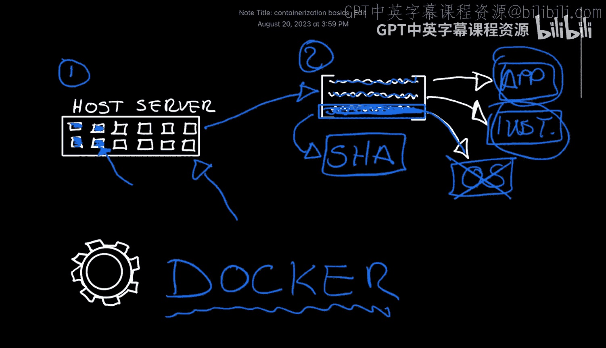

So all of those layers will become something that is part of the Docker built and will get pulled and those will build an image which is actually are next step right here So the image will get built and produced and it will live locally and you can start that image you can run the container bring up the application and make it run either on your own host or somewhere in the cloud for example so that's all all good and great。

 but once you have an image well will be the next step well the next step is to publish it to a registry So once that image goes all the way to the registry。

 what does that mean well a registry is a place and we'll see these later it's a place where you can publish many different images so when you you have the ability to publish all of those images that will allow anyone to do something like a Docker pull image and why is that important well because。

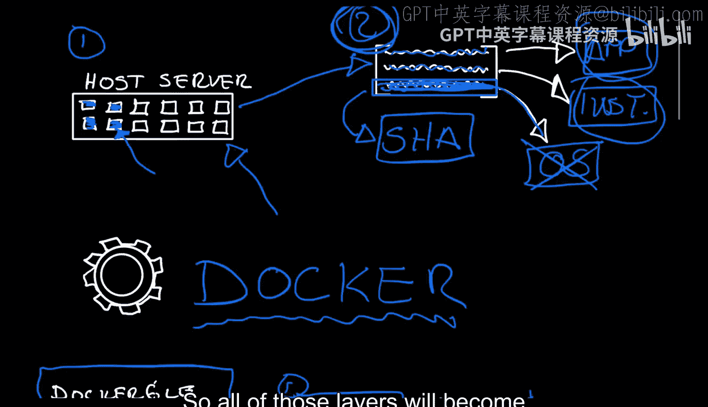

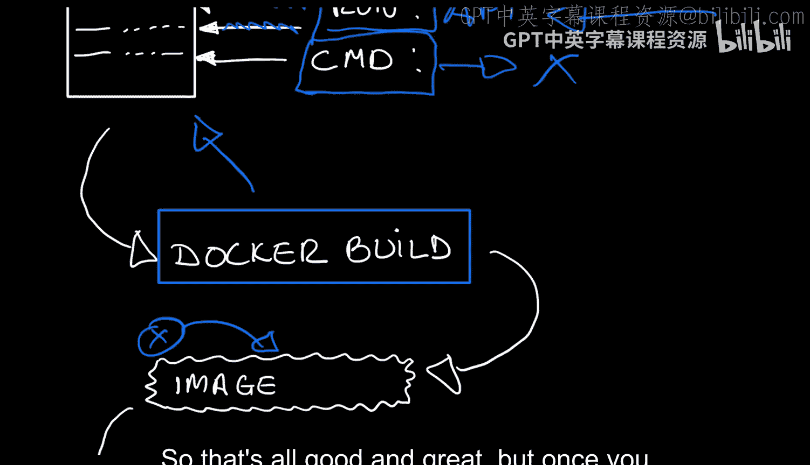

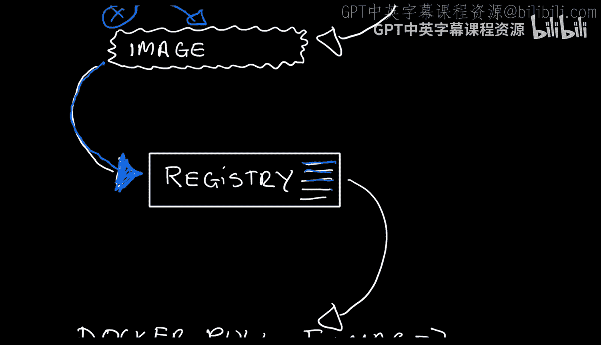

It allows you to publish and distribute your image not only so that others can pull that image。

 but you can also use these what we saw before in the Docker file。

 you can use the from directive and the from directy directive will allow you to not only like construct。

 build these images that are foundational。

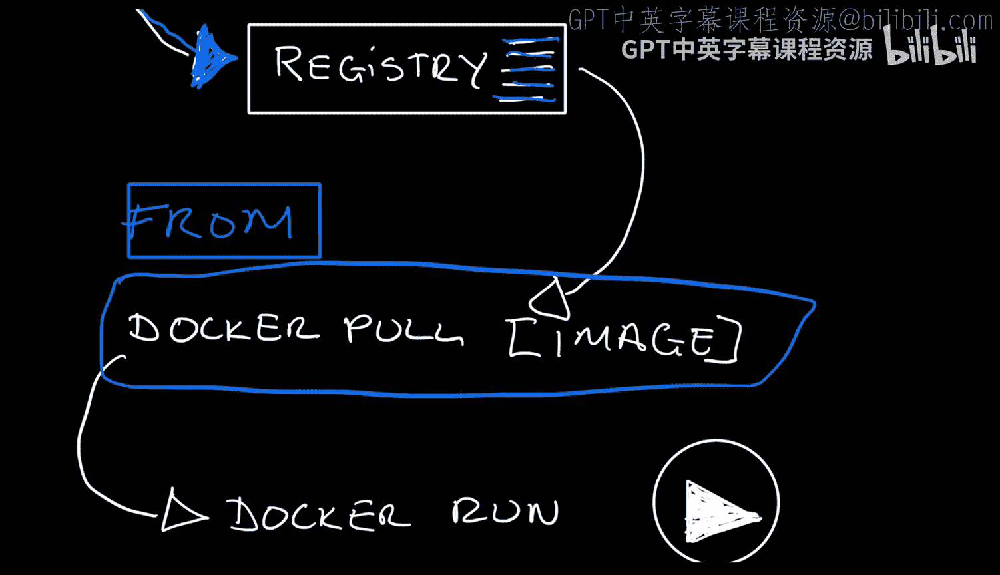

And finally， yes， of course， if you're publishing， you're allowing others to do a Docker run of your own container it allows you to get others to have everything they need。

 everything installed， everything almost preconfigure you're allowed to also configuregu containers on the fly。

 but very quickly， very easily run Docker， so that's it in essence。

 a very high and quick overview of some of the concepts of containerization and the Docker runtime。

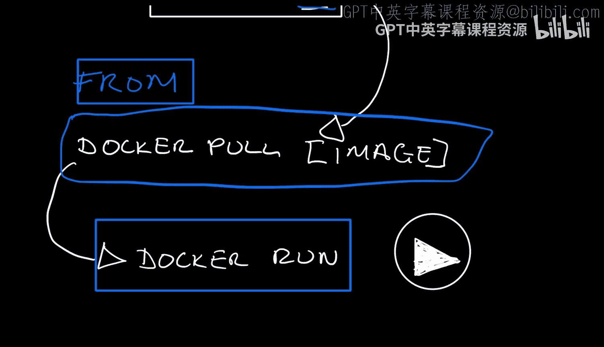

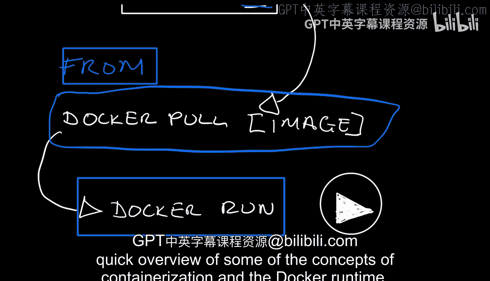