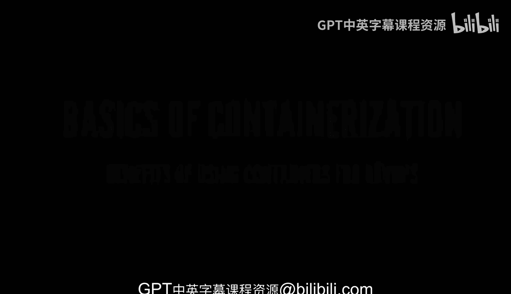
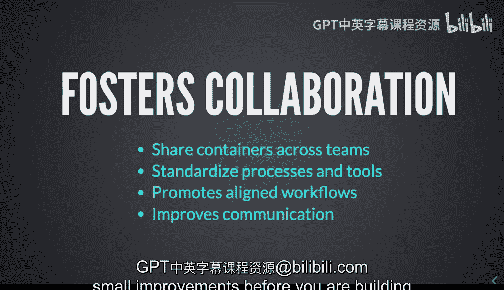

# 杜克大学《Rust编程2-3（数据工程、DevOps）｜Rust programming》中英字幕 p106 17_01_03_容器在DevOps中的优势.zh_en -BV11y411z7Dn_p106-

Let's talk about the basics of containerization and specifically what are some of the benefits that you might see when you're using containers specifically when it's related to DevOs。

So。Some of these and also apply to rust is that you can definitely have isolated environments and what does isolated environments mean well。

 you can define the constraints of your application and your deployment and you can have everything that it needs and you can reliably reproduce them because then again I mean you're relying on configuration files like the Docker file that we saw before and that configuration which can also go into source control allows you to be able to deploy in different environments。

 but you know in a portable way because regardless of the underlying system。

 your container is going to behave basically the same Now how does consistent development environments happen so you can definitely define what code is near your project code but also your dependencies and configuration and also that configuration can be slightly flexible。

I've seen some flags。And most famously or infamously for engineers that tend to say well it works on my machine。

 well， everyone's machine is very different， so you kind of like remove that problem from being part of what you're trying to do with containers。

 so bystandizing these environments either within your own team or other teams。

 you're creating a normalized way of development in the same platform。

 removing all of those problems that might come from slightly different platforms。

And when it's time to reproduce bugs， well， you have the normalized environment because imagine reproducing bugs or issues on different machines on different architectures。

 well that's going to be you know， quite hard to， quite hard to do。

Now we talk also about simplified deployments and the reason is because。

By bundling everything inside the container， you are you're good to go。

 you don't need to install them again， you don't need to put them in again or ensure that these dependencies are there。

 The container has everything it needs so it reduces the configuration and the onboarding I mean if you try to onboard any new engineers well you have everything you need。

And one thing that I really like is that it allows you to spin up the service much。

 much faster as opposed to a virtual machine or a regular server that has to do the whole booting up thing where you have to wait until like the whole operating system brings comes up online Now it is also resource efficient because the containers do share the operating system kernel and it has way。

 way less overhead than virtual machines virtual machines are also quite can be quite big。

 I mean containers can be big as well， but usually virtual machines are pretty large in comparison with containers。

You tend to save on cloud infrastructure costs if you're deploying to the cloud。

 and it is very easy on the cloud to scale horizontally。

 that is like you start spinning up more containers。

 no problem like it's actually pretty pretty easily。Now。

 we definitely did talk a little bit about portability。

 but being able to run on any platform pretty much every single cloud provider right now will allow you to run containers。

 which is offers you flexibility。 you want to change cloud providers。

 No problem like you can actually ship and move your containers around and these will be actually pretty straightforward。

 but basically you're avoiding vendor lockging， although you know sometimes being logged in into a platform that is offering you all of the facilities that you need in order to to be fast well that's also a positive thing and finally wide fosters collaboration。

 well， because you can definitely share， not only containers but you can also share the configuration on how to build them and how to create them and how to base your new changes on existing images as we saw before。

And by having all of these configurations available managed in source control。

 you can not only improve the communication， but the collaboration because it is easier to kind of like see how this container was constructed。

 built and provide some suggestions or small improvements before you're building a new version。

 perhaps of your container。

