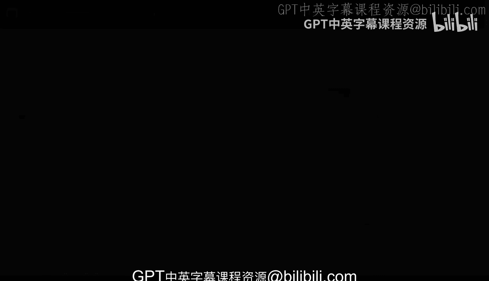
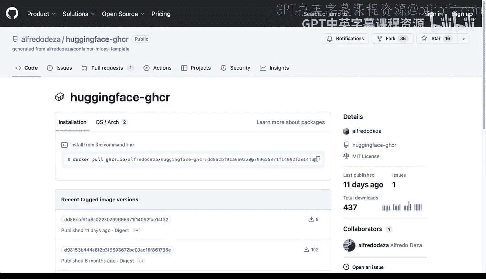
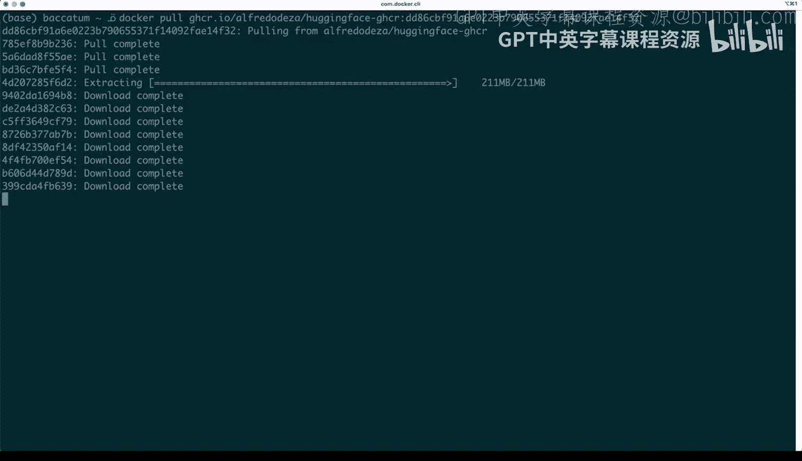
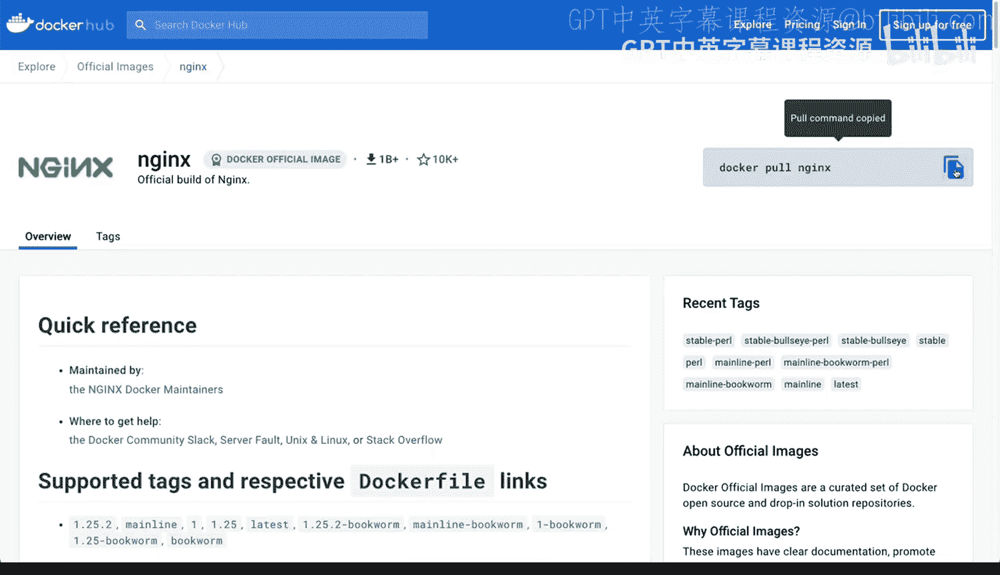
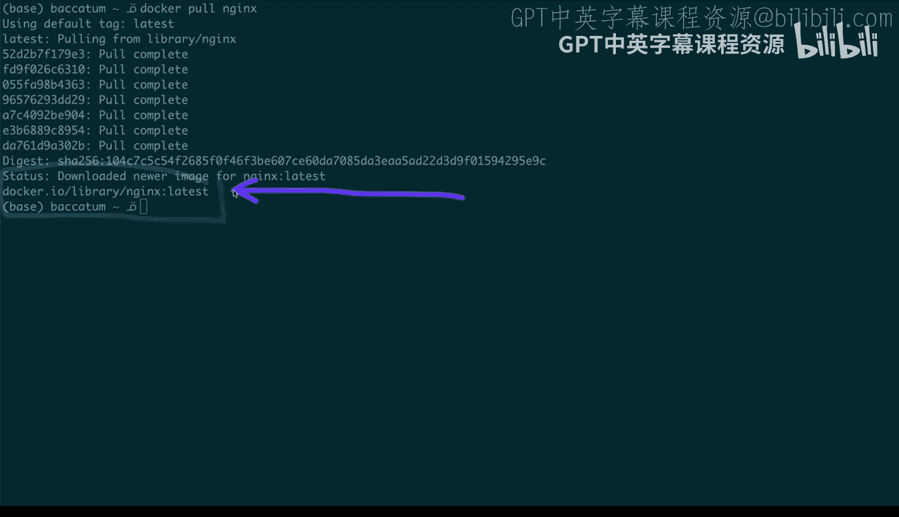
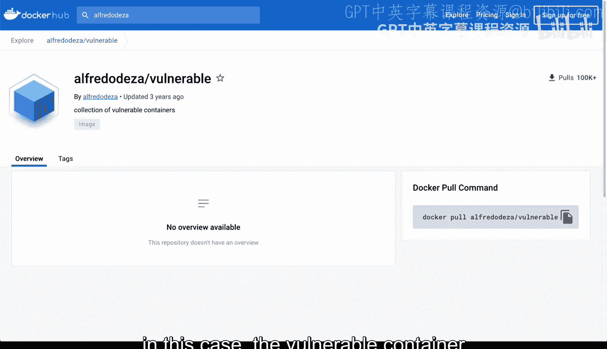

# 杜克大学《Rust编程2-3（数据工程、DevOps）｜Rust programming》中英字幕 p107 18_01_04_什么是容器注册中心.zh_en -BV11y411z7Dn_p107-

What are container registries Well container registries are a place where we can put containers it iss kind of like a repository where we put and push container images now in this case you will see here that I have one repository of mine and that doesn't look like a container registtry so what's what's the connection well Github does offer a container registry you see here I have packages I'm going to click there。

And I have one package right here and I think if I can actually go back and click on that actual package so you can have more than one package of course and GiHub calls some packages but you can actually publish your container images there in this case Ive built a container and the automation has published that to to the GiHub container registtry so there is a registry so if I click here I when to show you these before we go on other details。

 you will see that there are some details about the container image that I've just published and here you will see that there are several different tagged image versions and it includes the readme and I have the option to see all of the tags and there's some downloads associated with those published images now you will see here that there is。

The command to pull that image right so in this case is Dockerpool GHcr。

o what is this GHcro that is the container registry？

So if I actually go and copy paste this and go to my terminal。

 I can go in my terminal and then paste that and say let's actually investigate a little bit。

 let's decompose a little bit this commit Docker that's the executable we're going to pull we're going to get that we're going to download that image that GH CR that I always to contain registry that is my account this is the image and that is the tag this actually is the commit but like this could be something something completely arbitrary and I'm going to hit return and you can see that all of the layers are downloading so this is this is really useful we've talked about layers before and all of these are being downloaded separately。

Once that downloads， I can run that container locally and use it and actually build from it as well and do all kinds of different things now this is a big container we've talked before about some of the differences between rust and Python this is a container that has a machine learning model and it is very。

 very big can you imagine having a container this big and this doesn't this actually in fact has like a very simple machine learning model and a tiny web API in front and pursuing doing some requests and offering some life inferencing but those its are not important so this is exactly what the kind of operations that you will do with a container registry you're pulling from it。

 you have access to multiple different ones but going back to container registries the most common or popular container registry。

 the one that is started at all is the container registry from Docker。

And here I'm in hub。docker。com and although I haven't signed in I'm able to hit explore which I'm going to do right now and be able to look at some other containers。

 when you are dealing with the default Docker container registry。

 the container registry offered by Docker hubub you can actually just pull without passing in the domain and I'll show you an example。

 a quick example of that in a second so here we have several different ones。

 let's take a look at EnGX I really like EnGX which is a web web server， let me click on that。

And when you go into an EngineX， you will see that the command to pull is a slightly different That's the reason why is because this this is the actual image once you make the container registry domain part of the tag So if this was Ghcr。

o seng X and slash something else that would be coming from a different place but because it's coming from here this is going to be part of the official the default container registtry So if I go back to my terminal and if I paste that command of Docker pool EngineX you will see that it's using the default tag latest and it's downloading there's already several layers that were complete and it's going to be downloading something else and the tag actually is latest EnX is the image and where is it coming from do you catch that detail right here Docker。

o s librarylash Engine X。

Abstracted away， but going back again to Docker Hub。

 this is the container registry has many different containers and actually I can perhaps even look for my containers and you can see here they have vulnerable container over here I can have some test images so you can definitely create your own account and publish your container images here this is what a container registry is is a place where you can push in have all of these container images available so that others can pull I think it's unbelievable that this has over 100。

000 downloads， but can this is how you would distribute your container image in others can make use of these in this case。

 the container image that I did a few years ago。

