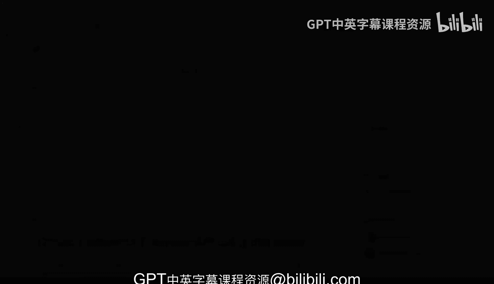
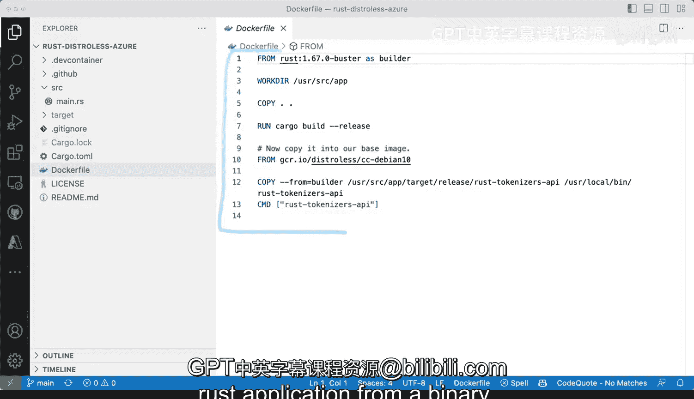

# 杜克大学《Rust编程2-3（数据工程、DevOps）｜Rust programming》中英字幕 p108 19_01_05_使用Rust构建无发行版容器.zh_en -BV11y411z7Dn_p108-

What we have here is a real world。Rust project that we're going a build container for andm going to be using diss first let's walk through some of the code that like one of the reasoning behind these project and is say disless API that we're going to be using so effectively what we're trying to do here is trying to have an API that will' be using tokens at the top you can see that I am using that cr So what we're trying to do is we're creating a generic function here and that generic function takes string well actually two strings。

 one is the name of the pretrain from the pre-trained tokenizer and the actual tokenization So if I scroll here to the tokenization function we're going accept a post request to tokens you can see here this is generic so any pretrained I call it pretrain model here or this calls pretrain model。

I think it's from a pretrained organizer that we have available so say for example bird case uncased then or bird base uncased。

 all of those will be available here and then we'll try to work with those so those are implementation dealers they're not these details are not that important what we're trying to do is we're working with Ru we're using ActcticX web it's going to run and bind to any address and on port 8000 and then we're going to interact with it so。

That's it that I'm not going deep into the details of what's in the application itself what we're trying to do is seeing how dis list can work for us so let's go to the most important portion here which is Docker file effectively you are be going be able to apply these techniques on dis list and then make them work on your own use case so I'm going to start by using the rust 1。

67 busster image Buter is the Deving image 1。67 is the rust version and I am assigning that the origin that base distribution。

 that image as the builder so this becomes essentially a variable so builder is the variable then I change the working directory to user source app and copy all of the contents from the repository then do a normal build release and now so far all the way。

Everything from here that's kind of like what you would have when you're building or creating an image a container using regular darkcker。

 no problem with the one slight addition of getting this as a variable so we're calling that as builder then the magical disre portion happens here and these three lines so we'll see how this is actually possible and what we're doing is we're finding our rust or the disralis image that we're gonna to be putting a rust application in there in this case is D and10 and that is fine and there's plenty more these are all coming from the Google container registry that's what GCR that IO stands for that's the domain for the Google container registry and you can see that's a dis list and then what we're going to do is we're going to copy the resulting the resulting binary which in my。

My case is going to be rust dash tokens dash API， and I'm going to copy that and I'm going to put it in user local bean rust tokenrs API and then the command where if I run that container is going to be that the name of the actual the resulting in binary。

 So that's one of the powerful things that rust has is that you can end up with a binary and then you can put it somewhere else and we'll see how that works。

So I've switched to VS code here and I'm going to run the terminal and'm going make a couple of changes。

 so are these is the same project， same files， everything the same as before I'm going remove that to make this view better and I am going to run Docker build I'm going to say let's see Docker build and the context is the current the current directory and I am going to tag these as I'm going to say rust local。

Or how about yeah local and then distros and I'm going to tag it like that and I'm going to run that command and this is going to start pulling all the layers all of the images and it'll take about five to six minutes depending on your banner with you might get different results so let's just wait until these completes and then we'll come back to play around with that resulting binary。

 that resulting Docker Docker image Docker container that we built。Allright。

 so we've finished building this container image now let's take a look at the images that we have here。

 so I'm going to try to find it out with Docker images and I'm going grab for Ross I'm going filter that result by local disral list and see what the result is so there you go that's the image and this this is a tremendous it is 36 megabytes which is absolutely absolutely stunning it is really amazing that something can be wait essentially 36 only 36 megabytes and what we can do here is we can actually try to run it so I'm going to clear here and I'm going run the command that would make everything work So in this case it's going to be Docker run and then IT for making。

Interactive if I don't want that to go in the background and then I'm going to map the ports 8000 on the container I want that map locally on my machine and then this is the tag that we use so I'm going to run this and get to see what happens Allright so pretty fast ats started the process it is actually running and if we go very quickly to the Exper and then we look at source and main thatRS you will see that we're exposing。

We're exposing these tokens and pretame model and we'll need to send something if we look at the serializer。

 it's text and then string， so we'll need to send some J for sure。Okay。

 so I've opened up a new terminal and what I'm going to do。

 I'm going to paste the command that I'm going to use it's going to be curls to send a post request。

 I'm going to send some data。 the data is going to be text is the key is Jason the value is going to be some text the heater is going to be content type application Jason and then the local host here we need to add tokenizers and then how about B base uncased。

 which is one of them and then what we get in return should be the tokens that the text that has been tokenized and we could do the same if we want it for some other tokenizer as well。

 So there you go that is basically how we have this running it is in a container if I switch back to Docker you'll see all of the requests that happen and we are seeing the birdbased case and uncased tokens and the most critical thing here is that only with some。

Minor minor tweaks to your Docker file， you can have something that is 36 mebytes unlike something that will be hundreds of megabytes or perhaps more more than one gigabte or perhaps even two gigabytes of a container size image this will allow you this will allow you to get faster deployments easier rollouts and faster experimentation when you're trying to run your rust application from a binary。

