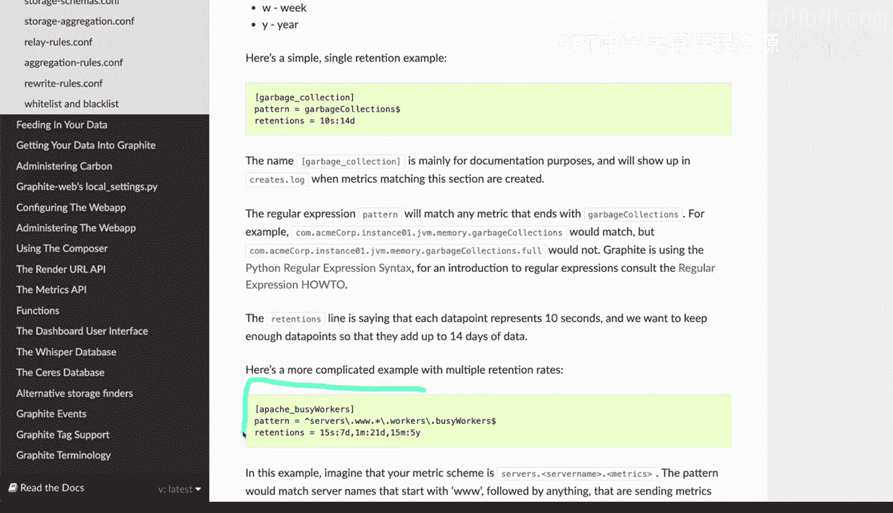
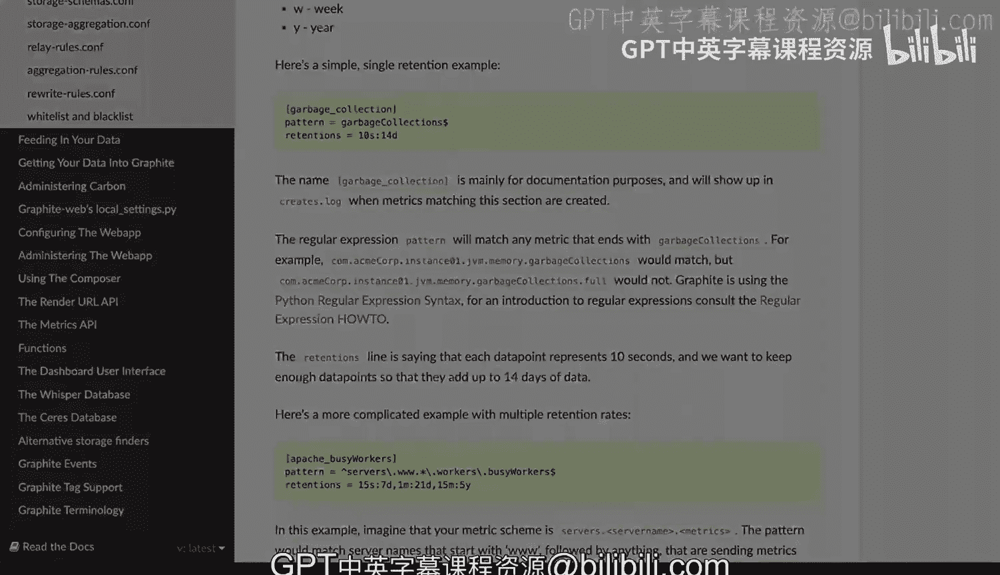

# 杜克大学《Rust编程2-3（数据工程、DevOps）｜Rust programming》中英字幕 p114 25_02_05_粒度与保留策略.zh_en -BV11y411z7Dn_p114-

Retention policies and granularity is something to take into account when you're dealing with metrics and login and monitoring specifically when you're capturing metrics now I'm going to look at graphite here specifically and how it configures its timebased database called carbon now this is specific to carbon however。

 what I'm going to explain is applicable to other services as well and it's useful to understand because it will give you a good idea on how to apply these strategies so I'm going to scroll here all the way down these specifics of carbon and graphite are not that interesting right now。

But for the configuration you start seeing that you get seconds， minutes， hours， days， week and year。

 these are called frequencies and histories that are you can specify and you can configure when you are dealing with a retention and here's the retention example and the retention has specifically these type of syntax。

 so you see there's 10 s which means 10 seconds and 14D which means 14 days。

That is separated by the colon right there and that's the retention what does that mean it means that for every 10 seconds that will consist in a data point and it will store that granularity for 14 days。

That is exactly what it says and you start seeing that while if I want to capture information for every 10 seconds and have it for 14 days。

 then okay that granularity makes sense， however you might want to do something slightly more complex and you can actually see that my explanation actually resembles here the retention line is saying that each data point represents 10 seconds and we want to keep enough data points so that data add up to 14 days of data I'm going to scroll here so that I can show you a more complicated retention policy。

Let's just forget about the pattern for a second and let's go deeper into the retentions so the retentions are separated by a comma and we have five in here。

 let's start with the first one it says 15s and 7D that means the granularity is for every 15 store for a metrics for every 15 seconds up to seven days and then for one minute do that for 21 days。

And what this means is that it will graphite and carbon will downsample these we create an average to try to not provide as much granularity。

 if you think about this for a second， if you go back for deeply you know deeply granular data if you're capturing every 15 seconds and you don't have this type of granularity here。

 what's going to happen is that you're going to have a lot of data。

 do you really need to go back five years ago and look for every 15 seconds of data probably not so it makes sense that when you hit the seven day mark and you you hit the eighth day then you can drop the granularity to every one minute。

 not every 15 seconds and when you hit over 21 days。

 then you can say well I'm for the 2 second day all the way up to five years。

I'm going to store it at 15 minute interval turb so why is that useful because as you grow your data。

 grow your usage， it will make sense because this amount of data will become ginormous and you probably don't need the granularity to have all of every 15 seconds for that many many years and many months。

Now this strategy will allow you to set the kind of like the recycling of data and pruning of data that is unnecessary。

 but its still useful if you want to go back why would you want to go back is to compare effectively is like if you want to compare how is this quarter going to last quarter or how is this season compared to two years ago are we doing better are we doing worse。

 are we getting more requests less requests we're going to using more storage。

 more memory are we doing more rightss， less writes。

 more reads in essence you can compare absolutely everything。

 but that's why you might want to have these retention policies in place and not be super extremely granular with your retention policies now this is again carbon for graphite。

 but there are other similarities on other systems that will allow you to consider some sort of a strategy for the granularity。

And for their retention policy as well。

