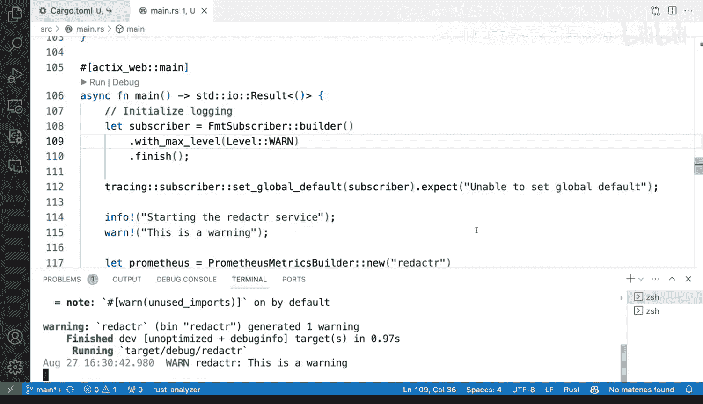

# 杜克大学《Rust编程2-3（数据工程、DevOps）｜Rust programming》中英字幕 p123 34_02_02_为Rust应用添加日志记录.zh_en -BV11y411z7Dn_p123-

We have here an application of an HtTP API that we've briefly seen before but not in actual tons of details。

 so let's go and dive into what we have here， we have a regular cargo。

 a project initialized with cargo and let's take a look at the dependencies so we have a little bit of as like Acts is actually required。

 we're going to use Cer for serialization。And the source code。

 I'm gonna make this permanent source code， let's take a look at mainRS。

 we've already added Prometheus before to expose a little bit of metrics and what I want to show you right now is if I go all the way to the bottom where we are instantiating these we have the HttP service right here on mainine so mainine is starting this has already like I said。

 been instrumented with Prometheus which is fine but it's exposing a couple of different things there so the way this works is it will bind to port 8080 it will run this service and the service actually does a little bit of personal information reda so it's going to redact personal information based on some regular expression rules which there are right here so you can see here like it's using regular expressions and it will say well that looks like a social security number。

A social securityulating with dashhes and and all kinds of other like credit cards and all kinds of other things that you want to interact So how does it work well if we open up the terminal I'm going to toggle the terminal and I'm going to say cargo run。

And so that is going to be running。 So're going to open up a new terminal here and I'm going to do a curl request and the curl request is going to use the redact end point and we're going to send some Jason is a Jason string and we' to say Alfred Smith went to the park so that's the redact service and what we get back is person one when to the park So no problem that's how it works in a nutshell and that's great So now we can actually close these but that's the project that's what we have but we want to add we want to add login。

 so how do we do that Well what we need to do here is actually start adding our libraries。

 the crates that we're going to be working with So let's go back to Cargo Ta let's open up some a new line here。

 we're going to add two things。 we're going add the tracing library and the tracing subscriber library these libraries。

 these crates are going to allow us to do some log。

Now why do we need to libraries Well tracing is a library a crate that allows us to do instrumentation is going to have like a facade for doing all of the logging work and the tracing subscriber is going to allow us to subscribe to the tracing Cate and start producing logs just by the full tracing will not produce logs that's why you need tracing subscriber so once we have that we're going to go back to mainRS scroll all the way to the top and start adding the tracing modules that we're going to be using we're going to use how about infoone error debug sounds okay how about we just do a couple so info and one for info informational messages and warning messages and then we're also going to use level and。

When I do semicolon there and then when I use a Tracing subscriber。And the Tracing subscriber。

 we're going to do the format subscriber to format our messages， Okay， perfect so we have that。

 we have these two things there right now not being used， so let's go and scroll all the way down。

To the main function。And let's add what we need in order in order to start adding logging。

 we want to add logging。 So how do we do this Well， we need to first instantiate the subscribers。

 I'm gonna to open up a new line here。 I'm going to say let yeah sure。

 let's actually initialize the logging when I call that with with that I'm going to say。

Lets subscriber。I'm going to say。Format format subscriber builder that's what we're going to do。

 And then with max level level info and then finish so we're gonna to accept here the suggestion from Githubcopit and this looks good enough So I'm going talk in a second what with max level means for me it's kind of surprising it actually I thought it meant the complete opposite。

 but I'll show you I'll get into that little that detail into into that detail in a second。

 So I'm going go here I'm going to say。Traccing， I'm I said the the global the global default for everything to be the subscriber。

 and I'm not going to use un wrap。 I'm going to use expect here to say。Unable to set global defaults。

 So that if anything panics， then that will go out into the output。

 And now let's add here an info message。 So I'm gonna say info。And we'mre going to say starting。Yeah。

 the。The aor service。 and that looks。That looks correct to me and semicolon。

 So let's now go back to the terminal， toggle the terminal and go back to this other terminal。

 you can see here that there's actual actual help of being put out from debugging and printing messages。

 Now we don't want that I clear here when a cargo are run。

This cargo run here and is going to build again our application is going to run it。

 and let's see what happens once it finishes。 All right so it finished and we can see we have several different things well first off we have a few things that we're now using that's fine but let's look at the output so we have starting the redactor server a couple things we can see here that's our module。

 our project， our create redactor it's at the level info here we have the date and the timestamp but we also have information from Acts server and by using by using that we can see that we're also getting information from Act Act server server as well so that's interesting Now let's go back to the code and remember I was telling you max level info let's see what happens if we do a warning message actually let's。

A new message I'm going to say war I'm going to say this is a warning sure。

 and I'm going to control C here and I'm going to clear and start again cargo run and we're going to get a warning right So this was surprising for me because I was not expecting a warning when the first time that I run this because if I show you the code again。

 it says with max level info。 So I thought and you might as well get into this where you are thinking the max level is info and that is not correct。

 what that means is that it will start logging at info and higher So what is what this is doing is setting that level So if we actually go and say for example。

 we say warning。And C C here and clear and cargo run， we will only get the warning message。

 so that means warning and higher， so for example， error would totally work if we added some error right there。

So in essence， that is a very straightforward way to add login or instrumenting logging in a applications so that it starts producing or there's more to it。

 the tracing crate can be overwhelming to work with。

 but this is a sure way to get login actually logs is starting to go out to the terminal。

