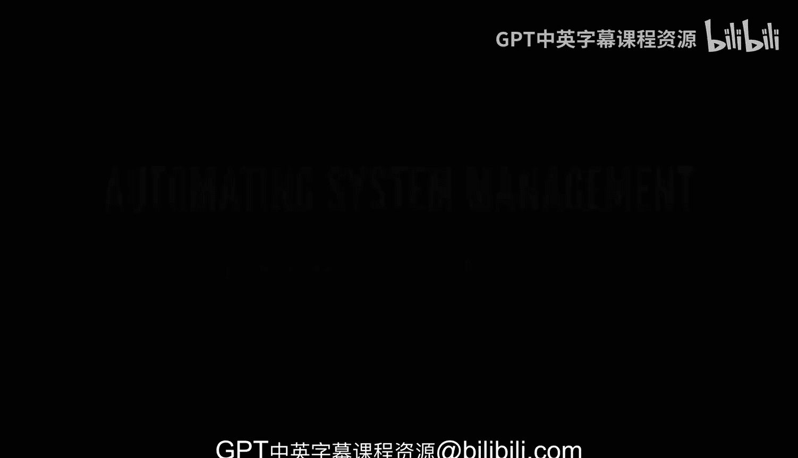
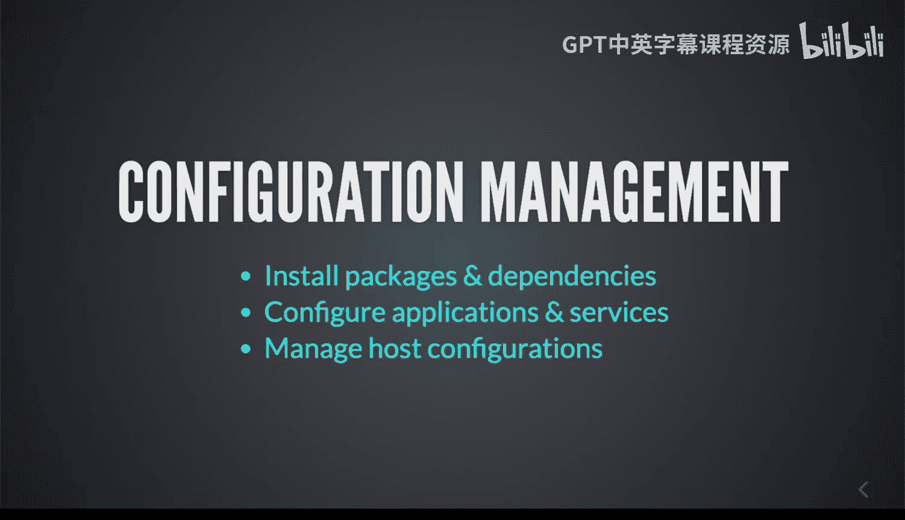
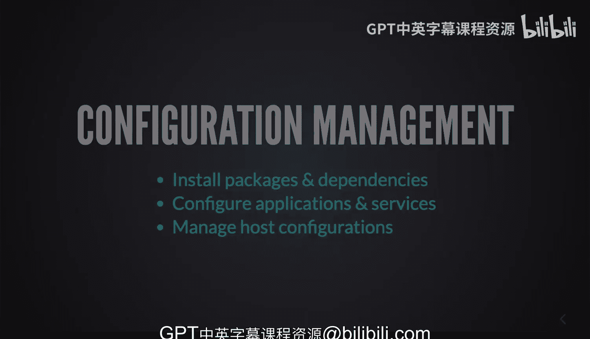

# 杜克大学《Rust编程2-3（数据工程、DevOps）｜Rust programming》中英字幕 p128 39_03_02_可构建的自动化任务概览.zh_en -BV11y411z7Dn_p128-

In system management， there's plenty of possibilities to do automation and in this introduction to system automation specifically。

 we are going to take a look at some other capabilities of rust， but beyond rust。

 also some of the things that you can consider when you're trying to do some automation when working with systems。

So Rus has this capacity of crossplatform scripting so you can build very powerful programs that will basically work anywhere and by targeting different different types of architectures and different types of servers and operating systems you can be confident that you can deploy a single binary anywhere and you can start leveraging these portability。

 as I've put here in one of my slides that will allow you to put a binary anywhere else regardless of the dependency so that's a pretty powerful concept。

 especially in comparison to other scripting languages or other programming languages。

 Rus is not necessarily a scripting language but it definitely allows you to have that flexibility so that brings also high performance because Ru is well it's very very fast and it will allow you to have。

peed in processing， especially with CPU bound tasks that can be very expensive in our programming languages to execute very fast and very quickly。

RusT also has the capacity of being able to work very straightforward with concurrency and multi threadreaded applications and start taking advantage of occupying all of those core in your CPU and has the memory footprint is pretty minimal。

 so this is why we sometimes refer to this as being very efficient because the memory footprint is very small。

Now， robust， reliable automation， why robust well， because again， the memory safety。

 the memory capacity of rust is very good， but beyond that。

 it also internally deals with it in an easy way like we' you know I've worked before in situations where we've had applications that were running wild with memory consumption and we couldn't tell where exactly that memory also referred to as a leak。

 a memory leak would happen。And you know， rust is not as highly complex or it reads kind of different if you coming from a high level language like Python or Ruby。

 but in some ways kind of similar and that makes it easy to work with and in the future if you want to lose some maintenance。

 but beyond that the compiler catching all of those potential problems in pitfalls that you may be unaware of will prevent you from getting those problems in。

Now some of the other things that you can deploy in here I'll go very quickly because this is more of like a quick overview of some of the other things that you can do well you can automate infrastructure and provisioning。

 you can write all kinds of different types of orchestrators or plug to other orchestrators like for example Ansible that is an orchestrator that you can write plugs in any other language including rust。

 you can have configuration management well Ansible also that's a little bit of configuration management。

 but some other systems and platforms and frameworks as well。

You can use RuS for continuous integration and deployment。

 but I would say more than using rustS there， I think it would be in addition to existing tools so for example Gitthub actions that we'll see later we can see how potentially you can call out to Ru to do some processing there monitoring and alerting we've already seen that and we've already been able to expose things on an endpoint we will take a look at log aggregation and analysis well that's a little bit of monitoring and login as well but being able to parse some logs or do something specialized is something that is also very important。

You might want to consider also doing some security and compliance scanning if you want to crawl the file system and do something else there as well。

Automated infrastructure provision sounds interesting and in the past I've worked systems that have taken care of balancing provision in virtual machines and taking them offline and scaling as needed so you can definitely spin up servers elastically databases and you can start using highly complex areas with a little bit of code so that will allow you to definitely not only create infrastructure with with ease but also destroy it like basically making a reproducible environment on demand just by writing a quick program and well configuration management。

 finally just being able to install packages and dependencies， configure applications and services。

 I would argue that perhaps installing packages and dependencies with rust not necessarily so but you can write rust in order to do some comparison and to try to ensure that。

specific state for a server is accurate and 100% managing host configuration。

 perhaps even setting some sort of a template that can provide you with very fast accurate preconfigu environments。

