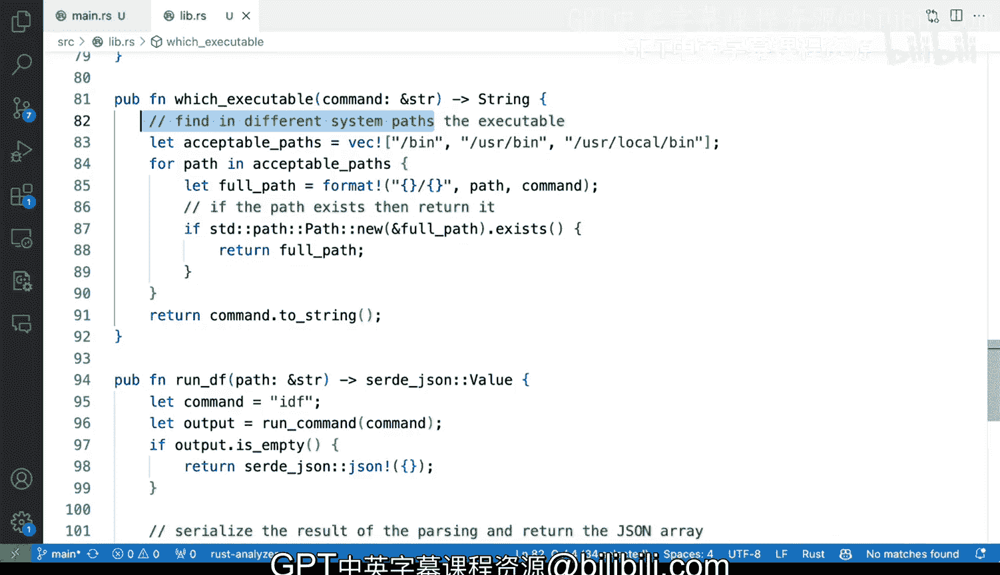

# 杜克大学《Rust编程2-3（数据工程、DevOps）｜Rust programming》中英字幕 p136 47_03_04_避免路径相关问题.zh_en -BV11y411z7Dn_p136-

And in this case， you can see that the command is IDf。

 not Df exactly that is because for examples on my system to make it consistent。

 I'm faking that executable。 that is one last thing that I want to tell you which you should consider is I'm relying on my path So this right here is actually let me show you my terminal。

 I'm going to talk on my terminal， I'm going to say clear this I'm going to say which IDf and you will see that that's coming from my home directory if I say which Df that's coming from B Df。

 So if I'm relying on my path environment variable。

 which has lots and lots of different things in there if if I'm relying on programmatically accessing executables。

 then I should have a robust way to detect where my executable lives and I should actually implement a path way to do that and let me show。

Use something that I've done before in other tools， which is I'm going to save fun， which command。

 and I'm going to say not which， which executable。And I'm going to accept a command。

And I'm going to say sure that's going to be a string and I am going to return a string for the path and I'm going to say find in different system paths。

The executable， so I'm not going to rely on path being correctly。

 So I'm going to say let acceptable paths。 I'm going to say I'm going to do a vector and those looks correct。

 and you know， like just like a proof of concept here。 and I can say from path inacceptable path。

 I can say that this is going to look I would say。I don't need to actually run these。

I don't actually need to run these。 So let me， let me remove that。 I don't need to。

 I don't need to do the whole command if and I'm going to say。Let full pair。

Say path and then command。 So the path is one of these。 and the command is coming from right here。

 So this will give me that。 So if， if the path， if the path exists。Then return it。So。

That that totally 100% works I I have all of these errors， but I have mismatch types。

 but that's fine well that's a format So what is happening here is that the compiler says that this loop might not yield anything and if it doesn't yield anything。

 then I won't be getting a string so the way to to fix that and to make the compiler happy is to do something like this at the very end。

Now what I'm doing there is if I don't find anything I can give up on these known locations you can have several and just take that command and return to string。

 so these would be a good way of not relying on path being set on a remote system that you don't control that you don't know how the path is set and that will help you half a more robust not only parsing。

 but also calling out to external commands。

