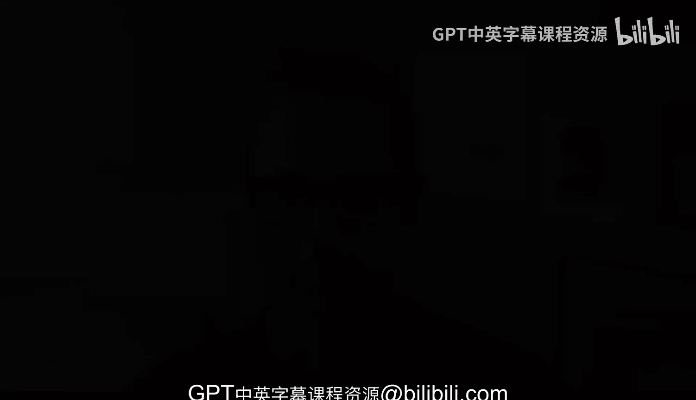

# 杜克大学《Rust编程2-3（数据工程、DevOps）｜Rust programming》中英字幕 p139 50_03_01_引言_9.zh_en -BV11y411z7Dn_p139-

Putting all the things that we've done so far into a actual real world use case is。

 I think the best way to demonstrate the capacities of the capabilities rather of rust when you're trying to implement something with with systems engineering and in this case compliance is one of those corners of systems engineering and DevOs where you maybe face with trying to inquire trying to find out do some spaning。

 do some investigation as to what are some of the aspects of the current state of a system and compliance has many different aspects and might sound slightly overwhelming but we'll see some use case like say for example。

 let's take a look at if like if a file exists or not or if the file a file has certain permissions that shouldn't it shouldn't have and we'll see some real world cases where。

Whenever a file has the own permissions， things will stop working。

 There's actually things that can prevent that。 And and that is important because if， if say。

 for example， a file has permissions that are widely open or are too permissive。

That could be a vector for a security threat to take advantage of your system。

 So there are certainly things that need to taking place and building a compliance tool is certainly an interesting approach to try to well go through some of the things that we've already seen like crawling the file system。

 And， but using rust as well to try to harness that。 And we'll see how we can make that possible。

