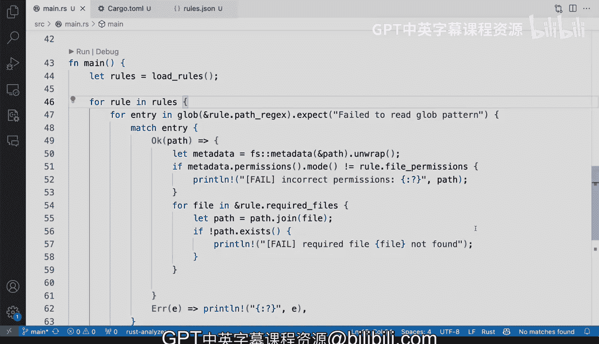

# 杜克大学《Rust编程2-3（数据工程、DevOps）｜Rust programming》中英字幕 p142 53_03_05_构建合规性程序.zh_en -BV11y411z7Dn_p142-

So how do we build a compliance program， Let's dive more into our program that we have here where we have the rules that JN I've modified them a little bit instead of using a regular expression I should probably update D key over here in the JN object because these are going to be blobs and why or actually not blobs but Globs and a Gob pattern which is similar to a regular expression allows us to define what kinds of files and what kinds of traversing we want these are expandable in the shell if you're using the terminal if you do an LS home slash that star that will definitely expand so similarly if you have like a star like these this will expand into multiple files Now I've added to cargo a dependency which is the Gloob dependency which allow me to。

Spend on those and do file traversing instead of like walking the file I can just use the pattern so if I go back to main thatRS then lets everything's the same we have our decialization struck here so that we can load those Json rules into our program we have our load rules functions still and we' to keep scroll all the way to main now I'll probably have to get these cleaned up and remove out of main usually main should be pretty suin pretty small and would allow you to call out to other functions and hyperper functions and library。

Libraries that you might be implementing so but for now this is good enough so let's take a look at what is going on here and let's go line by line so first we're going to load all of the rules that's going to Bter me a vector of compliance rules as you can see there and i'm going to loop over every single rule I'm not going to use a results vector I'm going to remove that。

And I am going to use the G createate the G library so that I can pass in the path brackets again。

 I should update that field because it's no longer a regular expression is more of a pattern so I'm going to use that entry let's see like say for example the path regular expression right there will allow me to basically looking to every single file into Es right so that's what we're gonna to deal with。

 that is that not the entry but the path brackets right if it fails to read the G pattern like you will tell me I'm printing also every single entry。

 this is probably overkills， we're gonna remove that I don't want to be thatbo all right if's if there's a match on every single entry we're going to print the path and then we're going to have either if it passes。

 we don't care right like who cares if it passes if this is a compliance tool we only want to know if。

There's anything that is failing permissions I think they had like some debugging here that was left over。

 so I'm going to remove that print I am only going to print either if there's an error or if we're failing the permission so that's that's it let's quickly toggle the terminal So with that I'm going to say cargo run。

And we're going to get a lot of failures let me see so that is probably because I'm parsing a lot of files and kind of like the rules that I have are ridiculous because I mean I have let's take at some of the rules that I have here so in Etsy I want every single file to be 420 permissions that that's probably not going to not going to work at all and I have some required files which is password and group and those should be fine because I have those but you start seeing that some of these are going to not really work so those are Esy。

Let's see， well， actually group and password were not found。

 so those are definitely things that I need to look into。

But you start seeing that there's things that are not quite right with the reporting right。

 but so far what we've done is we've hooked it up correctly。

We also have like the home the home stuff right here。

 but we hooked up our logic into main data rest we still need to clean up a little bit we're loading the rules correctly we've made some changes into the rules adjacent to accept a G pattern and for every single entry we're running were running the rules now this logic of required files is not quite right and we'll have to fix that so that this entry will not requirement this has to probably has to be outside of this loop so that it matches just once。

And so that's fine， we can clean up， but this should give you an idea on how you could actually implement this with a fairly solid pattern there using match and for every entry you' will going to do either something with a path or if you can't。

 if there's an error， you're going to report that error。

So that is very solid and the last thing that we are left to do is to remove this big chunk of code into something else outside of Ma so that we can keep main very small calling out to helper functions。

