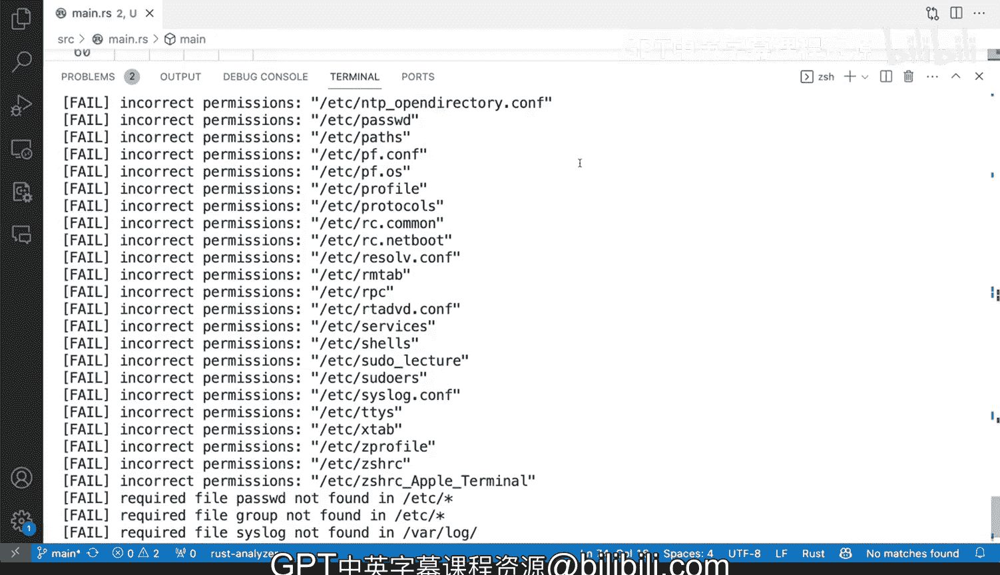

# 杜克大学《Rust编程2-3（数据工程、DevOps）｜Rust programming》中英字幕 p144 55_03_07_程序报告策略.zh_en -BV11y411z7Dn_p144-

When you want to make these tools be consumed by other systems like say for example a CICD system。

 imagine our compliance tool running automatically for say for example。

 a certain virtual machine image that you're building or some other remote system that you will execute correctly remotely so one of the things that we can try here when I run our tool again so we have a lot of failures。

 one thing that CICD systems rely on a lot is if there's a failure like what we have here to rely on a non0ro exit status。

 what is that well whenever programs terminate they can return an exit status a dig a number an integer and the way we check this in the terminal is by doing dollar sign question mark and in this case it should be zero。

SoWhen we get a0 it means it implies that everything's fine， CIC this systems by default fault。

 if the X status is a0， then it won't stop execution or it won't consider error。

 it actually doesn't matter what the output is， even if it says fail。

 critical error critical failure， it doesn't matter， it will check the X status。

 if we say for example， Ls something that doesn't exist invalid for example。And we say in ballot。

 no such file directory， do you see that little red X。

 my program here has detected that there has been a non zero x status。

 let's check it out If I do echo dollar sign question mark I'll get a1。

Programs can actually use these to set all kinds of different numbers for a it's called a non-zero exit status and when that happens。

 it means that multiple different things can can be applied to those errors so we can do the same here so let's actually go ahead and look at our program again and we're going to go at source S or C main that Rs and let's actually implement that in our program in Rus I'm going to scroll all the way to main and just below rules I'm going say let mutual fail I'm going to set up a variable here is I'm it's going to be a booleium and'm going to make it a false and then whenever I see a failure so say for example on the file permissions if there's if there's a failure like right here I'm going to say。

Faiiled is true。Right， so now I don't need to use let again。

 So let is here just to instantiate that variable。 and now I it's already there and I can just reuse that。

 And there's R failure here for require files so I can do the same thing。 I can see。

 I can say failed true。And then save that and then outside of this loop outside of that。

 I can actually do a non0 x status so I can actually and it's not this one is this one。

 I can say if failed open curly brackets and I say STd process exit1。Right， so if I say that and do。

Toggle Ter and Nou cargo run。We'll get a fail， lets do echo。

And we'll get R1 and you can actually change these to be other kinds of exit numbers you could be like a two so you could。

 for example， see you know do an exit2 if if it's just for acquire files and not for the R1 which is for now for demonstration purposes let's do an exit2 and see what happens not that one lets do cargo run and then check the exit status and you can see here it is a2 so that is definitely one thing that you can try and you can implement for your systems for your programs and one last thing that I'm not gonna demonstrate right now。

 but one thing but we've done it in the past instead of producing a log file log output or something that prints to the terminal like this you could producing some Jason because Jason is kind of like a common language so other tools even in other programming languages can understand Jason in the same way or similar ways as rust and they can read that rust。

Imagine now read that Ru but， read that Jason， imagine producing Jason with all of this information。

 other systems can grab that JN information and do some reporting so say for example。

 a dashboard or some other type of reporting where it could because otherwise if this is to make this machine consumable。

 you you're going to have to parse that output and parsing is well it's tricky to get right and prone to error。

