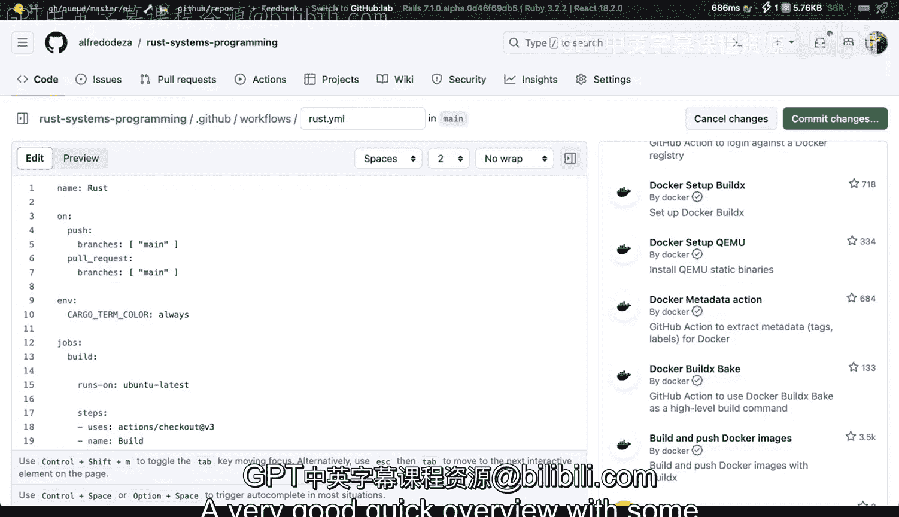

# 杜克大学《Rust编程2-3（数据工程、DevOps）｜Rust programming》中英字幕 p149 60_04_05_GitHub Actions简介.zh_en -BV11y411z7Dn_p149-

We've briefly seen a little bit of GiHub actions before。

 but let's dive a little bit deeper into what it is。

 but still kind of like giving a high overview and I'll start with the documentation of GitHub actions that is a great source of information for all of the different components and all of the different things that you can do with GitHub actions。

It might be overwhelming if we go through all the different components of the Github actions。

 but we'll see how that works I'm going to click here and we've seen before kind of like what is a job in this case this is a pipeline with different runners and execute so like that maybe be one then that bill goes to these other runner and that are runner so say for example。

 if you have a bill system that needs to deploy on Linux and then on OS10 the runner would have to be different the runner being the system and then you would perform all of these steps in there so the workflows are the files that we're going to have in GiHub but by default fault you have to have this directory path and GitHub will look into these hidden directory in your social repository so that you can take a look at your YaL files by default fault everything's YaML and you will have to take a look at how that works。

And then you have all of these events How are these basically they call them events I call them triggers some of our systems also call them triggers。

 I think you can see here an event is a specific activity in a repository that triggers a workflow run So all of these things happen and then eventually become some sort they trigger some sort of an action and then you have the actions that we've already seen the jobs in the actions as well and the runners are again the servers where these are running but I want to show you the example workflow which is pretty simple and then you have these basic portions。

 you define a name you have a specific， well they have a run name here。

 I don't tend to use a run name when is it going to run is going to run when there's a push to the corepository and is's going to run on this operating system or a runner also called a runner in the Github actions universe and it clones。

the the code and then it uses a specific action， this uses thing is kind of like being able to pull in external helpers that allows you to do certain things so in this case is set up node。

 it will set up node JS and you can see here node version 14 and it will do something with NPm。

Allright so so that's definitely something that we can do if you don't in this project I have a little bit of rust。

 this is a different project that I have and the components are very similar right so I'm going say this is only for things that are going to change on the main branch I'm going to run on a boom to latest when I clone the contents of the repository I'm going to set up rust and I'm going to use these little helper right here and then I'm going to do a cargo built that's it that I'm not going to do anything else you can do many different things more but in essence you can keep things simple and built from there。

 this is why I was saying that it's easy to get overwhelm if you're looking at the documentation and see all the different examples and components that you have but having something very simple like these to start with is a great way of learning more especially about a platform like Giub GiHub actions。

So the other thing I want to show you is if you don't have anything。

 this is an R repository that I have where I'm building all of the examples for this course。

What I can show you here is that this doesn't have any actions if I click on actions right here。

 there's nothing， but I'm greeted with this that says hey。

 you want to get started with actions and you know I want to say well yeah sure you know I want to do something let's see if there's anything for rust if I click rust or hit search for rust I can see that there's a lot of things that I can use SlSA generic generator。

 probably not rust by Github actions build and test a rust project with cargo wow。

 that seems pretty interesting， why don't we take a look at here So I'm gonna click configure and what you are greeted with once you click on that configure is that it is going to create that Github slash workflows with a rust that Yal already in the main branch for your repository So that configuration you don't need to remember that this is Yaml you don't need to understand all of the heavy。

ftIn on the syntax， you will have everything there by default。 So if I keep scrolling here。

 it will run the build and it will run the tests if you have them。

 hopefully you have them for your for your system and then you can just commit。

 you can commit the changes right here on this agreement button and then that will become part of your repository So it's a great way to get started as well and you can even search more Github actions for what you want to do here And from there if you're feeling overwhelmed by creating one from scratch。

 you can definitely poke around。The marketplace， if you don't have any actions also here on this search thing here。

 but you can actually say for example， how about Ru， maybe there's something for Azure。

 there's nothing for Azure， but if you wanted to deploy how about Docker。You know。

 there you go you have Docker login， set up a build D。

 you can do all kinds of different things for build and push Docker images is certainly one of the ones that I use the most。

 so that's it a very good quick overview with some extra components on GiHub actions。

