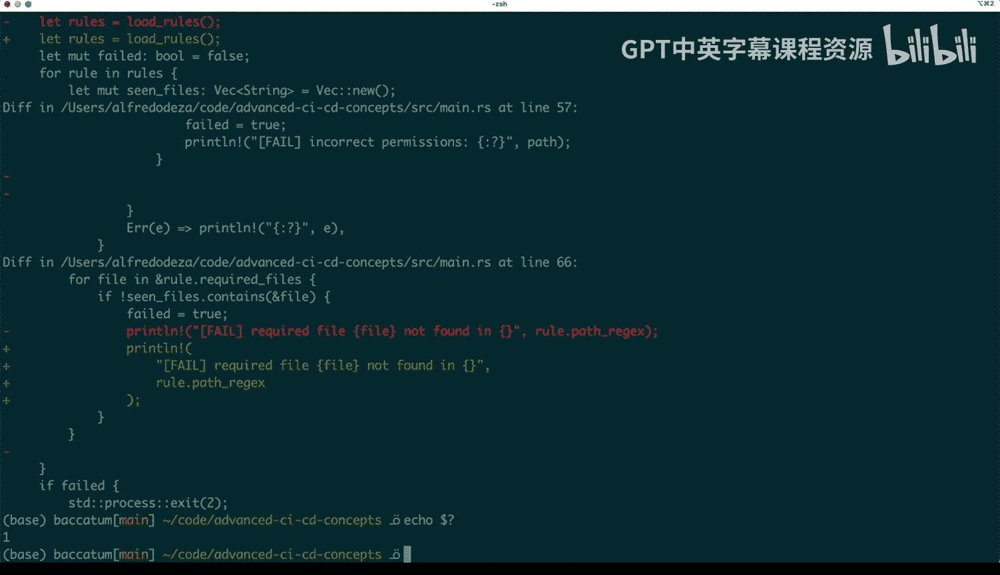
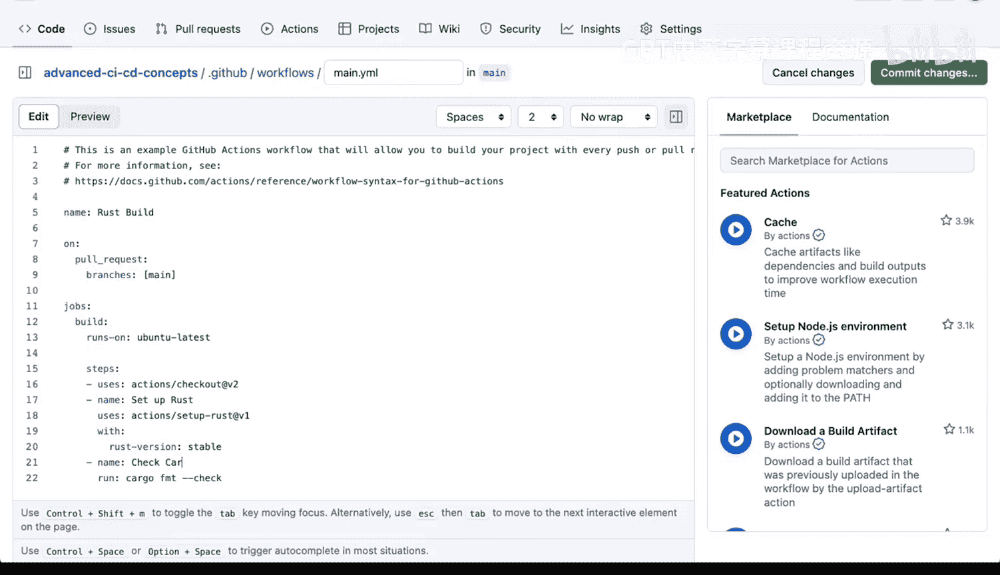
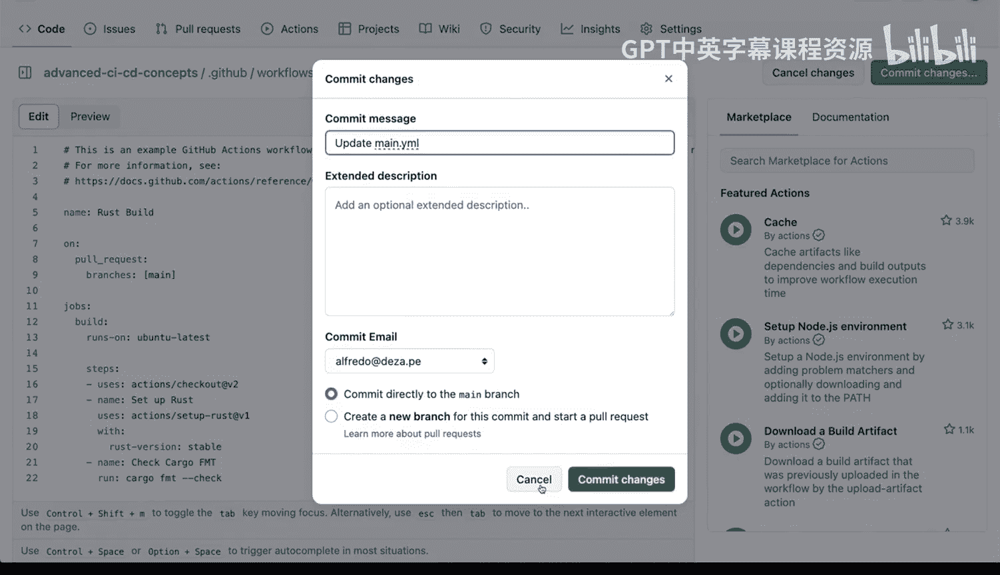
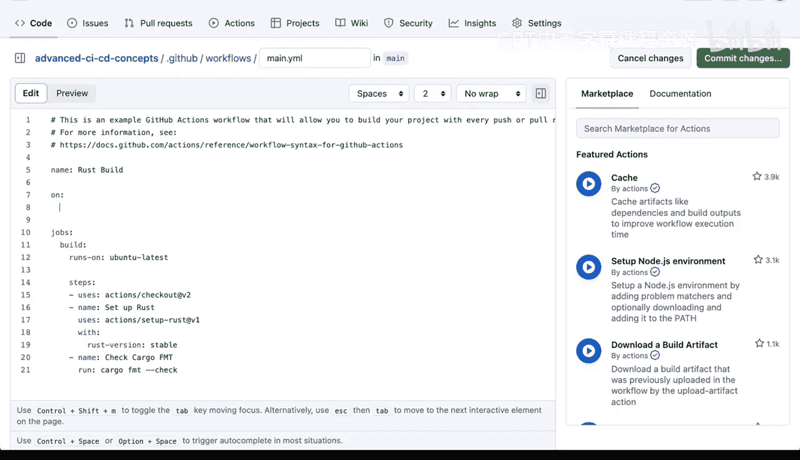
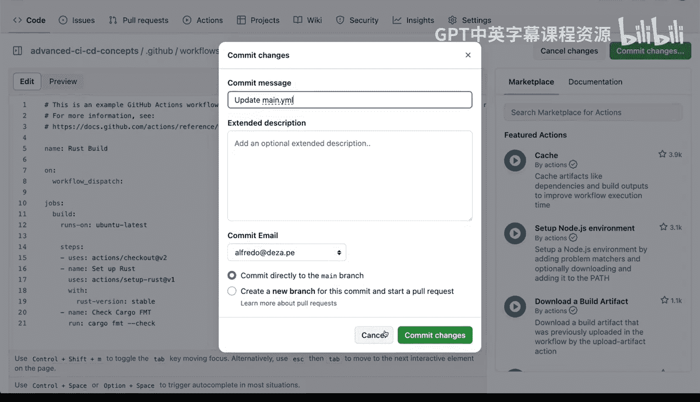
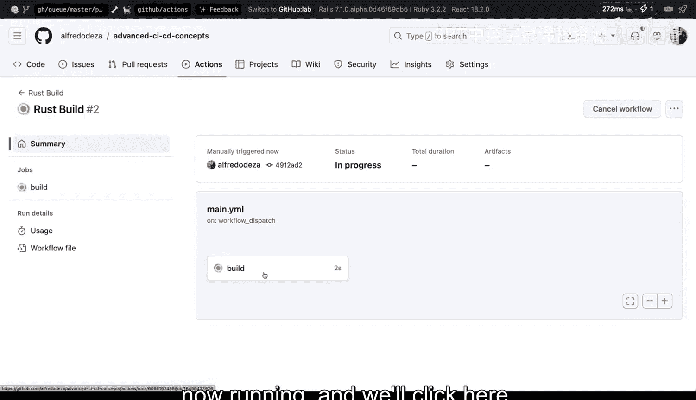
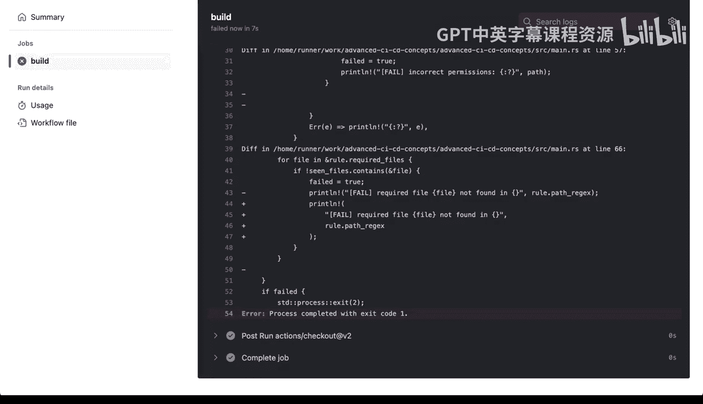

# 杜克大学《Rust编程2-3（数据工程、DevOps）｜Rust programming》中英字幕 p151 62_04_02_自动化常见任务.zh_en -BV11y411z7Dn_p151-

We have here a Ru project。 It has a couple things。 we've already seen this in in the past。

 we have a mainRS and these main thatRS， this rust file is the one that does the system compliance。

 Now whatever the project is it doesn't matter for what we want to try to do here。

 but what we definitely want to do is to try to identify some of these things that might be you know we want to automate some common tasks。

 and one of the tasks that I haven't shown you before because of the example types is to do cargo format。

 Now cargo has a format which are FMT for short and that command will allow me to format or reformat my Ru code in a normalized way will be kind of opinion needed to try to do。

To look into my rust files and format them。 So if I run cargo format for this project。

 and you can say you can see Gi status will say there's nothing， there's nothing changed。

 So right if I do cargo format， it will go and change things and now if I do gi status。

 it will say that there are things modify。 if I say gi di so that you can show me what has changed。

You can see that certain things are changing， the imports are changing。

 things are getting into different spots， new lines are getting deleted。In some cases。

 I believe this is there was probably like white space because otherwise that looks the same more more new lines deleted right here instead of having a single line right there it did this print line in this way which is you know fine and that's the end of it。

 So those changes where theyre E I。One to implement this in a GiHub action what I need to do or in an automated way。

What I need to do is you know and this is something that you might want to have all of the time。

 So you want to prevent code that will have to change So I could do I want to show you one thing before we go into GiHub actions Im going to do Gi checkout here so that Gi status this status says that there's nothing changed I went back to my original state So if I do cargo format once again。

If I run these in a CICD system and I want to prevent these from creating a getting basically failed a job。

 I need to rely on the non0ro exit status， if I do that this tells me the hey， things are zero。

 like the exit status was zero， there's no error CICD would never find these like a problem。

Now we want to have in nonzero exit status here if there is a change。

 so if I say cargo format dash dash help， you will see that there is a dash dash check。

 run Ru format in check mode， if I redo this thing again， get check out here。

 go back to where we were before， then do cargo format check。Then things will show like in that way。

 and then I can do echo dollar and question mark and we'll have our non0ro x status。 Al right。

 so let's go to our repository and in our repository we're going to go and add Github actions and then we are going to add we're going to add a make some modifications。

 there is a rust build right here So actually both test the action we need to modify。

We need to modify the workflow。 so I'm going to click here。

 main that Yao and instead of doing a cargo build， I'm going to modify modify these very quickly。

 So I'm going to edit that file and instead of cargo build， I'm going to say cargo format。Check。

And I'm going to change these to。Check cargo， cargo format， and I'm going to commit the changes。

Actually， one thing before before we do that， I don't want to run this on a pull request。

 I want to run it manually just so that I can show you what it is。 So instead of pull request。

 we're going to say。

We're going to say workflow dispatch。

And I'll show you what that means or what that does in a second。

 and I have to reload there so that you can see the changes。 I know that this looks very odd。

 but what this does is that it will allow me to run manually we're talking about triggers before and this is a manual trigger。

 I know it looks odd。 I know it doesn't read like a manual trigger but that's what it is。

 So we're gonna go back to the Github actions tab and we're going to click our rust build now because it has the workflow dispatch trigger。

 we have this magical button here that says run the workflow。 So yes。

100 percent we want to run the workflow this is going to take a second the run is going to appear here and that and there we go and has appeared when we click there you will see that this is now running and we' click here now cargo format has failed here and let's take a quick look at this one and it will get me all of the output from cargo format check。

which is the command that I had so this is useful because if I didn't know what was going on。

 I could see exactly the same output from the terminal remember we had some lines that were removed and some changes were made to print lane print line sorry and you can see process completed with an exit codeta 1 so there you go that is how you would automate something that is very common such as cargo format with a project that you may have that is used in rust。

