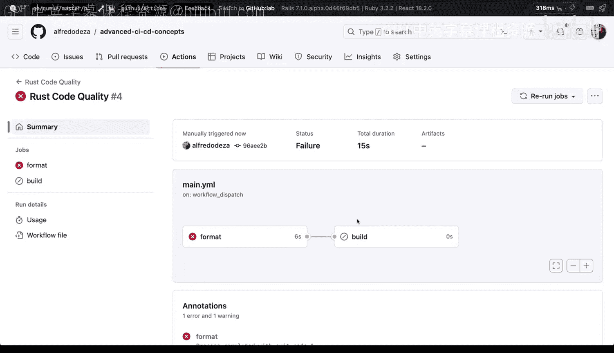

# 杜克大学《Rust编程2-3（数据工程、DevOps）｜Rust programming》中英字幕 p152 63_04_03_管理相互依赖的作业.zh_en -BV11y411z7Dn_p152-

How can we implement code quality management for a project like these where we're doing a lot of rust work and we've already done some changes here with cargo format？

So the way that we can do this is by expanding this rust build。

 so let's actually go ahead and edit right away with this button and we'll edit right there so we could actually save that instead of rust build we can say rust quality quality。

And we can definitely keep it running and work for thispatch。

 And what we're going to do is do you see that that build。

 we could actually start separating builds from from one of each other so we could actually do another build and I'll show you here what that will look like so we can say。

We can say runs on1tu latest as well， and we can say we are going to say steps。

I'm going to say uses actions。 Check out also 2。 And'm going to say V2 as well。

 I'm going to say the name is going to be。Make sure。Cariggo builds or rust Ru build。

Bs builds correctly。So with that what we're doing to do is I'm going to say run and I'm getting out of the screen here。

 So what I'm going to say is I'm going to say run cargo build， I can't have build again here。

 so we have to say this could be built and this could be format when I make sure that this is correct。

 So do you see those squiggly lines that happens when your you are doing something that is not quite right。

 And in this case I forgot to add a semi column column character there and this is something useful if you're editing right there if you were using a text data like Vi code those would be caught instantly。

So I'm gonna commit file， I'm going commit the changes。

 I'm going say that and I now I can go to actions and see that the Ruco quality has changed。

 So if I go and click that and I go and run the workflow and implement that then we will be able to see that things are going to be a slightly different for the rust quality change so you can see now that instead of having one job I'm going to have these two and they're going to run at the same time these one does not depend on that one so these are running independently if I wanted to have format and then build then we would we have to make some changes actually so let's take a look at how that would look like so you can see build succeeded here but format failed So how would that look if we had to make them interdependent。

 So I'm going click on here as well and just go back to our Yal file。

Kthub workflows main that Yal the way you would do that is by saying needs so needs is a special keyword and what we're going to do is going to make them interdependent so one cannot actually go to the R1 without the R with a previous one passing so the way you do that is by adding these say for example the build。

 we can say not runs on but we can say before steps we can say could be read only let's actually edit that I forgot to edit that so when I click here I'm going to say needs and when I say that we need actually format so I keep trying to save the file but I forget that I need to commit the changes so by saying that needs format this format is that job。

So I can enter the pen depend one job can depend on the R1。

 so let's commit the changes and see how that looks。 I'm going I commit the changes。

 go back to the Github actions。Go to Ru quality， run the workflow， click on run the workflow again。

 wait until that appears and then take a look at how different it looks now that we have that interdependency So now you can see that format is here both are not running concurrently so Bill will have to wait until this one completes So this is a great way you can see build like if I click build。

 it will say this job was skipped So this is a great way of managing your code quality with separate things depending on the strategy you want to have either both all of them at the same time or one before the other depending if it passes or not。

