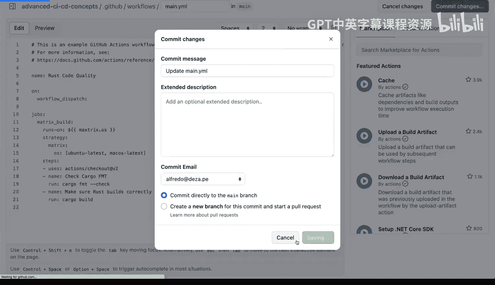
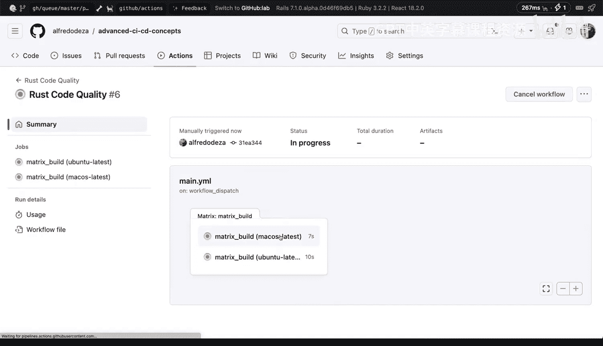
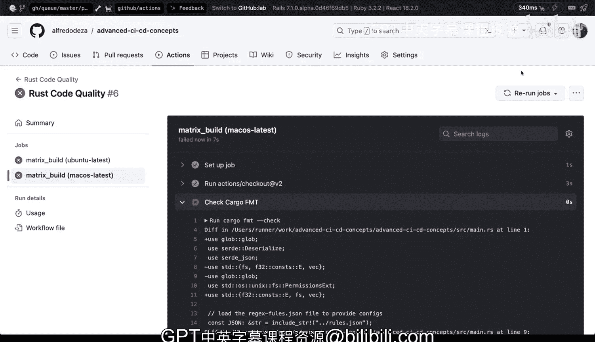

# 杜克大学《Rust编程2-3（数据工程、DevOps）｜Rust programming》中英字幕 p153 64_04_04_构建矩阵作业.zh_en -BV11y411z7Dn_p153-

Back to our project here that we've been working， I want to show you how you can actually do a matrix job so this is all running under Ubu to latest and we have now our interdependent jobs we can change that if we wanted to but all this is running on Ubu to latest so if I go back here back to our Yaml file which is this one we have these format job that runs on Ubutu latest this one runs on Ubu to latest as well and the problem with this well not a problem but like what happens here is that。

If I wanted to say run on a different operating system。

Then that would I would basically have to copy paste this into a different operating system entry。

 that is error prone and it's a maintenance burden。

 the maintenance burden is because if you have like several different steps and you have to make an update say on this one that will also need to happen on the other one and you might have a typo you might forget about something and not implement them exactly the same and things can start to drift All right。

 so how do we implement a matrix job so underneath jobs right here instead of having the actual job。

 we are going to have a matrix when I say。We're going to say matrix， matrix build。

 and within our matrix build， we are going to have a strategy。

And this strategy is going to require us to have a matrix。

 I'm going to have a matrix here and what we're going to do is we're going to say how about we say operating system and we run on different operating systems So instead of having only one for boon2 latest we're going to say boontu latest here and we're going to say Mac OS latest because Github actions allows us to have that defined now you might see that I have a cur underline if I hover over it will tell me a job requires either runs on or uses and that's actually correct so how do we access some of these things well so if we say runs。

Runs on We're going to access the value of the matrix and that will be matrix that Os。

 Now what is going on here exactly is that I'm interpolating I'm extracting this value。

 this OSs is one of these one each So we no longer need to be defining what we want to have in this way right so that is that is the key and now we need to what we need to do is we need to indent a little bit on what we're having right here。

 So where you see strategy。That that is fine， but all of our jobs need to be kind of like indented a little bit over。

 so we're going to。We're going to have to indent a little bit so that we can so everything starts starts aligning now because before we had two different jobs now we have to actually not have them be separate so we are going to reduce that to only have steps so we're going to reduce that to our step right here is going to be the same step。

 we're no longer going to make it interdependent， we're going to remove steps here again so what is going to happen right now is that these steps。

 were no longer need the actions right here right so we made a bunch of surgery over here。

 we're going to simplify， we're going to use checkout then we're going to do the formatting and then we're going to make sure the rust builds correctly and these are going to happen for each one of our operating systems we're going to commit those changes I'm going to save that。

I am going to go back to our actions and I'm going to click on rustco quality。

 run the workflow and see how that looks One seed appears right here。 Al right， so now it's running。

 let's click on it and we'll see0 out of two jobs completed if we look into it we'll see that we have Macs and Ubutu latest both running at the same time。

 and you can start seeing that our matrix will have well all of them are going to fail because we have cargo format messed up So this is on OS 10 and why would this be an interesting approach especially for rust because right now we're trying to do format and called quality but if we're actually trying to cut release we could actually build a binary for Mac and Uuntu separately one for Linux one for OS 10 no problem So this provides us great facility。

Start expanding we are able to do that with our matrix job configuration。

