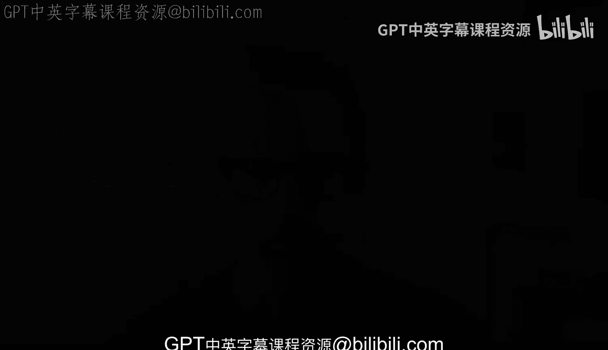

# 杜克大学《Rust编程2-3（数据工程、DevOps）｜Rust programming》中英字幕 p155 66_04_01_引言_12.zh_en -BV11y411z7Dn_p155-

One of the common scenarios as someone that is in DevOs or trying to apply DevOps concepts is that you become the owner of a project。

 something that is' there， perhaps is already written。

 perhaps is already in production but it doesn't have too much to it there's not much automation there's not much else to it so one of your primary tasks as a DevOs a DevOs engineer or even someone that is deep into systems engineering and wants to see like well what are some of the things that I can do here。

Well， that's what we're going to do right now， we're going to take a project that has several things that are lacking and we're going to know how to identify those and start building from there to try to have something very robust from going to a Docker file to also enhance the Docker file with LinkedIn and building and making sure that changes don't get into the main branch of the repository unless certain checks have passed。

 we'll see how were going to put all that together for these rust project and we'll also be working with working with a little bit more advanced patterns as we try to identify if things are good for a pull request check or perhaps a manual trigger we'll see how we we can implement those and at the end we'll put everything together and containerize this whole application and deploy it or submit it to a container registry kind of。

The end goal sure， like you might have like 10 different paths for the production deployment like going to a cloud service provider。

 but in this case， we're going to do the grant work of verifying co quality and proper containerization all the way until a container registry。

