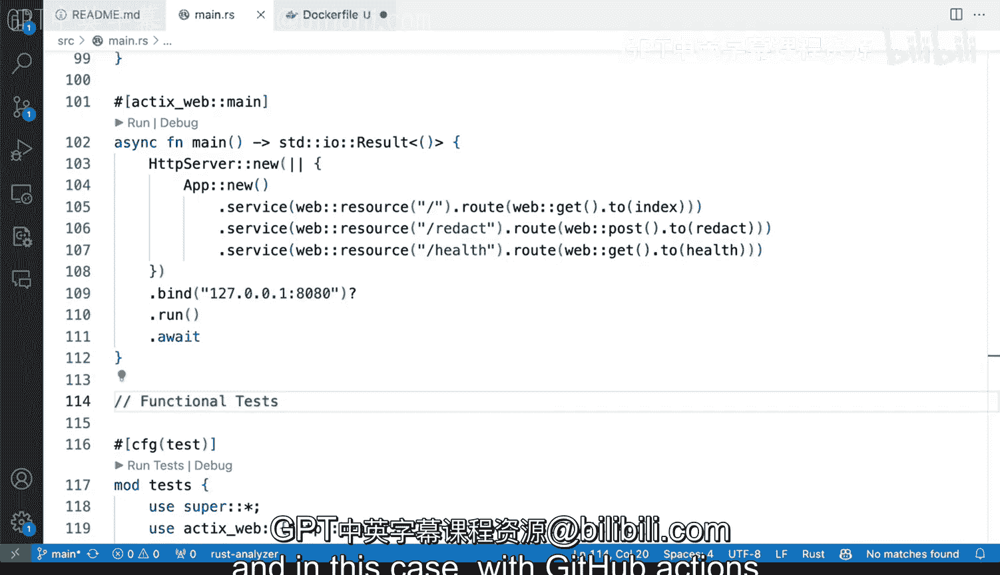

# 杜克大学《Rust编程2-3（数据工程、DevOps）｜Rust programming》中英字幕 p156 67_04_02_识别项目需求.zh_en -BV11y411z7Dn_p156-

Let's identify some of the things that we can do with a rustS project to set up some automation using CICD all the way from verifying code quality to formatting containerizing and deploying so we have our rust project here this is our HTTP API that will red personal ident file information so this is pretty good it's an HTTP service it's all good。

But let's poke around what we have。 And if you were a systems engineer or DevOs engineer and you own this project。

 not on the development type， but on on the DevOs side you would have to start poking around Well first off we know that we don't have any automation right here。

 So we have the Ra code read me and and then that's it。

 So what are some of the things that we can tried to do well the first thing I would do is take a look at the code and see if we actually have some tests。

 so perfect， we do have some tests， the developer that created this project was able to produce some tests so these are certainly things that we want to include when we are trying to implement these thing so this is for sure one of the first things that I would take a look is if this project has some tests so that we can add them to our build system so perfect so that would be one I would definitely implement cargo format。

So the first thing that I would go ahead and do is make sure that cargo format passes， right。

 like we don't want to necessarily implement it。 so I'm going to run the terminal and I'm going to say cargo format。

And that's probably going to make some changes here。

 And I'm going to make sure that all of them are are good to go。

 So cargo format didn't find anything。 My source control set。 like there's nothing to commit here。

 So okay， perfect。 we we don't need anything any problems there。

 We don't have let's keep the let's keep the explorer up。 So that's， that's very good。

 So we can do cargo format another thing that we can add is to make sure that this has。

Container Act like want to deploy these one of the many things that may be a thing here would be to add a container。

 So if this doesn't have a container， I mean， of course you would do this in coordination with a developer or the developing team and I could add here a new file and say for example。

 Docker file。And do a from。From rust and then from some rust image and try to implement what we want here for building these into a robust robust service so I've paste it here content from a very basic default fold that I have for building Docker files and I can use rust。

 then I can change the work there to my app and copy the contents of everything in this repository to that my app directory in the container I can do cargo build release and use De andbusters Li if I want that for dising my application the command my app is probably not write but if these are things that I would definitely consider again for packaging and distributing these once we package these once we create a container then what we can do is actually put it into a container registry。

 we'll see those things later。In more detail。 But so far， we have tests， we have LinkIn。

 we have building， and we have containerization。 So those are top of mind for me。

 And definitely things that I think are useful when you're trying to set up some of the automation in a C ICD system with with rust。

 and in this case， with Github actions， as we'll see in more detail later。

