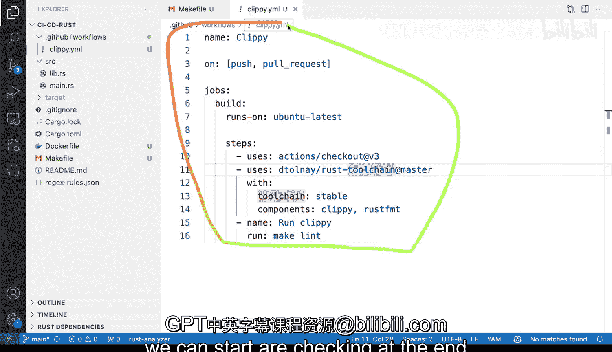

# 杜克大学《Rust编程2-3（数据工程、DevOps）｜Rust programming》中英字幕 p157 68_04_03_为拉取请求设置代码检查.zh_en -BV11y411z7Dn_p157-

Okay so let's start adding LinkIn to to this project that we have here。 before we do that。

 I want to add a make file and the reason I like to add a make file is because we can actually do something very neat。

 We can abstract away some of the calls from that we have and you'll see in a second why this is definitely important。

 One of the things that I really like about make fileile is that actually not only it will allow me to abstract things away and but also will allow me to normalize everything for all of my projects So there's many different things that you can do here and I'll show you some of the things that are useful and I'm going not going write all of these targets by the fold。

 I'm just going copy them and put them right here perhaps bump in the version number is a bit too much but format。

LinkedIn is definitely is definitely useful so here you can see that I'm saying hey make sure that Cpy is definitely there。

 so that is definitely something that I want to that I want to do and I want to make sure that Cpy is there so whenever I'm hooking this up from CicCD then I can just called make Li and the help here with a grab will allow you to do something let me show you toggle terminal and I can type make help and you can see I have very nice documented things there so if I say make Li。

I'll get all kinds of errors。 So this is perfect。 I'm going to say echo and question mark and we we're seeing that we're getting all kinds of different different errors there。

 so let's take a look at how we're calling well we're doing format right there。

 but we can say remember we want to do check and cargo clippy。

 we can say dash dash all and we can say dash F。嗯。And we we want to have those we want to have the。

 we want to say warnings include the warnings for sure。 So let's try this again， terminal make Li。

 And now let's to echooler and then want to have dollar signed to perfect。

 So this is what we want before we were getting zero So we want to add some flags there。 So great。

 how does that look like now， when we want to add the files so that we can hook this up to our CicCD system。

 Well， we will have to add one here， I'm going to say new new folder。

 this is going to be that Github。And then we inside of Github。

 we are going to say new folder in there is going to call workflows and inside of our workflow。

 we're going to have to have a new file。 we can say Clipy and clippy is something that we we haven't seen before。

And。And what that will do is basically ensure that the core quality for this project will work correctly。

 Now I just copy pasted this， but you can see that make Li will be called right there and run clippy if what that gives me is the ability to understand if there are LinkIn problems for my project。

 What is the problem like am I making wrong assumptions if I go back to toggle the terminal we can see this are not errors。

 but you can see that there's some suggestions like consider using two string instead of that。

 and and then all of this is just essentially like very。

 very good and then you can see could not compile due to previous errors。

 So that's good like a string warnings as errors and that is exactly exactly what we want。

 So this is how I would do LiIn on a project we've implemented these this is already working and once I push we can。

Are checking at the end how that works on GiHub actions。

