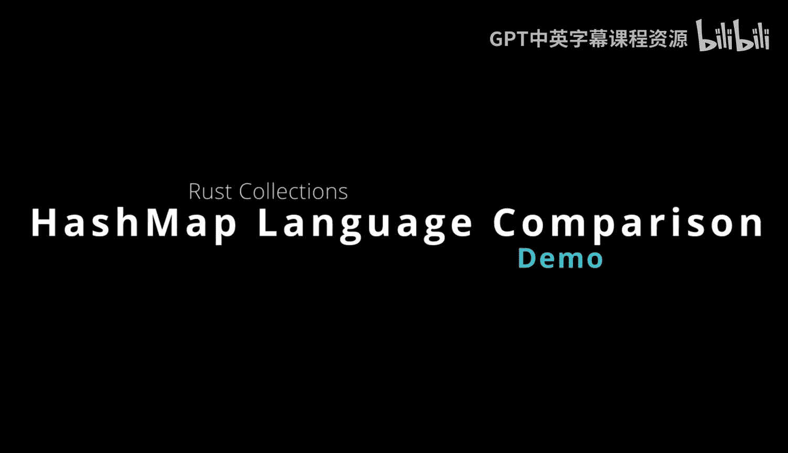
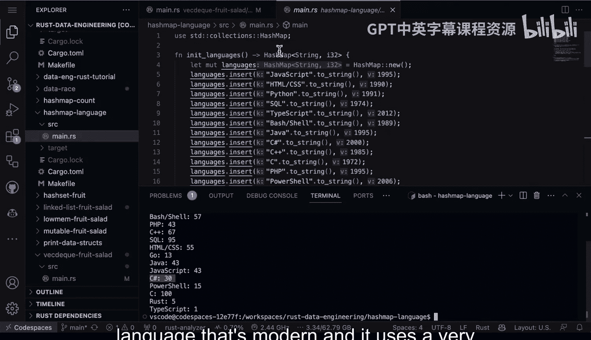

# 杜克大学《Rust编程2-3（数据工程、DevOps）｜Rust programming》中英字幕 p16 16_01_09_哈希映射语言对比演示.zh_en -BV11y411z7Dn_p16-

All right， so here we have a hashmap example that is really fitting for。

 let's say a data scientist or a data engineer where a lot of times you'll need to create your own custom metrics Maybe those metrics will be fed into a dashboard or you know a database or something like that。

 In this case， I've gone through and used hash mapap up here and created a knit languages function insideside of here we see that I've created a mutable hashmap inside this hash mapap。

 it's going to contain strings。That are I 32。 We have jascript， HTMLl， Python， SQL， Typescript。

 bashhe， Java， C sharp， S plus C etc ceter。 And what's really interesting is once you start diving into the age of the languages here。

 It's a good thing to mix in with the popularity。 So what I'm going to do as I'm going make another function here called calculate weights and what this calculate weights accepts is the years active。

 and what it's going to do here， it's going to calculate how long a language has been active。

 Then what I'm going to do is I'm going to take the languages here and edit it calculate the weights here And I'm going to say the language wane from one to 100 by age one is the newest and 100 is the oldest So let's go ahead and do that And what's nice about this again is this would be a similar type of operation you would do as a data engineer or data scientist to create your own custom metrics that feed in。

To a dashboard， if we go ahead and we type in cargo run。Look at this。

 I could actually rank a language in a very different way in the fact that in this particular weighing here。

 I'm going to say language weighing from1 to 100 by age 1 is the newest and 100 is the oldest。

 So if we look at this。We can see here that Typescript is the newest rust is also pretty new。

 C is actually the oldest one and so you know really depends on what kind of thing you're thinking about。

 but should you be using Python maybe for very stable projects if you want to do something more cutting edge。

 maybe you should start to look at things like rust or Typecr if you want something that's a little bit in the middle you know C sharpp。

 for example， is ranked 30 So this again is something very similar and that you would do as a data engineer and it's quite trivial to do in rust and you know the performance is going to be incredible because it's a compiled language that's modern and it uses a very efficient hashmap to do the calculation。

