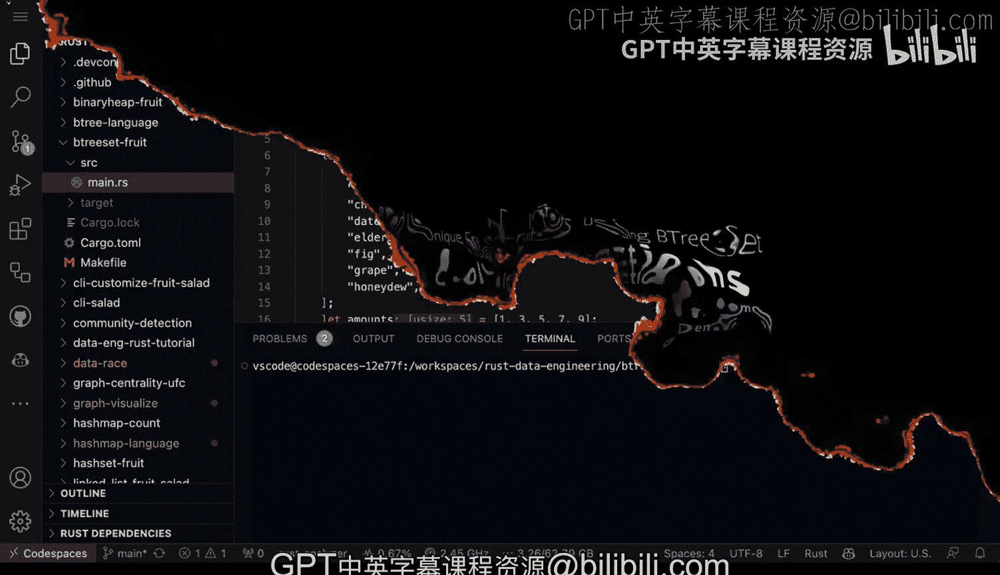
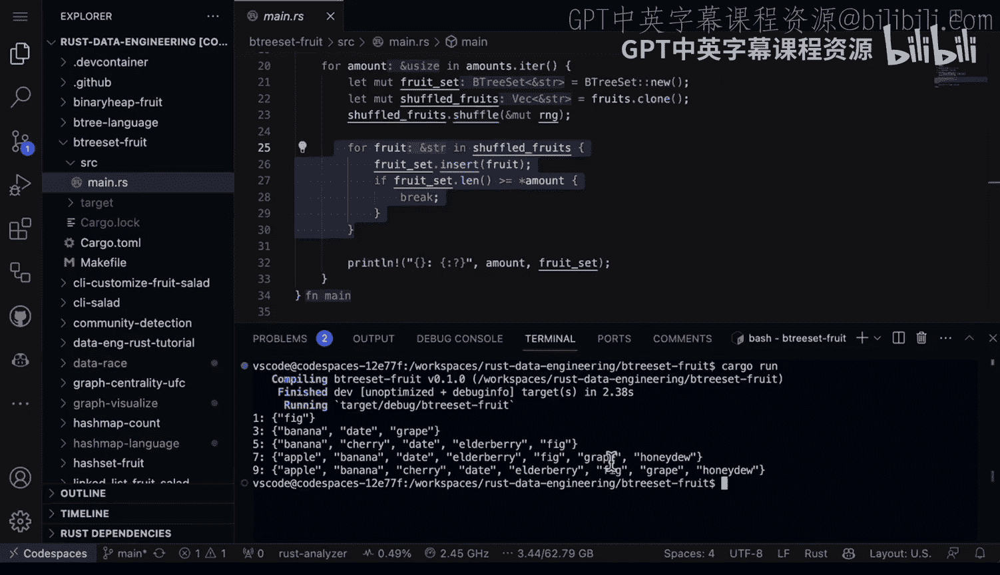

# 杜克大学《Rust编程2-3（数据工程、DevOps）｜Rust programming》中英字幕 p19 19_01_04_使用BTreeSet维护有序唯一水果.zh_en -BV11y411z7Dn_p19-

Okay， let's dive into another fun data structure， which is B3 sets。 And in this rust program。

 it's going to generate a B3 set of fruits with varying amounts。

 So the Bre set is another unique collection that's a similar collection to a hashet。

 but it keeps its elements in asorted order， which could be really helpful for certain kinds of data engineering problems。

 If you wanted to again， you， collect some custom metrics。 So first up。

 we are using the random crateier。 how do I know， I could just go to cargo。

 that's one of the nice things about a rust project really simple to understand what's being used。

Now， the other thing we're going to do is we're going to use these random features here。

 So slice random thread RG， and then we're going to define a list of fruits。 So again。

 pretty simple to use a vector here。 The vector is going to contain strings。

 I think this is something that's really powerful about rust is that it's going to explicitly tell you what's going on。

 So in this case， we know it's a vector and the vector has strings inside。

 So we don't have to guess like what else is going to be inside of this vector。 Well。

 it's a vector and it's got strings inside。And here， we also have the amounts here。

 and we also have the randomness that comes through here。 So this is where the shuffling occurs。 Now。

 finally， here， what we do is we actually keep track of the amount of fruits here as well。

 And then at the very end， we actually are able to calculate， you know， a fruit set。

 So let's go ahead and do this。😊，I'm going to go ahead and type in cargo run。It's going to build it。

And we see we've got the first one has a fig。 And then we have three as banana date and grape。

 The next one has banana cherry date， elderberry Fig。 The next one is Apple banana date。

 elderberry fig grape， honeyneydew， etc cea， right。

 So the idea here is that it's creating these unique sets。

 and it's preserving the order at the same time， which again。

 is really powerful because depending on what kind of problem you're solving。 know。

 maybe shopping car transactions or some kind of really fancy statistic that you want to put into a dashboard。

 This is an elegant data structure for that， it rust and， of course。

 because it has binarybased deployment。 It would be very easy to package this up and put it somewhere。

 And it would run extremely efficiently at scale with sea level type performance。😊。

