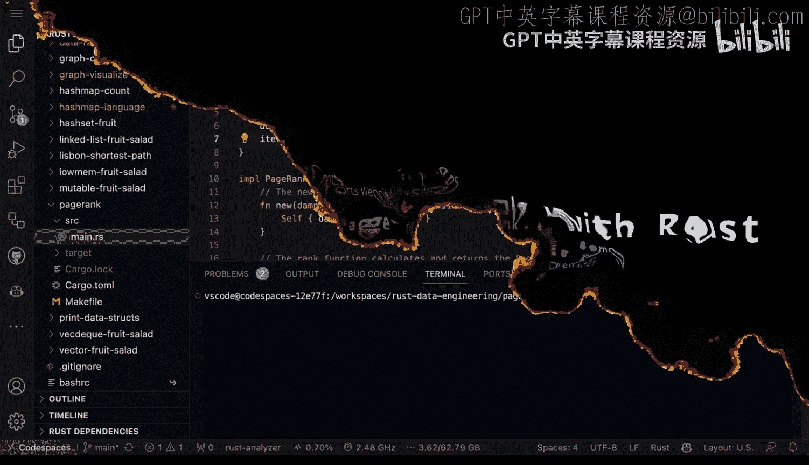
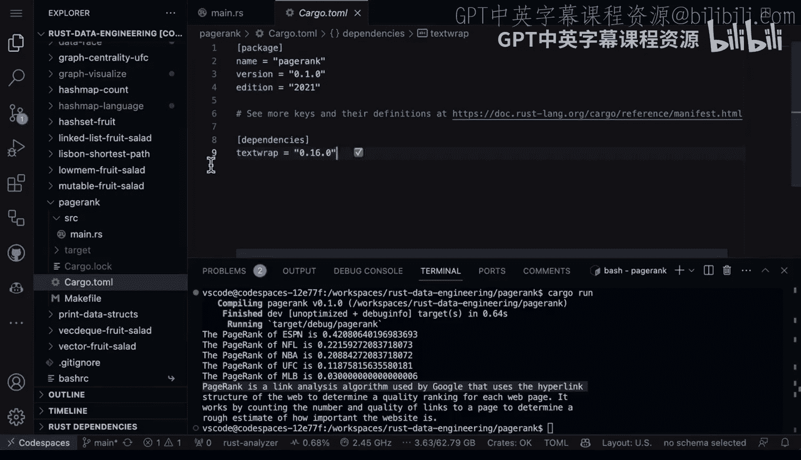

# 杜克大学《Rust编程2-3（数据工程、DevOps）｜Rust programming》中英字幕 p21 21_01_06_体育数据PageRank算法实现.zh_en -BV11y411z7Dn_p21-

All right， so today I'm going to talk about page rank algorithm and how you can do it in rust and the page rank algorithm was first developed by Google to rank web pages based on the relevancy and importance and I'm going to talk about how the concept of damping is also used in page rank you can see this right here and this struck I use damping and I also use iterations here。

 So first up inside of here， look at the damping factor and this is accountinging for the fact that not all surfers will continue clicking indefinitely。

 so the number of iterations is the number of times in algorithm will run to actually stabilize the rankings。

And the other thing that we have as well is a new method here。

 And this new method will create a new instance of page rank。

 And then if we look at the rank method itself， this is where the main algorithm is implemented。

 It takes a reference to a graph as an argument。 and it returns back a vector of F 64， right。

 So this in particular is going to have everything we need in order to do Page rank。 Now。

 the rank method itself。 it starts off with initializing the page rank of each node。

And in is going to be the total number of nodes that are in the page rank。

 then the method enters a loop that will run for a number of iterations。

 and then it'll calculate a new rank based on the old ranks。

 and then for each node it's going to distribute its rank over its outbound links here。

And then finally， after the distribution， the ranks are updated with the damping factor。

 And this makes sure that there's always some rank left。

 even if a page doesn't have any inbound links at all。There we go。So now to run this。

 all we have to do is get a graph of a vector of vectors。 And so in this particular scenario here。

 we can see that ESPN links to the NFL and MB NFL links to ESPN， NBA links to ESPN， Uf， etc cetera。

 etc ceter And then this allows us to kind of get things going here and then we also name the indexes as well。

 we have an initialization of the page rank with some you factors here like the damping at 0。85。

 the number of iterations。 and then again， this is the thing that goes through and calculates it。

 So really a pretty straightforward algorithm once you walk through it。

 let's go ahead and run cargo run here and we'll go ahead and take a look。

 So what's happening here is that the page rank of ESPN is 0。4 to the page rank of NFL is 0。

22 the page rank of the NBA UFCc， MB， etc ce。So what this says is that the Page rank is a link analysis algorithm used by Google blah。

 blah， bla， blah， blah， so in a nutshell that the higher the rank。

 the higher potentially we would put this into a search index so it's kind of fun about this is you could use this to implement your own type of search algorithm in your organization。

 maybe for documents or maybe email messages or customers etc。

 you could figure out a way to rank something by how well connectedned they are inside of a network and again it's pretty straightforward to do with the just kind of basic rest here。

 the only thing that I used that was out of the box other than vanilla Ru was textrap。

if we take a look at this right here， the text wrap。

 all it does if we go back to the code here is that it makes a nice wrapped up explanation here that wraps it at 78 characters per line。

 So if you did want to print something out that didn't spill out into you know past that particular margin。

 this is a great little tool to use and that's why I did it is so that I was able to print out this nice little description of what the Page rank algorithm did。

