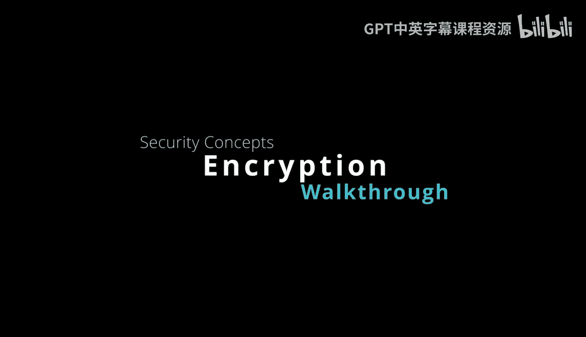
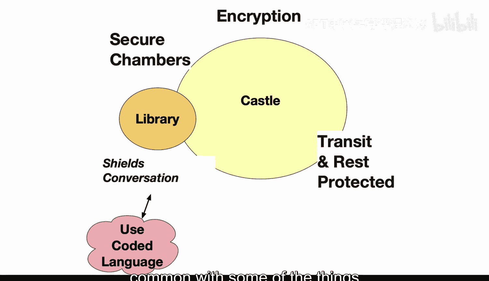

# 杜克大学《Rust编程2-3（数据工程、DevOps）｜Rust programming》中英字幕 p28 28_02_05_加密技术.zh_en -BV11y411z7Dn_p28-

Let's take a look at encryption from the view of a castle。

 so within a castle there are secure chambers， and encryption would keep the conversation private。

Secret coded language is used when a messenger bird would relay important communication outside the walls。

 and the encryption itself acts like an invisibility cloak。

 This prevents people from accessing the sensitive information and intercepted messages appear meaningless to anyone lacking the cipher key。

 Modern computing would then rely on encryption to protect data， both at rest and in transit。

 and the powerful algorithms would scramble information so only authorized parties can read it。

Innccryption keys unlock access to data and with symmetric encryption。

 the same key would both encrypt and decrypt。 This is the way that you would encrypt files stored on a hard drive。

 but for secure communication。 asymmetric encryption is used with a public and a private key。

 So you'll see this with SSH， you'll share your public key and then your private key will be able to unscramble that data so you can actually use it。

 Now， in terms of proper key management now it becomes critical because the safeguards of encryption are not going to be in place if you lose your key。

 your private key。 What could happen is that the data becomes unusable or if someone gets access to your data and they have the private key。

 they could decrypt the data。 So applying encryption across systems and networks will prevent unauthorize access to。

Sensitive materials and it transforms data into a secret code that appears like gibberish to intruder。

 So really a medieval castle here has a lot in common with some of the things that we're doing with modern day encryption。

