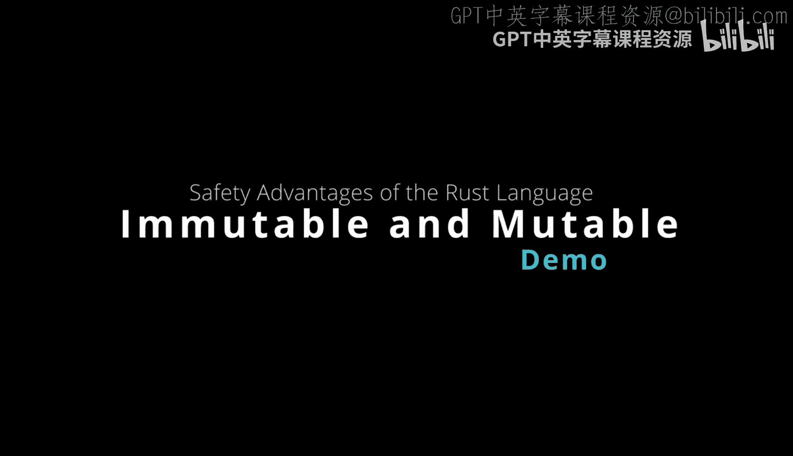
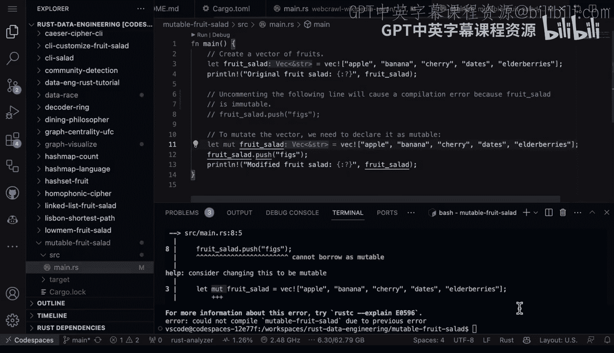

# 杜克大学《Rust编程2-3（数据工程、DevOps）｜Rust programming》中英字幕 p29 29_02_06_可变水果沙拉.zh_en -BV11y411z7Dn_p29-

Let's take a look here at a example of immutability and why it's so important as a security design of the rust language。

 Here you have a rust function。 And in the very beginning here， we create a vector of fruit。

 So this is like a python list。 But one key difference here is notice when you say let。

You actually are setting in stone。What is going to be inside of this vector。

 So you can see it's apple， banana， cherry， dates， elderberries。

 And if I go through and I print this， we'll be able to get our result。 Now。

 if I wanted to try to make a change to this here， What's going to happen is that there's going to be a compilation error。

 because this has been designated as an immutable data structure， this is an advantage。

 because by default， it's safe， right， So if you accidentally did something in your code that pushed something into the list or mutated the list or corrupted it。

You may have a problem catching that in a interpreted language。

 But in a modern compiled language like rust， all you have to do is have the compiler here really protect you from accidental errors。

 Now， if we do want to mutate it。 What you would do is you would say， let mute。

 And you would declare this as a mutable variable。 And you can see here that this fruit salad would be a vector that would contain some strings here。

 And then if I wanted to afterwards， I could push those figs。

 So what we can do here is comment this out first。And first， let's just run the code。

That's very simple， so let's go ahead and say cargo run。And you can see your original fruit salad。

 Now， if I try to mutate。That vector， we're going to get a compilation error， in fact。

We can even see from the error checking in here that even before I compile。

 it says you cannot mutate immutable variable。 right。

 So this is an amazing feature that you get in terms of safety from the Ru language。 Now。

 if I go ahead and I， you know， try to do it anyway， it's going to say， nope， you can't borrow。

As mutable。 And it gives me the exact line of code， which is right here。 And it says， look。

 let me tell you what you should probably do。 Now， this is one of the advantages of the Ru compiler is it's not using you know。

 generative AI or some kind of fancy technique， It knows what the code should look like。

 And so it can tell you， look， you probably mean to make this mutable。

 why don't you go ahead and make that change。 And so again。

 this is an amazing feature of the rust language。 Now， if I go back to。The other example here。

 what we can do is we can actually then mutate this， and let's run it again。

 and you'll be able to see that。 In fact， the original fruit salad was this data structure and the modified fruit salad is here so。

I think as you use rust more and more， you'll start to appreciate the fact that。

You know even though you build something once， it could run a million times。

 and so by spending a little bit of time upfront and protecting yourself。

 you're actually saving time in the future in case you know code was modified or there's some kind of change is that you can rest assured that certain errors just don't exist in the rest language。

