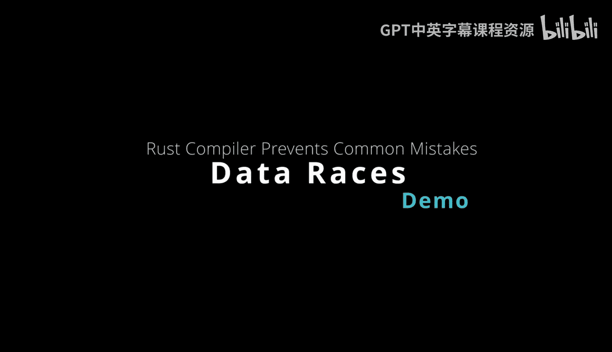
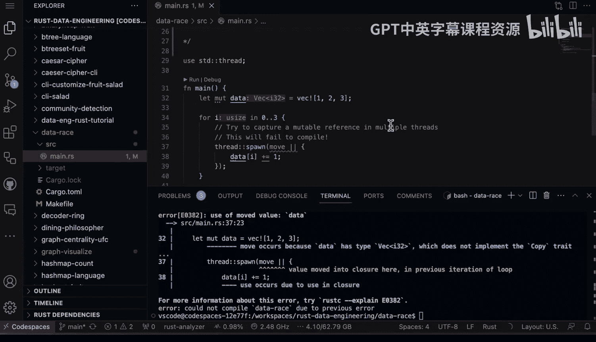

# 杜克大学《Rust编程2-3（数据工程、DevOps）｜Rust programming》中英字幕 p31 31_02_08_数据竞争示例.zh_en -BV11y411z7Dn_p31-

。Let's take a look here at one of the core features of the rust language。

 which is the ability to really protect the user that is building multithreaded applications from catastrophic error so in this particular piece of code there is the standard library and there is the thread module now inside of the thread module we're able to spawn。

 you know however many threads we need and this particular piece of code right here we have this main function。

 I go ahead and I create a mutable variable here， which is data Now inside of data it is a vector that contains three items。

Now， I loop over those， and I try to capture a mutable reference in in multiple threads。

 So really why this is so dangerous is that if you're taking a piece of code and everybody's touching the same data structure at the same time。

 you could corrupt it。 There could be race conditions。

 it really is there's no scenario where you want this to happen。

 you need to have a way of coordinating your multithreaded code。

 So in this particular scenario when we say thread spawn move。

Notice it gives us a error message here that says use of moved value data value moved into closure here in previous iteration of loop。

 So basically this is a problem because this is a dangerous operation in the compiler will project it。

 So if we go ahead and try to compile it anyway， we should say I don't care it says nope。

 you can't do that。 And in fact， the compiler gives us a great warning here that says move occurs because the data has type vector。

 which doesn't implement the copy trade。 And also the value is moved into the closure。

 So in a nutshell here， the problem is that that is not able to be compiled now。The solution to this。

 if we scroll up here， is that you could actually create a mut text that protects the data vector。

 And then if you look at how that would work。The muteex would actually lock that particular data structure。

 And so nobody could operate it on it simultaneously。

 And so every time you would want to do some kind of operation to that particular data structure。

 you would acquire the lock， modify the element of the vector and then give the lock back。

 so that somebody else could take it。 And this is exactly what this code does。

 we can go here and say， use standard library syncnc mutex， let the data structure be this。

Go ahead and let the handles work here and then for handle and handles， handles that join， etc。

 So this is one of the powerful features of the rust languages really protecting you from conditions where you really don't want to be doing certain operations and the compiler is your friend and this is one of the really huge reasons for using rust for you highly parallel。

 highly concurrent work because it has some of these safety features built into the language and also because it's a modern compiled language you're going to get these features where if a language was built maybe 2030 years ago。

 some of these issues weren't as apparent to the developers of the language and now as we've learned from those mistakes。

 we're going to have newer languages like rust。

