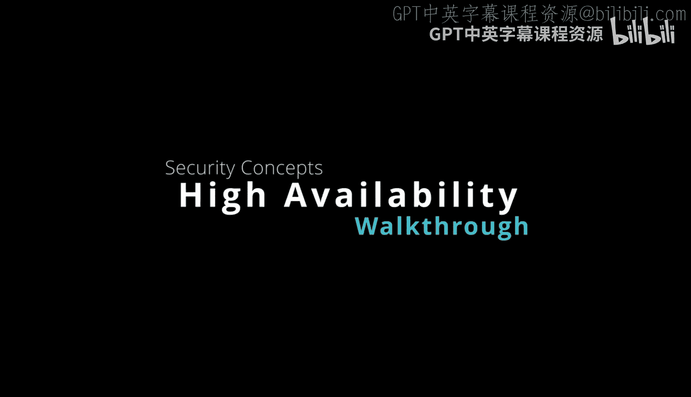
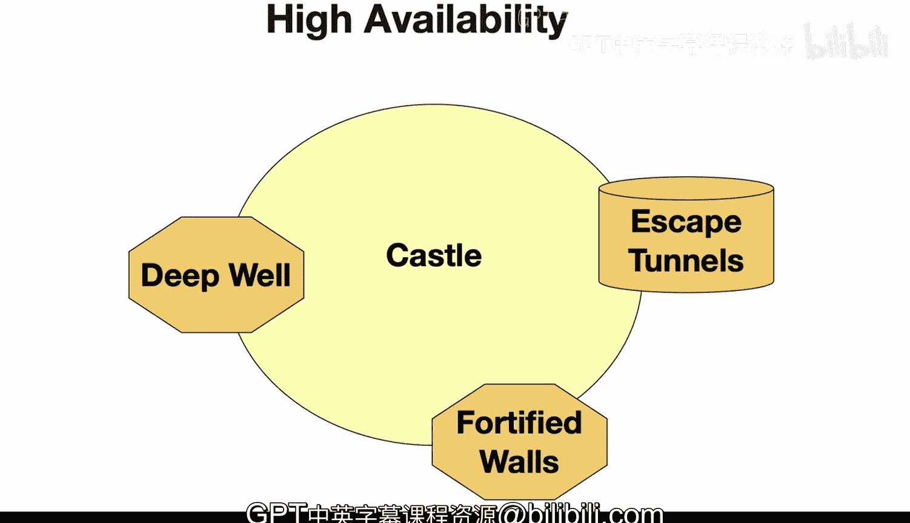

# 杜克大学《Rust编程2-3（数据工程、DevOps）｜Rust programming》中英字幕 p32 32_02_02_高可用性.zh_en -BV11y411z7Dn_p32-

Here is a high availability concept for a medieval castle。

Let's take a look at some of the concepts here in terms of a secure castle。

 It would be designed for resilience。 This means that there could be fortified walls。

 So this means that even if one of the walls is temporarily compromised。

 it's fortified by other means so that it won't just topple right over。

And an escape tunnel as well as a really good way to prevent isolation。

 So let's say the castle was under siege。 There could be a secret escape tunnel that would allow people to get provisions or maybe go in a boat and go to some other location then come back。

Also， a deep well could be a way to make the castle highly available。

 because the deep well would be able to provide water， even though the castle was under siege。

 So this is really a concept here of thinking ahead of time when you're building a medieval castle。

 like what are some of the things that come up。 And how do I make sure that the castle is always available and it doesn't collapse from an attack or a siege。

 Can I get out， Can I also continue to thrive inside of the castle。

 So a computer system is very similar and that it is going to design a system that is going to really be able to respond to highavail events。

 So this could be multiple internet links to prevent connectivity loss a redundant power supply for shutdowns。

 Maybe even。A battery backup system， solar power， mirrored servers could ensure continuity if one fails and also geographic distribution of infrastructure would also be a way to limit the localized outages。

And load balancers would be spread across the different resources。

 And then when there is a scaling issue， it could elastically accommodate this spike in demand。

 So achieving high availability really means thinking about the fact that failure will occur。

Either in the case of the castle or with a computer system。

 so you don't want a single point of failure， you would eliminate them and you also want to eliminate downtime because you have some kind of failover capability。

 So for example， in the tunnel， the downtime would be that if you can't get out。

 you could really have some issues so you would design the system knowing that you could escape in terms of the backup power generator kicking in or a replicated database or anything like that。

 this is a similar concept in the computer world。 So a proper highva design would be able to whether the storm and have a safety net and with a sound architecture or your system would operate at a castle like security level and a castle like level of resilience。

