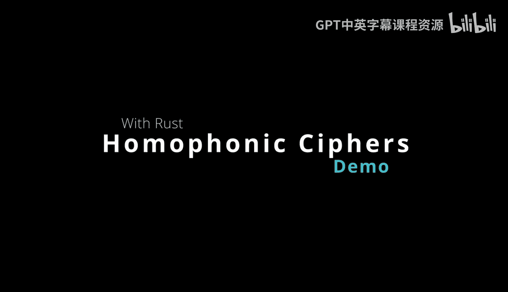
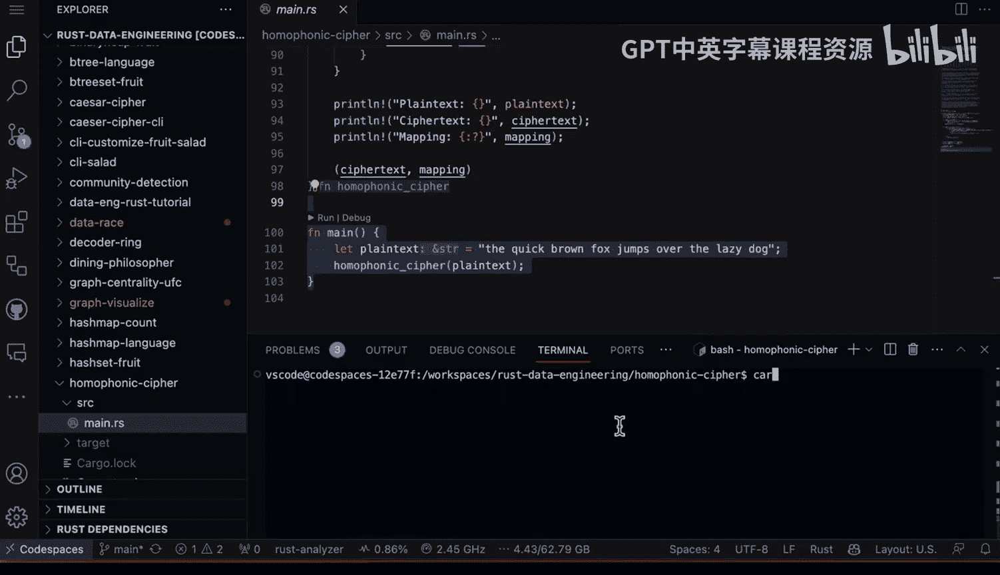

# 杜克大学《Rust编程2-3（数据工程、DevOps）｜Rust programming》中英字幕 p33 33_02_03_同音替换密码技术解析.zh_en -BV11y411z7Dn_p33-

Here we have a homophonic cipher， and this Ru code implements a homophonic cipher encryption by generating a random mapping of characters to multiple homophone substitutes。

 It prints the plain text， cipher text and mapping。

 So we have a good idea of exactly what's happening here。

 and a cipher is a method of encrypting text by substituting letters or symbols for other letters or symbols based on a scheme or algorithm。

 This is really common for royalty， you know back in。

 let's say the 1500s Mary Queen of Scots is famous for using ciphers。

 and there's a very interesting story about that as well。

 ciphers aim to make a message unreadable to anyone except the intended recipient with the secret knowledge of how to decrypt it。

 This homophonic cipher is very interesting because it creates a more secure type of encryption。

Then a simple one where you're just substituting characters to multiple homophones。

 letters that sound alike This is more ambiguous because the cipher text is harder to crack through frequency analysis because it could be one of many different letters。

 And so in summary， this is a way of demonstrating how to encrypt text in the old days by using the rust language。

 So if we go through here and we look at the ranand here。 we look at hashmap， really。

 that's all we need and we build out a function called homophonic cipher inside takes plain text。

It's going to return though this hash map and a vector as well。

 So if we go through here and we look at the random here， we look at alphabet。

 we look at ciphertext and this is pretty clever is that all you have to do is say A to Z and we're able to collect those into a vector and then we go ahead and we map those all together and then what happens is essentially we figure out some random substitutes for those particular letters and the alphabet and then we go through here and we put it all together and we push that out and we even print out the plain text。

 the ciphertext and the mapping。And at the very end。

 it actually goes through and returns back those items。 Finally。

 all we have to do is actually run the main function and put in some string that gives us the cipher。

 So if we go through here and we write cargo run。

This is going to go through a build it。 And then we can see here that the plain text was the quick brown fox jumps over the lazy dog。

 The ciphert is all gibberish， but we can see here that there's mappings here where each of these letters that is substituted here has。

 you basically different pairs that could be mapped exactly to that particular letters。

 So it makes it a little bit more difficult because it's not necessarily a one to one mapping etc cea。

 it's actually one of many different mapping。 So this is a great way to play around with ciphers and encryption is to use rust。

 it's pretty straightforward。Also， if we go through here and we look at the documentation。

 we can even see a little bit more information it generates a list of random homophones for each lowercase letter in the English alphabet and maps those and you can see here's an example of what's happening and you can see that the mapping T is part of the homophonic cipher mapping from plain text characters to their cipher characters and in this exact example here。

 the plain text character T can be represented by either a Q and a or a V。

 So this makes it more ambiguous about you what is actually happening a little bit more difficult to do frequency analysis because there's some letters that show up a lot more frequently。

 and so that makes it harder to break comparing this to。

 let's say something really simple where you just substitute an A for a Z or a B for an A or something like that。

