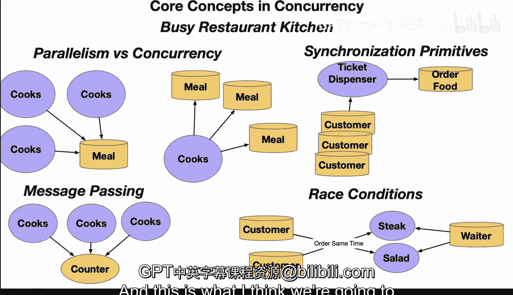

# 杜克大学《Rust编程2-3（数据工程、DevOps）｜Rust programming》中英字幕 p39 39_02_02_并发核心概念.zh_en -BV11y411z7Dn_p39-

Yeah。Let's take a look at some of the core concepts in concurrency by using a busy restaurant kitchen as an example。

 There's four key concepts here。 First up， we have parallelism versus concurrency。

 Second synchronization primitives， third message passing and fourth race conditions。

 So if we take a look at the first one here， parallelism versus concurrency。

 let's take how a multiple cooked scenario could really increase the parallelism versus a single cook that has multitasking between different dishes。

 This would be concurrency。 So in the parallelism example here。

 each of the cooks could really make one part of the meal。 So one cook cook a steak。

 one could cook mashed potatoes， another one could cook a salad and once they prepare that meal together。

 that's the finished level of parallelism with concurrency here with a cook。

 the same cook would potentially put a steak on the grill。

Go ahead and stir up some mashed potatoes and then start to chop up the salad。

 And so that one cook could be highly utilized for that specific meal in the other scenario with the multiple cooks。

 Each of the cooks actually could be preparing you know。

 several different steak dishes at the same time。 So really。

 there are two different concepts when you're thinking about parallelism versus concurrency。

 Next step， we have synchronization primitives and a good way to describe this would be a ticket dispenser that makes a customer line up and take a number in order to be served。

 And this would avoid making a bunch of crowding at the counter and would even limit the amount of people that would actually go into the dining room。

What happens here is that the tickets dispenser is the synchronization。

 So each of the customers gets a ticket and they're only called when there's room in the dinner area for people to sit and also when the cashier is actually available than you're able to actually order the food。

 So this is really similar to many other types of concurrency problems in the real world and that you maybe put work inside of a queue and each of the threads would actually grab one of the items at a time。

 and then that queue is actually the thing that's locking things up in terms of message passing。

 this is also a core concept in concurrency is that there are different stations but maybe theres a grill。

 there's a fryer， you know there's the salad section and these are loosely coupled So they're not really working together but they do communicate because when they're done。

 they put the thing that they produced onto the counter and then。

Go ahead and you know the waiter will come by and pick up each of those separate items so really this is the counter as a form of message passing so once you know that there's something on the counter you know that that particular job is done but they don't necessarily even need to communicate with each other other than to grab that order initially。

Likewise， a race condition is something that does happen and has to be protective against and one of the things that could come up。

Is there's two customers that order at the same time。 If you're lazy， you just always， you know。

 assume that， you know， that because you put your order in at the same time as another waiter in the restaurant that as soon as the food is out。

 you just give it to the customer。 But in a situation where there's two customers that simultaneously order。

There could actually be a race condition where the waiter could bring the wrong food to the wrong customer。

 And this does actually happen in the real world。 So the concept here is that you do have to protect against race conditions by maybe using synchronization or message passing or some other technique to avoid those kind of interaction。

 So really multiple cooks show parallelism。 a ticket dispenser would enforce order synchronization passing orders between stations would demonstrate message passing。

 and then finally customers would have potentially concurrency risks if there's mixedstep orders with race conditions。

 So you can see these you situations come up quite a bit in programming。

 And that's why languages like rust are so powerful because they prevent some of these things from happening more easily。

 And this is what I think we're going to see with modern compiled languages。

