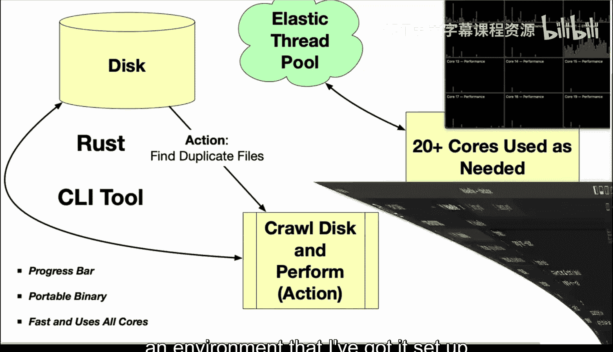
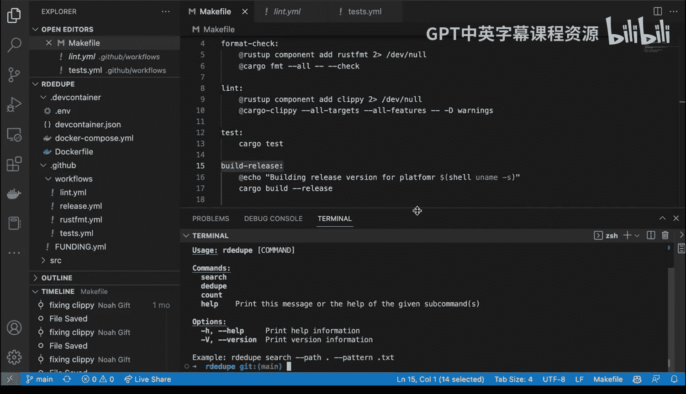
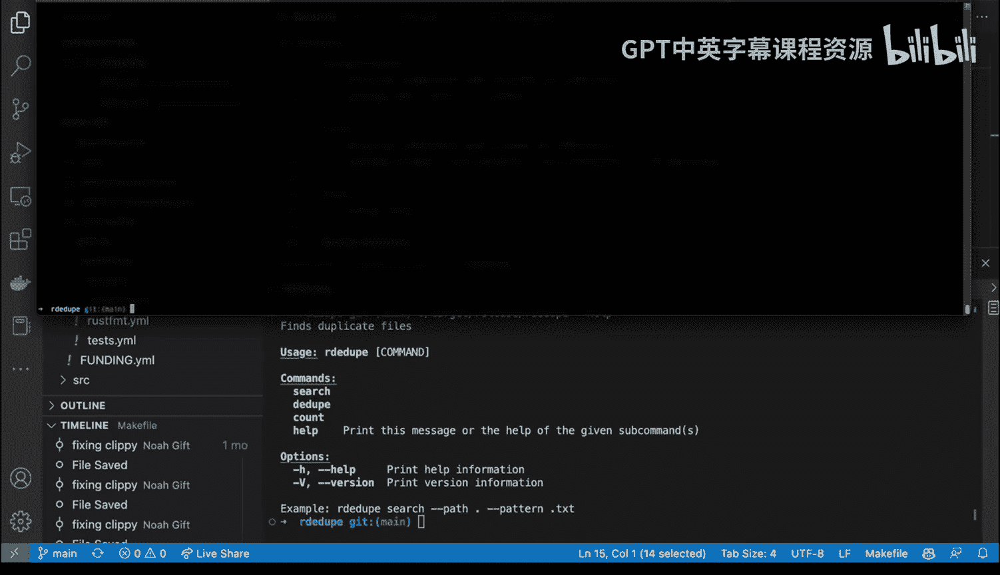
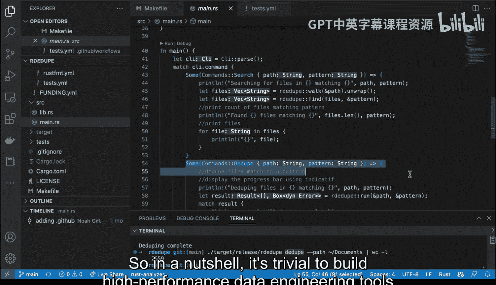

# 杜克大学《Rust编程2-3（数据工程、DevOps）｜Rust programming》中英字幕 p43 43_02_06_Rust多线程去重实现.zh_en -BV11y411z7Dn_p43-

Let's talk a little bit about data engineering in my opinion。

 data engineering is the classic systems programming problem and rusts is a systems programming language a lot of my career。

 I've worked with building kmelan tools that would do some kind of data operation like moving thousands of files somewhere or using a petabyte scale file server to build movies。

 for example， when I worked on avatar or Sony movies or Disney movies but when I see something like rusts what's so exciting about it is that you can build things that are multi-threaded。

Efficient， use low memoryory and also build portable responsive technology。 So really。

 that's the key thing that you get with rust versus a scripting language is your ability to build high performance tools。

 Now， the question is， is it too difficult to do。 what I'm going to show you is how to build a deduplication tool。

 you can actually， replace the deduplication and put in whatever else you want， for example。

 you know archiving or transforming data。 But this is really a classic data engineering problem。

 I'm going to show you how to do it step by step with rust。 All right， let's go and get started。

 here I have a repo called NoAgi R Ddupe。 And if we take a look at this， in my opinion。

 this is a pretty good example of a systems programming tool for data engineering。

 Or if you wanted to do some kind of ML ops type tool You could use a similar pattern。

 Let's walk through what I would consider， are the core competencies necessary。 First step。

 I like to do dev have container here。 You can see I've got this。

Configured so that if I wanted to share this project with someone else， they could just spin it up。

 do some kind of testing inside of this container。 Next up， I also configured Github。

 if we take a look at this， I have a li right here。

 and this shows you that you can just do a make Li and this will link the code every time I make a change we can all do also do a release and this is something that's really cool。

 I can build a high performance binary and share it with the world。

 I also can format my code so I can check to make sure that my code is formatted properly and then finally I can run some tests that make sure that I'm not introducing business logic problems。

 and then inside of my project， look， I put links to all of this。

 So this is really what I would recommend is this style for building binaries that are high performance and also that you deliver the binary to other people so they can just download it This is a huge advantage over Python where you can't distribute binaries and you have to give people explicit instructions on how to install software。

Next up， let's take a look at this diagram here。And rust， as I mentioned。

 is a systems programming language for data engineering。 And one of the key things here that's very。

 very different than Python is that if you had， for example， a petabyte file server。

 which is very common or you used Amazon EFS。 One of the things that you care about is the ability to efficiently used memory and have high performance code。

 We know that Rus can be know 70 times faster than Python and it also has extremely low memory usage because it's sharing memory when you spawn threads。

 So what we want to do is if I'm running something on my 20 core Mac， I want to use all of the cores。

 I don't want to use one of the cores and just be kind of thrashing back and forth here。😊。

And I also want to have some kind of action that is going to use a progress bar。

 I want to distribute my portable binary。 And I also want it to be very。

 very fast and efficient so that I can build high performance data engineering tools。

 So that's really the goal here。 So let's go ahead and now shiftft gears here。

 And let's take a look at in environment that I've got it set up locally here。

That we can walk through and take a look at the code。 So first step inside of this project。

 I have a make file。 I always like to have make files。

 And if we go through here and we just say make format。

I constantly am doing reformatting while I run things， and I'll do make Lnt as well。

 I constantly want to run run through， make sure that lintting is passed。

 And that's a huge advantage of this ecosystem。 The other one。 that's a big one I this one。

 make build release。 And what happens is it'll build an optimized binary。

 So I can just distribute this to other people。 And it's set up to be a very high performance tool。

 Let's go ahead and do that。 Let's go ahead and say， make build。Make build release。There we go。

 It made a high performance binaryr。 Now， how do I use this easy。

 All we have to do is go over to the target， right， and we can navigate to the release。

And then the executable is right there， right R D dupe。 And then I can just play around with it。

 So let's go ahead and try this out。 We'll say help。 look at this。 It gives me a menu right here。

 And what's what's cool about this is that I can actually bring over a shell and just transpose it right here and we can actually take a look at this thing in action。

 So if I go through and I say each top， for example， and I look at all the chords。

 you can see things are relatively calm right now， But if I wanted to navigate back and forth here。

 What I could do is is is go back and forth between。😊。

The shell environment and what's happening。 So I'm going to go ahead and say， you know， R D dupe。

Here， and will say。Ddupe， and this will look through some path that I set。

 and I'll go ahead and say path。Let's look at my documents directory。And then if I wanted to。

 I could even put， you know， some kind of a delimiter to search for movie files or whatever。

 But the main takeaway is that I run it。And we've got this really high performance tool that shows me how many files It gives me a nice little progress bar here。

 And then it's going to go through and do a bunch of check sums。 Now。

 if I go back to my environment here， look at this。

 you can see it's using all of the cores and we can even see that is actually extremely memory efficient at the same time。

 And there we go， I've been able to do that。 Now， if I want to go through and do a word count L。

 we could even count know how many duplicate files that I had。 But again。

 the key takeaway here is that I'm able to actually use actually all of the cores。

 but in an extremely efficient way in extremely low memory because of how powerful and efficient threads are versus processes。

 And you can see in this particular directory， there's 2500 files that are duplicates。

 And I could do other things that if if I cared about manipulating those those duplicates。

 But this is really the big takeaway is that you can build high performance system tools that are memory efficient。

😊，Let's go ahead and walk through the code real quick。

 And you can see it's actually very straightforward。

 I like this pattern of Lib where I put in all of my logic in the library。

 and then I execute it against the commandlan tool。

 I think this pattern is is ideal for data engineering。

 So I go through here and I load some cargo imports here。 And if we go through here we look at cargo。

 You can see that I have my development of armment。 And then I have my production of armment。

 And this is a commandlan tool。 This allows me to walk directories。 This allows me to check some。

 This is an efficient thread pool。 and this is a progress bar。😊。

That actually interacts with a thread pool。 So you can see this pattern is very usable for other tools。

If we go to the lib file here。Here's the code that walks her directory。

 doesn't look that much different from Python。 It accepts a path。

 which is a string and returns back a vector of strings。 Next up， I rear a little bit of code。

 So if I want to do pattern matching again， it goes through here and it does pattern matching。

 And again， very tiny a bit of code。 not that much different from Python。

We also want to go through and do a checkum and inside of this code a little more complex。

 but not too bad。 notice that what I do here is I say build a checkum。

 but I also have a progress bar and we see that right there， and then at the very end。

 we actually pass in all of those into the result， which is a dictionary that is actually returned。

 and finally we look inside of that dictionary and we make sure that if there's more than one file that has the same checkum。

 then we report it And this is the end result here as I tee it all together。

 So how do I then execute this， I go to the main file。I have boilerp code here at the very beginning。

 And really， the only thing that's important is these mappings。

 So I just say here's a search command。 Here's a Ddupe command。 and here's count command。

 And then over here， I map it all together。 So I think this pattern is very。

 very usable to build extremely powerful tools that are memory efficient。 And again。

 we can see that that Ddupe command。😊，Maps exactly to this。 So in a nutshell。

 it's trivial to build high performance data engineering tools with rust。

 And hope you give this a try。

