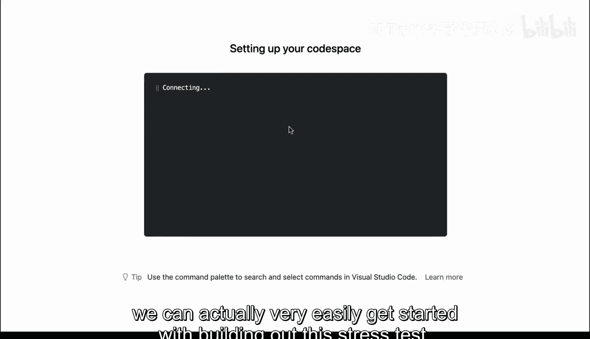
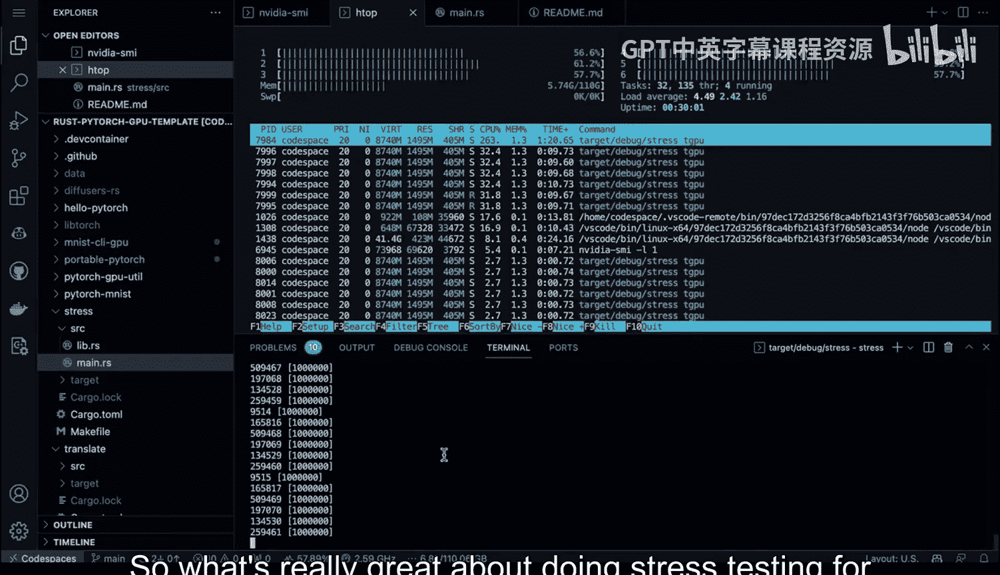

# 杜克大学《Rust编程2-3（数据工程、DevOps）｜Rust programming》中英字幕 p45 45_02_08_GPU并发压力测试.zh_en -BV11y411z7Dn_p45-

One of the more powerful ways to use rust is to build a systems tool that talks to a GPU。

 Fortunatelyly because Pytorrch binding work so well with rust。

 what I'm going to do is piece together a tool that can not only talk to the CPU and saturated via Pytorrch。

 but also can talk to a coup to enabled GPU saturated it with Pytorrch and then use some of the advantages of rust。

 which is the true cores that allows you to spawn a pool of threads and then send data into a GPU to try to get the most out of it in terms of a stress test。

 let's go and build that tool in just a few seconds。

Let's take a look at the architecture of how you could build a stress test tool for a coa enabled GPU by using the systems programming capabilities of rust and。

The helpful rust Pytor bindings。 First step， we have to have access to a coa enabled GPU with Github code spaces。

 That's one way to do it。 It could also be a Aws instance or GCP instance or an Azure instance。

 we then configure NviDdia SMmi monitoring。 So next up。

 we look at how the GPU is being able to be utilized during our stress testing and we hook together the rust pytor bindings。

 Once those rust pytor bindings are enabled。 Then I build together a rust kmelan tool。

 and I have three different ways that I execute my stress test。 I have a CPU。

 a GPU and then I use the true thread and the powerful multithreaded but memory efficient capabilities of rayon and I shove data into a GPU in a multithreaded fashion to do a full stress test。

 All right， let's go ahead and get started。 Okay， let's go ahead and get open this environment here。

 I'm going to go ahead and launch it and we can actually very。

eaasily get started with building out this stress test and some of the things to take care of right out of the way is to make sure that we've got the correct cargo structure set up that's really one of the key takeaways here。

And it's probably easy to go through and first run this to see how it works。

 And then we can see what are the changes we want to make in the future。

 So here I have a translate app。 that's one， and also have a stress app。

 I'm going to go ahead and use the stress one and this one is pretty interesting because if we look at the cargo file。

 we're using three dependencies。 First step， we have the Cammele tool。 Second。

 we have the pytorch bindings for rust。 and then we have rayon。

 which allows us to do multithreaded code。 that's all I have to do to build this stress test tool Next step。

 I again use this pattern。 My library code lives in Lib dos and my Cammelan tool lives in Maine。

 let's go ahead and take a look at the library code first here inside of the library code we have functions that are built and each function is quite simple。

 So I have the rayon imports， I have the Tensorflow imports。 but if we look at this。

 you can see that I build。Load test and all it's doing is sending a vector into the device。

 in this case， it's a CPU and it's going to print out what's happening In this case I build a GPU load test function so we just change the device so we say look I want to actually iterate into this couda device and then finally all I need to do to change it to have a multithreaded version of this is just use this into par iter for each op and then throw that into the kuda device as well so。

What's really cool about this is we have three completely different ways to actually utilize testing。

 Now， all I need to do is go over to my main。 And again， it's the exact same pattern。

 This is essentially boiler play code。😊，Here's the stuff that matters。 I build out a CPU subcomd。

 I build out a GPU subcommand， and then I build out a T GPU subcomd for multi threadreaded。 And look。

 I just map each one of those to the library code。 So this pattern is so powerful because you build just a few lines of code in a library and then you map that those functions into here。

 The only other thing you have to do to be aware of is make sure that these are each pub Once you've done that。

 you're good to go。 Now， all I need to do to run this is is go ahead and run cargo。

So let's go ahead and build that， we'll say cargo and then say dash dash help。

And we can say cargo run。Help。And this will go through and compile it again。

And it'll give us a help menu which will correspond directly to each of these commands， the CPU。

 the GPU and the Q GPU， and that's exactly what we see。Now。

 one of the things that's really helpful is to do two kinds of monitoring。 First up。

 let's go ahead and do age top， and let's go ahead and take a look at the。CPU here。

 So if we go through here and we look at the CPU and I run cargo run。And I say CPU。

 what's going to happen is it's going to throw a bunch of data into the CPUs and look。

 you can see it's saturated right now， if I go over to the GPU monitoring。

 you'll see nothing's happening。Right so this is a great way to understand what's going on with your code right we know that we're using the CPU device。

 So no traffic is going to the GPU。 So next， what I'm going to do is now we're going to change gears here。

 You can see it stopped and I'm going to go through and I'm going to say， okay。

 let's go to the GPU Now what happens when you go to the GPU。

 We do a GPU stress test and lo and behold。 it's going to send a bunch of data into the GPU。😊。

We'll be able to see it by toggling right here and you'll see this thing getting saturated。 Now。

 it only really gets up to， let's say， a quarter of the load。

 And if we look at the the threads here as well， They're still being utilized。

 So basically the cores are still being utilized， but some traffic as well as being sent to the GPU Now。

 can we do better than this， can we get this load higher。 if we really want to stress test things。

 Well we can。 And that's where the threaded GPU comes into play。

And now is the code I wrote earlier that uses rayon and now let's take a look at this。 There we go。

 So we've been able to actually over more than double the load that's getting sent to the GPU right it was really around like 2025%。

 So let's say it's been two to three times more load。

 And now if we look at the CPU check this out notice how it's actually reduce the load of the CPU。

 So you can see here once you start putting enough traffic into a GPU。

 it's actually a great way to offload some of the resources on your system。

 So what's really great about doing stress testing for a tool like this is to really get a feel for what's happening in your environment unless you do a benchmark。

 you really don't know what's happening， especially in a distributed computing problem like doing Pytorch training on a GPU and you can see here rust is the perfect tool to do training to do inference to build portable binary tools and really a rust is the systems tool that。

Is an ideal tool for MLOs。