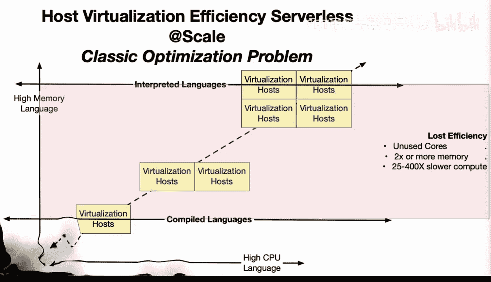

# 杜克大学《Rust编程2-3（数据工程、DevOps）｜Rust programming》中英字幕 p46 46_02_09_无服务器优化的主机能效问题.zh_en -BV11y411z7Dn_p46-

Let's talk through some of the key problems with host virtualization efficiency in serverless technology as well as virtual machines。

 you'll see this problem。 And in a sense， it's a classic business school type optimization problem where you have a set of requirements for a solution you're trying to build and you have you know to fit the best possible solution into the limited things that you have。

 And so in the case of virtualization host， they do come in default flavor。 So， for example。

 there could be a two core machine with you know a certain amount of memory or a four corere machine with a certain amount of memory。

 Now the problem is if by default， your language or your solution uses a lot of memory like many interpreted languages like Ruby and Python。

 then already at the very beginning， you're going to be given a machine that has potentially more memory and more cores than。

Compiled language。 So you're really losing efficiency even from the very beginning by using a high memory language。

 And a lot of times they associate high memory with high cores。 So let's say that。

You're building something that doesn't need a multi threaded solution or doesn't need。

 you know multiple cores。 But because your solution requires so much memory， you're given for cores。

 So you're essentially having three cores idle doing absolutely nothing。 And that could cause。

 you know， huge cost inefficiencies in the solution。 So in nutshell。

 let's take a look at maybe a more specific example。

 which is rest and Python efficiency and serverless for， let's say， AWs Lada。

A Lambda in rust could use a smaller memory allocation like 128 megabytes versus 512。

 and this is because you have a lower memory footprint。

 also Python Ladas are limited to certain executions because of gill。

 but rust can actually scale with pure threads， so you're going to be able to use threads as a solution by default。

Another issue is the rust start time is a lot faster than Python because it's already compiled。

 and interpreters introduce a slowness。 And this also benefits the slow starts in a serverless solution。

 and also Python multi processing to use cores， causes much more memory over it， so。

It isn't a one to one solution。Also， rust threads use a lot less memory than Python processes。

 and Python garbage collection can pause， and this can cause latency spikes where rust has a predictable performance because of the way it's built。

 and also rust lambdas can achieve near native performance So basically sea level performance where you know machine code level performance。

 but Python itself is limited by the interpreter。And also。

 the rust compiler is going to enforce the thread safety。 So if you do have to use threads。

 you're going to get safety as well as a low runtime over at。 So in summary here。

 if we want to wrap this up， there is a smaller memory allocation for rust AW slam does。

 There's better scale with threads versus Python Gi limits。 There's faster Colstar times。

 There's lower memory usage for rust threads。 There's also more predictable performance。

 and you've got near native speed versus Python interpreter over at。 So in many scenarios。

 it would not be in a organization's best interest to be doing things with serverless by default with Python because of these issues。

