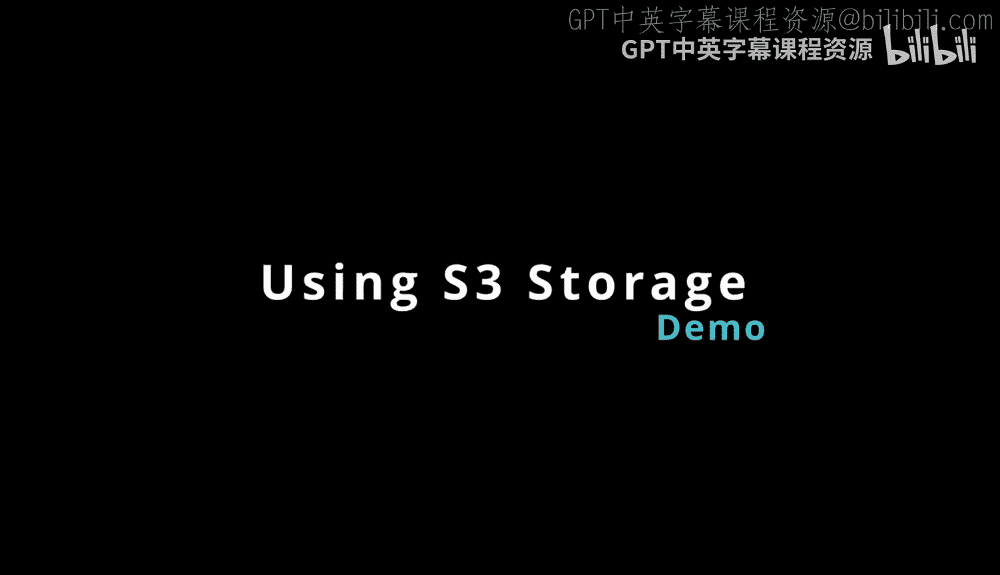
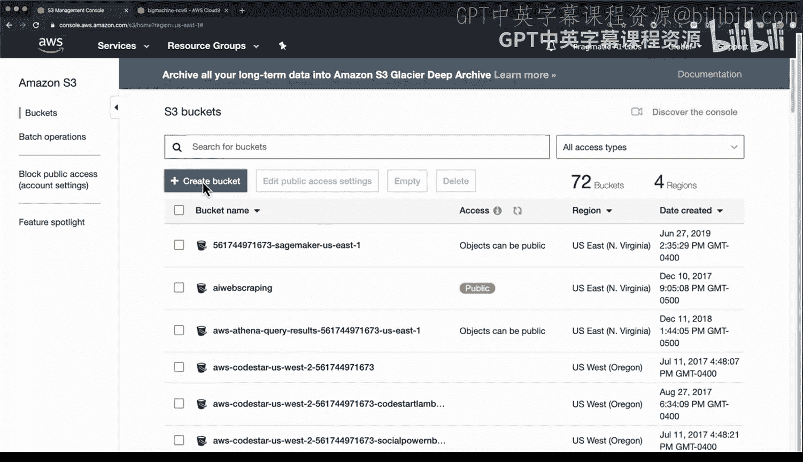
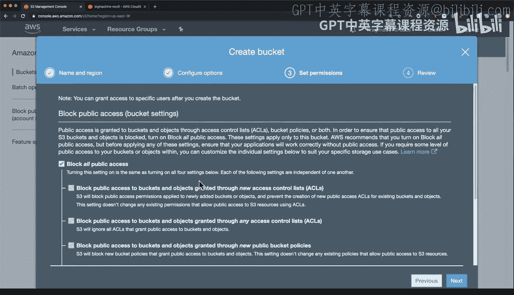
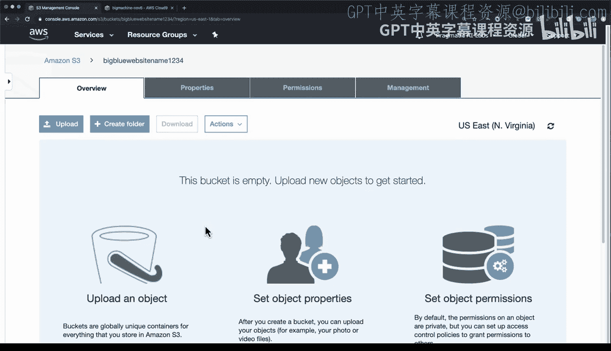
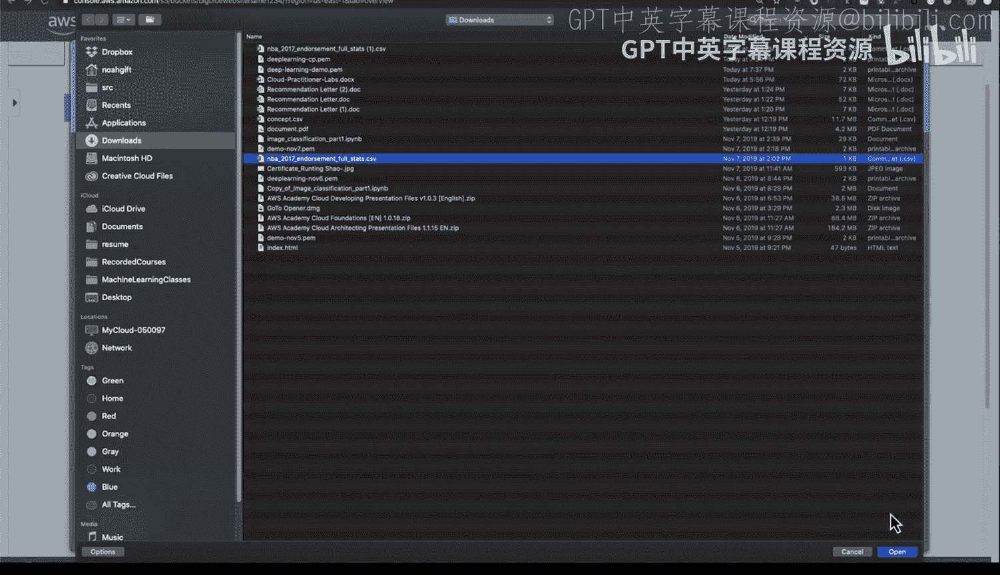
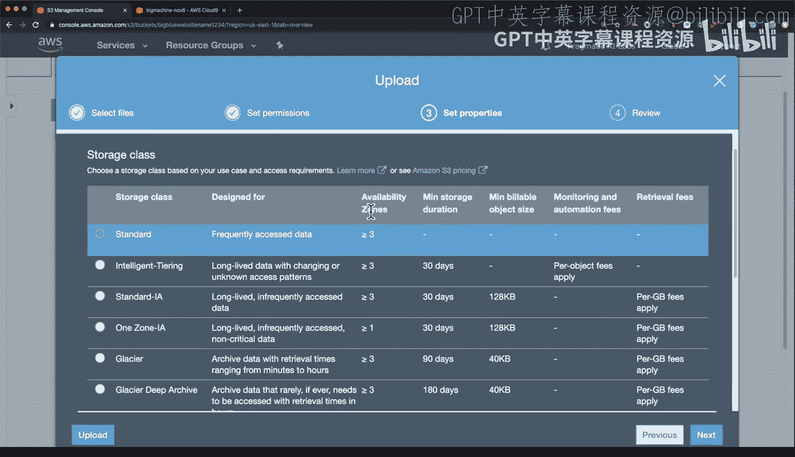
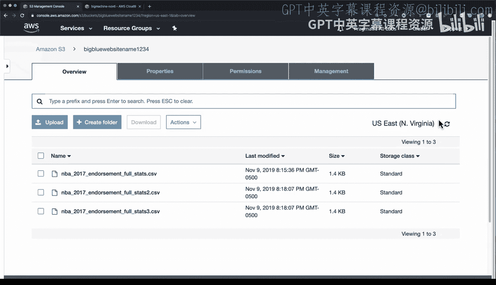

# 杜克大学《Rust编程2-3（数据工程、DevOps）｜Rust programming》中英字幕 p50 50_03_05_AWS S3存储使用.zh_en -BV11y411z7Dn_p50-

Okay， we're back at the AWS management console and what we're going to do is demo how to get data into S3。

 how to synchronize it and how to move it back and forth really S3 is a work course for doing operations especially if let's say you're data scientist。

 data engineer working in a data science program or just need to do something with a lot of data it's important to know how to use S3 So to start with let's go over to S3 and we'll just type in the word S3 here there we go。

Step1， we need to create a new bucket。 And again， remember that these buckets have a unique name。

 So what we're going to do here is we're going to say a weird name here。 So we'll say big。

Blue website name 1， two，3，4， just for the sake of this demo。

And now what I'm going to do is I'm going to put that in text editor so I can get it later。

 and then I'm going to go through here and just leave everything by default Great， that looks good。

And in this case I don't want to do a website， so I'm going to leave everything private。

 so that way no one can access it except for my account so now that I've got that I've got this big blue website name bucket here。

 how do I get data in there Well one of the ways I can do it is just uploading it literally so I'm going to go here and'm going to upload a file。

Just some random file， here we go， NBA endorsement data that looks like a good file to put in there great。

 I've uploaded that next year。

I'm gonna to leave everything by default because I don't want anyone to have access and I'll leave it as a standard piece of data so this will be available and multiple availability zones and' I don't have to change anything So let's go ahead and upload that and immediately you can see now have access to it So that's one of the really powerful things about S3 is it's an infinite storage system This could be deep learning training data could be SQL files。

 it could be you know customer data could be whatever it is you need we've got it pretty easy setup up。

 Now how do I connect to that and move things around and again， this is an infinite storage machine。

 So how do I get more data in there。 Well to do that。 I'm going to again go to cloud 9 environment。

And in cloud9， what I'm going to do is I'm going to use a command to synchronize that data locally。

 so I'm going to type in AWS S3 syncnc。And then I'm going to put in the name of that bucket。

 So it's going to be S3。And the name of that bucket that was created was big blue website name 12，34。

 and what I can do here is just do dot。And but actually before I do that。

 why don't I create a directory and we'll call make this directory files here。

 I'll seed into this files directory and you can see it's been created right there and then I can go through and run that command and you notice how I put a hashtag right there。

 that's a good way to save a command so you can use it again。

And then I'll use dot and what this does is it puts it in my current working directory。There we go。

 And you can see that that file is already been loaded there。 And in fact。

 I can now inspect it inside of this cloud 9 environment。

 You can see that it's got some CSV data inside。 So how would I get data back and forth and you know。

 work on things Well， pretty pretty easy Now， if I wanted to。

I can actually make another copy of this file here， let's go through here and we'll make this。

We'll make maybe there's one file， let's make two files here great now I've got a couple files。

 well this could be gigabytes of data or terabytes of data back and forth depending on what machine I'm on。

To get it back over there， I just run that same sync command。

 And what this does is it's going to now make sure that that bucket has all of the latest data。

 There we go。 And so that's a one way sync。 But what if I want to sync it the other direction。

 So all I all I got to do is just swap these two things， let's sync it the other way。

 let's sync what's in this current working directory。To that directory。

There we go and you can see it's very quick。 it's been able to upload those new files。

 and if I do a refresher， we've got these two new files in there。

 so really powerful workflow to create buckets， put things in there， upload them by hand。

 then open up cloud 9， use the command line tools and you can get access to those files and go back and forth using the S command。

 very， very powerful workflow， especially if you work heavily with data。

