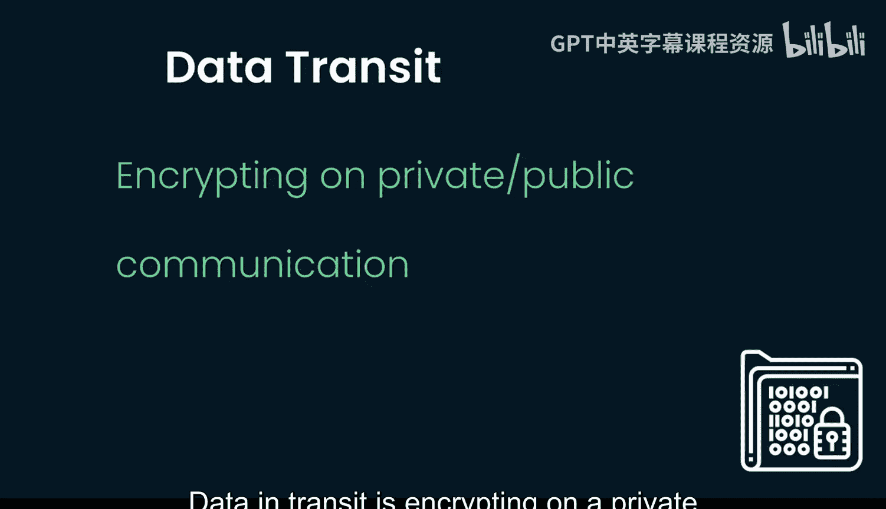
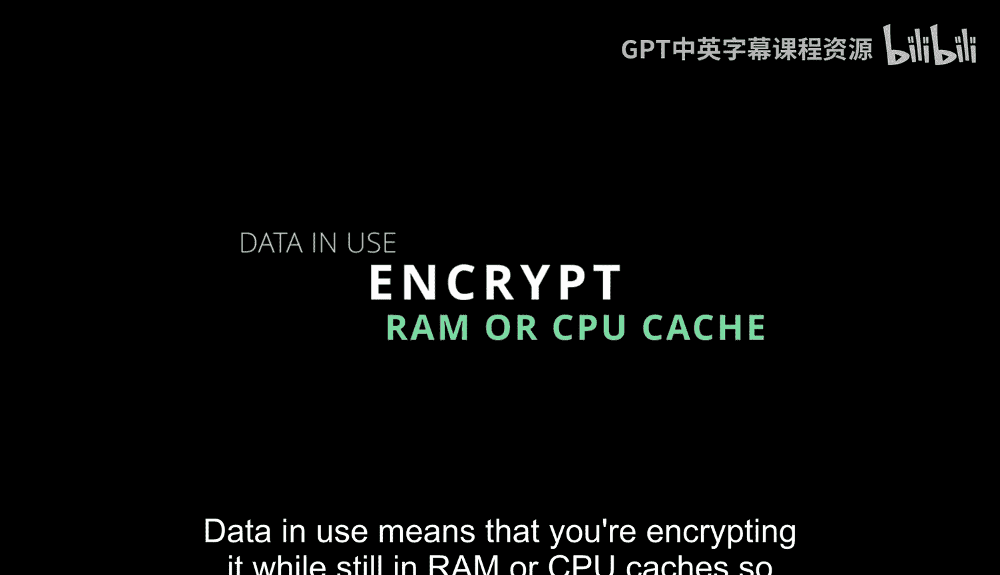
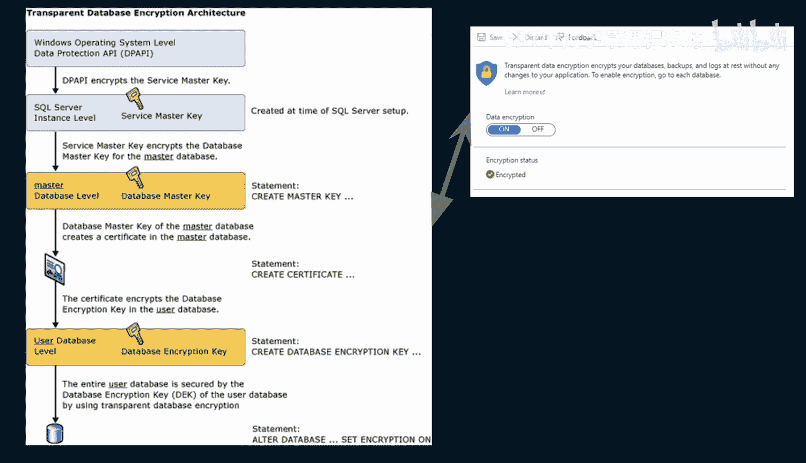
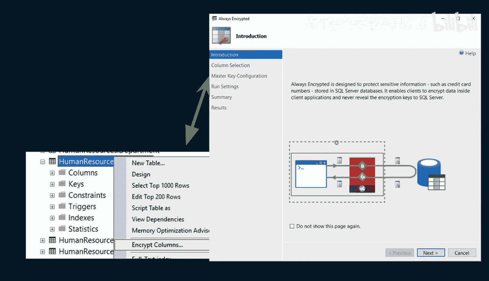
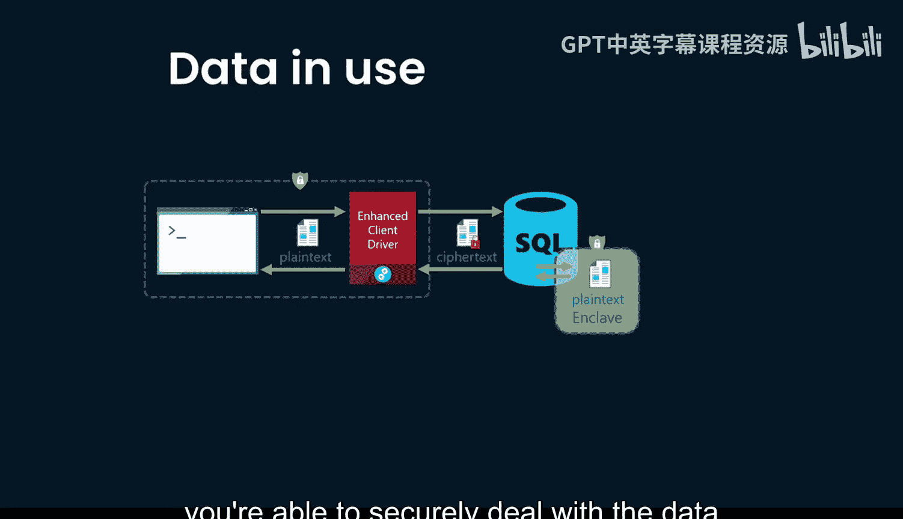
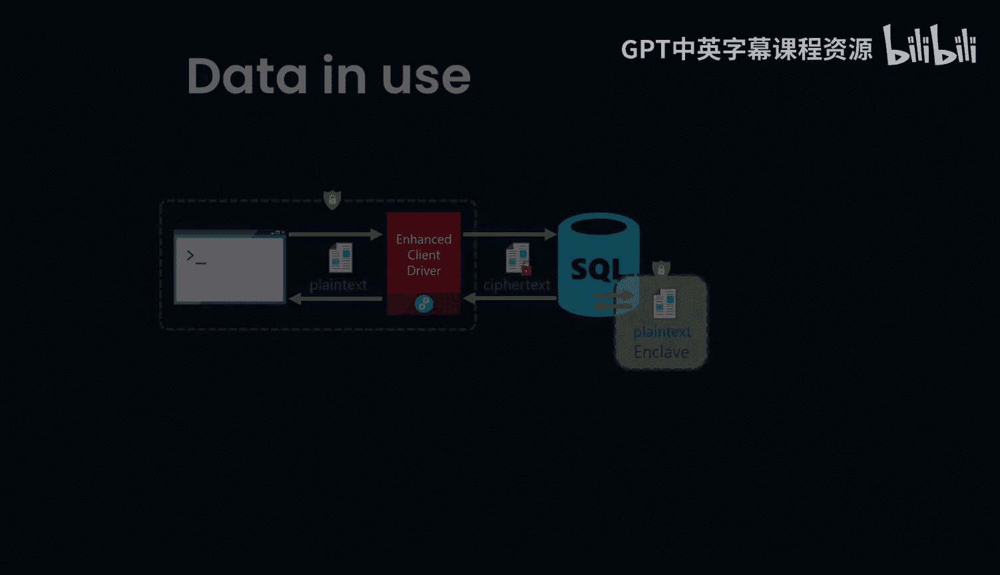

# 杜克大学《Rust编程2-3（数据工程、DevOps）｜Rust programming》中英字幕 p52 52_03_07_加密数据写入表格或Parquet文件.zh_en -BV11y411z7Dn_p52-

Writing crypted data to both tables or parquet files， let's talk about some of the techniques。First。

 data at rest is an important concept to be aware of。

 it means that you're encrypting it while it's already on the file system or in a database somewhere。

Da and transitit is encrypting on a private or public communication channel。

 so you're ensuring that while it's moved， it's still secure。

Data and use means that you're encrypting it while still in Ram or CPU caches so that someone can't intercept it if they have access to that machine。

Here's a good example of transparent database encryption architecture， the Windows operating system。

 Data protection API or DP API would encrypt the service master key from there it would actually go through and use that for the database and then at the user level。

 they also could use that same database encryption key how this enabled well through transparent data encryption your database。

 the backups and the logs are all able to be encrypted through your application。

 so really this is just a toggle on or off inside of the Azure database。

Now， if you take a look at a database column here as well。

 you could say that I want to encrypt a particular column and when you have always encrypted。

 it can then design things so that they're sensitive information and would it stored in a SQL server database。

 it would enable clients to encrypt the data inside the client application and it would never be revealed via the keys to the SQL server。

Finally， what this means is that when the data is actually in use in memory itself。

 you wouldn't need to worry about the data being secured。

Because it's done through the secure enclave and this is something that is part of the ecosystem of Azure with SQL。

 you have an enhanced client driver， there's plain text， theres cipher textex。

 and both in the rest in the transit and then also when it's used you're able to securely deal with the data as long as you're using these controls。

