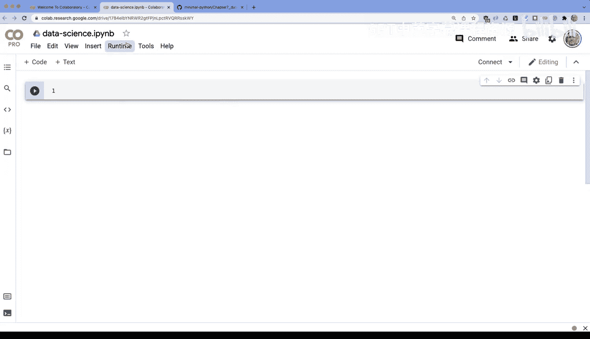
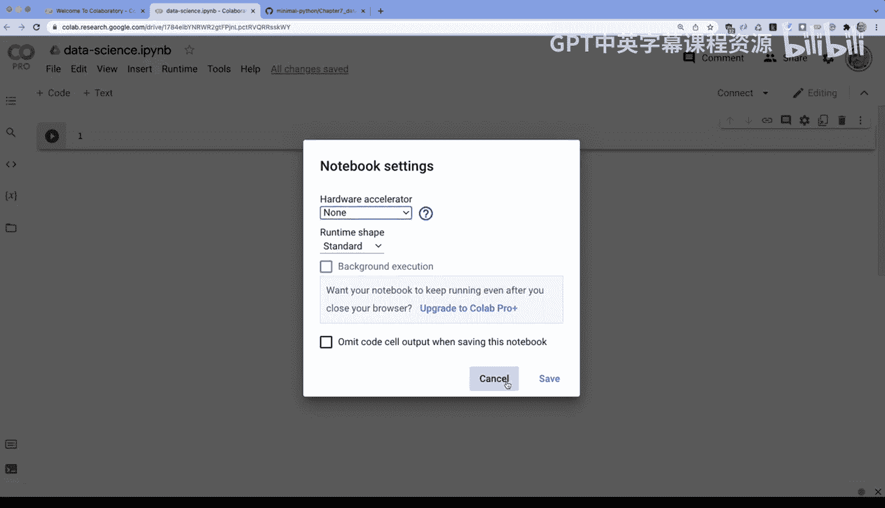
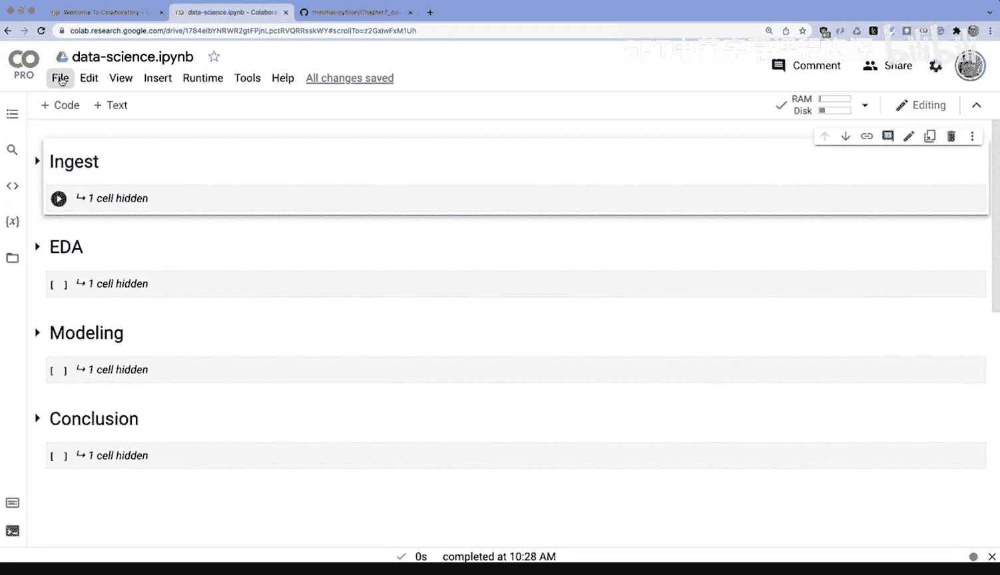
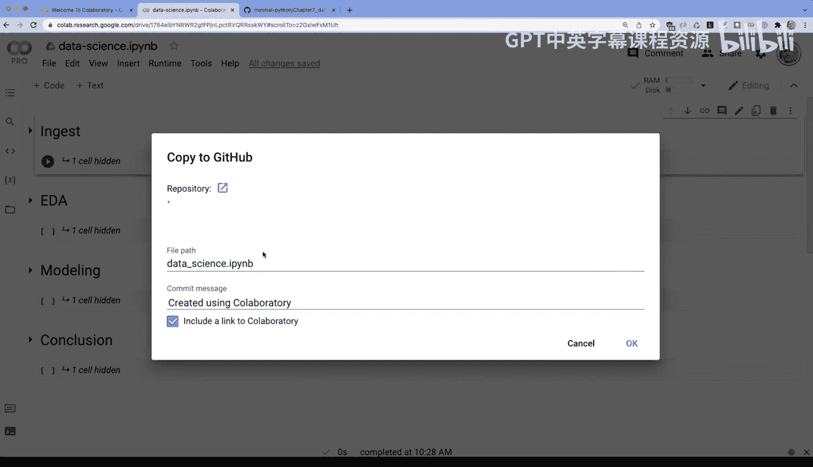
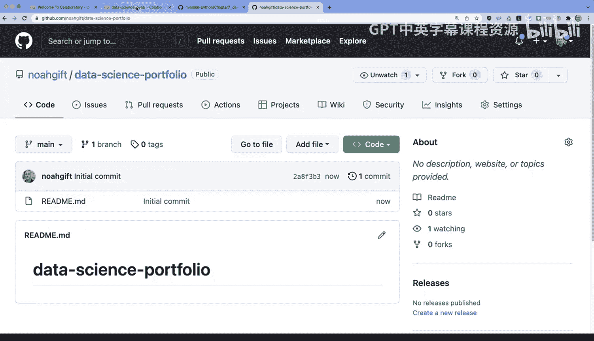
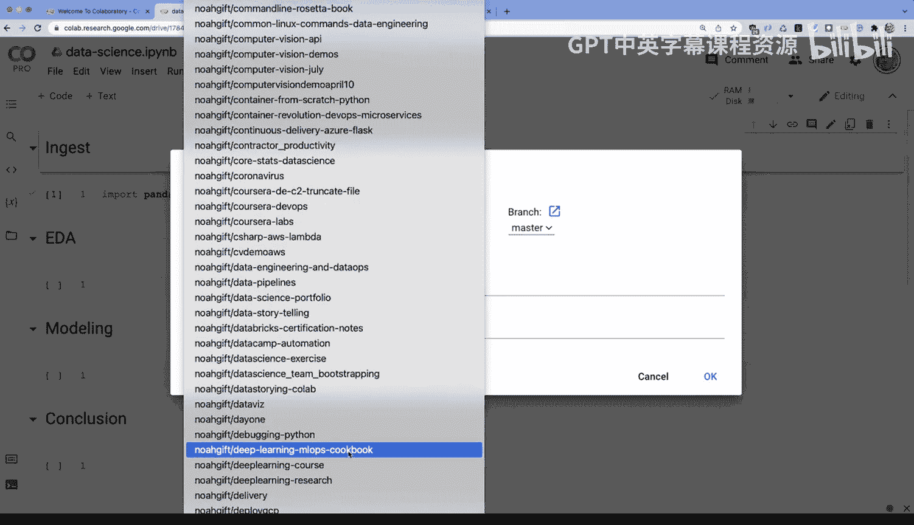
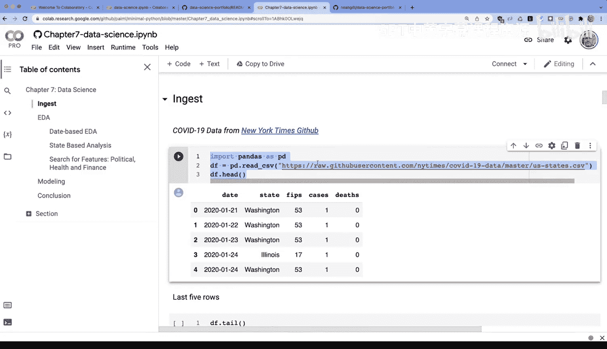
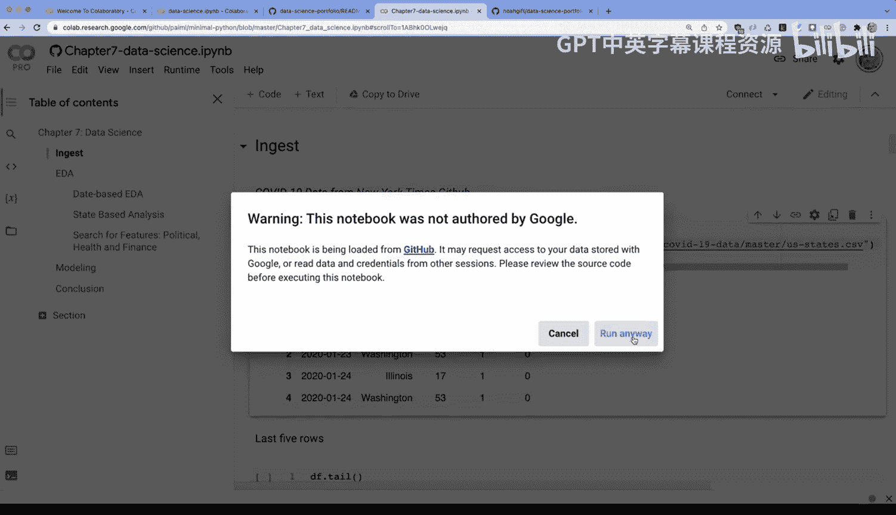
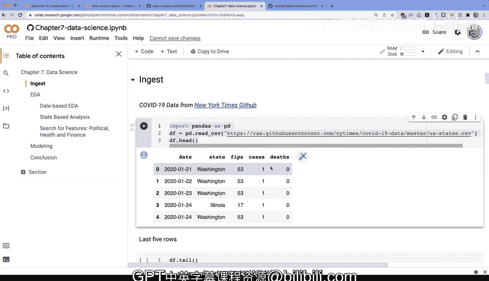

# 杜克大学《Rust编程2-3（数据工程、DevOps）｜Rust programming》中英字幕 p53 53_03_02_Colab平台介绍.zh_en -BV11y411z7Dn_p53-

Let's dive into how to use Google coabab notebooks for data science projects， portfolio projects。

 You can see here this is the default screen， and it gives you a good set of instructions for how to use it worth taking a look at The first thing I'm going to do though is show you how to create a new coab notebook。

 so we'll say file new notebook。 it goes ahead and it creates a empty blank template。

 A couple things to point out here is that you can name this something。

 So I'll go ahead and call this data science。And then what's nice about this naming structure is that it can be very related to a project that you're working on and you can name it in a way that other people understand what this notebook's about。

The other thing to point out is under runtime here you can actually change your runtime so you can use GPUs if you have the pro version。

 you get more high performance GPUs， you can also use TUs as well so there's a lot to like about both the pro and the regular environment and it really can be helpful in using this as a hosted runtime The other thing that I'll point out that I recommend to students in particular or data science professionals is to create a hierarchy in your project so what I like to do is go here and say ingest。

As my first phase， and then I have another cell down here and I say EDA。

 and then I have another cell below called modeling。Like this。

 and then I have the conclusion and the idea here。Is that by creating a hierarchy it's very easy for someone to understand what's going on in your project and they don't have to navigate through thousands of lines of code So notice as well how things get collapsed and so I would recommend if you're data scientist or a student doing data science you have the structure andgest ED modeling inclusion notice if I go on the left here I can actually navigate through the table of content So really incredibly useful style here for sharing projects now how would I actually go through and you know build out some code fortunately you can just execute Python code and for example。

 I can type an import pandas。As PD right and import some project import a library everything inside of this ingestion phase could be hidden or exposed depending on what I'm trying to do with it the other thing I'll mention is that if you want to go ahead and save this or share it with someone else there's a couple ways to do this the easiest way by far would be to go file and say save a copy in GiHub this is something I like to do quite a bit and how would we actually you know arrange this。

Easy way to do this would be to go to GitHub。Create a new repository for some portfolio project you're working on。

 we'll just call this data science portfolio。Portfolio and inside of here。

 I'll just make a readme file and then create a repo and now it's ready for me to do something with the coLB environment。

All right， how would we save this to GitHub， I would go through here and go down to the name of the repo that I just created。

 in this case this would be data science portfolio and go ahead and say okay。

This is a great way to share things with other people on your teams or in your company or with just a future employer because it has this open and collabab link here and then someone can just execute your code one other way that is actually pretty powerful is that you also can use the features of the Google drive environment and in fact how could you do this Well we could click on this share icon over here。

And when you go to share， you could actually change to anyone on the internet with a link and I could copy this link。

 and then I could also go down here and I could actually put in my readme file， you know。

 something like， you know。Open my notebook。And this is something that I think is very critical as well if you have a huge notebook that maybe you want to do a demo on or code along with somebody you can actually use the default Google Drive sharing capabilities and what's awesome about this is that anybody has access to this without having to authenticate so I would recommend if you are going to share either use one or both of these approaches to share your notebooks the final thing I'll mention is here's a look at a more sophisticated project here that has I would say more of a traditional data science workflow let me go ahead and click on this open in Coab link and if I go to this open and coabab link notice that I can easily navigate this project so I can look at ingest EDA modeling inclusion notice in the ingest I actually read through and I have a New York Times CSV file and I use that for the rest of my project one thing that's nice about this approach。

I don't have to worry about data and this is another highly recommended way to use coabab notebooks is to be very critical about making it 100% reproducible and easy to navigate so in a nutshell those are some of the high level features that I would recommend if you are dealing with data science with coab as a student。

 a data science professional or anyone else that wants to share and go ahead and get started on your own。

