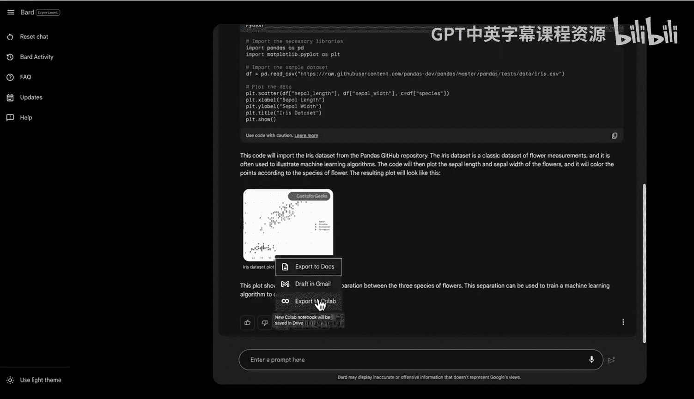
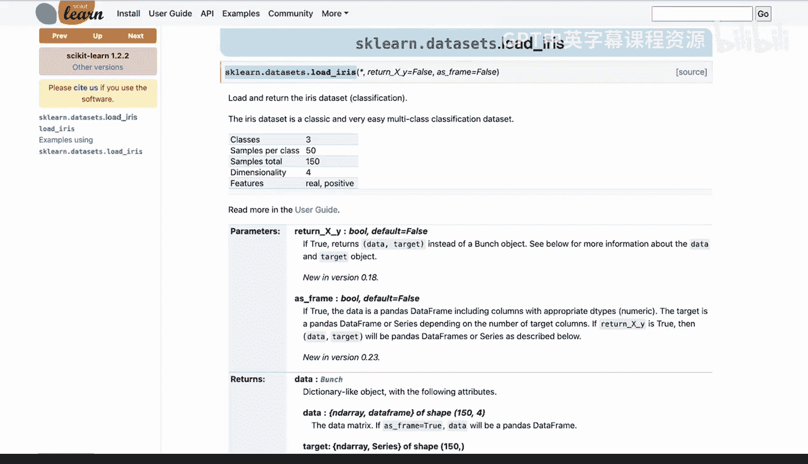
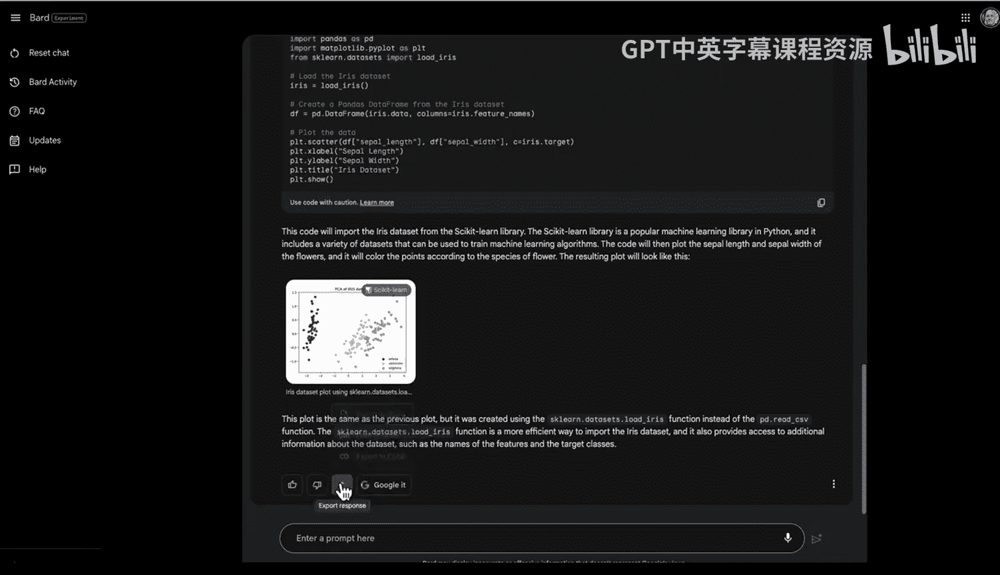
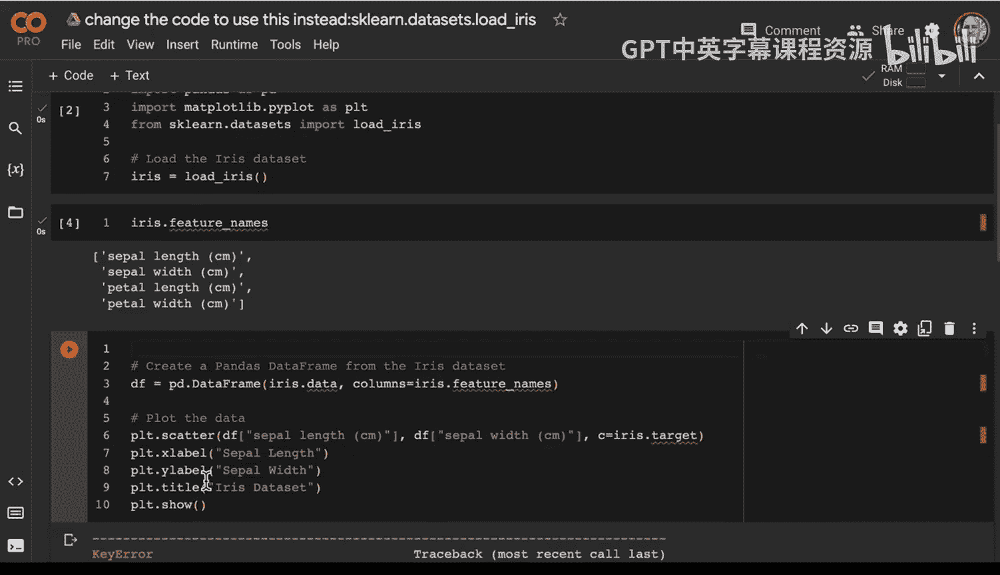
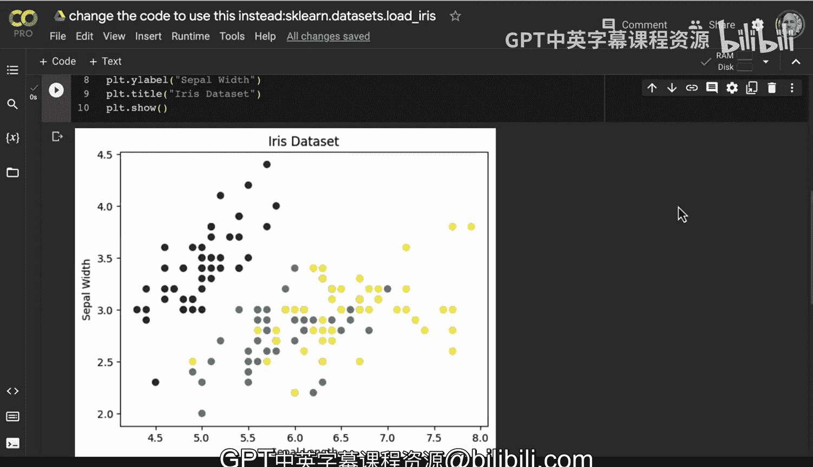

# 杜克大学《Rust编程2-3（数据工程、DevOps）｜Rust programming》中英字幕 p54 54_03_04_使用Bard增强笔记本开发.zh_en -BV11y411z7Dn_p54-

One of the exciting aspects of modern software engineering is the ability to use AI pair programmers to help you out when you're building a project or even to study for a certification exam。

 let's go ahead and take a look at this barred prompt here。 First step I'm going to say。

 you know what are three key aspects。

Of security。On the GP cloud platform。 let's say I was studying for a certification exam for the Google cloud platform。

 I could go ahead and ask Bard here。 what are the key aspects， And I can see here。

 data security identity and access management and compliance， in addition。

 there's some other features， right？ So I've got some great ideas here for how to study。

 So this is really from a knowledge standpoint。 But what if I wanted to do some coding， right。

 So if I wanted to go through here and say， you know build a Python coab notebook。

That imports a sample。Data set。From pandas and chartet。Let's see what happens。

At this point I can actually get a starter kit available from Bard here and look at this。

 I even have the code as well and I can even say export this code as well so notice that this says import pandas asP import mapplot Lib。

 pipepl asplLT so I've got a nice little snippet here and then if I want to go through it I can actually export this response directly into a notebook let's go ahead and try this。

Let's say export to coabab notebook。 And what's nice about this is that I can actually have really the best of both worlds is this pair programming assistance from Bard plus the ability to actually dive into an example notebook So let's go ahead and change the runtime here we'll go ahead and say change runtime type。

 And if I wanted to let's give it a little bit of Ramm here and from here。

 I can actually go ahead and run this example。 So this is a great way to just very quickly get up to speed with a particular library is you can actually go through here and use this as an example。

 Now what do we have here， we have one issue it says oh this thing is not actually found。

 So sometimes you'll see errors like this。 So how do you get around a problem like this。

 Well let's go ahead and debug it。 So if I go here and actually open this up in a new tab We should be able to see then in fact。

 yeah，'s that's a problem So what I could do is。😊。

the best of both worlds here and I could just say you know IIS data set pandas and I could just do a search for it and we could see here that there's a call here that we could actually take a look at that will give us the load IIS data so I'm going to go ahead and go back to our prompt and I'm going to say let's see like change the code to use this instead。

So this is an important part of being able to iterate is to understand how to be okay with the fact that there's an issue and there we go。

 now we just go ahead and we say export response and now let's go ahead and open up a new note notebook。

 here we go and we can go ahead and say open coLab。

And from here， we've got a slightly different view now。

 right we can just say from psyitlen do datas import loadirris。

 And let's go again and change the runtime。 maybe get it high Ram here， save it。

 And let's go ahead and run this。 So it's important to get the idea。

 but you can't necessarily count on the fact that the code will be perfect。

 You have to have some ability to kind of go back and forth here。 So now we have one more issue。

 And we see that this particular column may have a problem。 So what could we do to fix this。 Well。

 pretty easy。What we could do actually is debug this by diving into the code。

 Let's go ahead and do a code cell here next。 And what I would do typically。

Is see if I can actually load anything。 So let's go ahead and try to load this first。

 So let's go ahead and pull this part out， paste this in， run it。 So that worked。

 Now let's add a code cell below here。 and let's actually just look at Iis do data。

And we see there that， in fact， it does appear。That we've got something working， which is nice。

 so I can go ahead and get rid of this one。And so we know that Iris data columns now let's look at see if we have iris dot feature names that that could be the issue is that we actually don't have the Iis feature names so let's go ahead and try Iis dot and what do we have here we have we do have feature names there we go So we have Sepel length so the issue is that the feature names are a little bit different than the names that we're expecting。

 which is pretty easy to fix right so I just go through here and I can actually change the sepel length to this new sepel length and I can change the sepel with here to the new sepple width which is right here。

And then if we go back here。We should be able to get this one to work there we go and now we see that the plot works。

 so it does take a little bit of patience to be able to use a peer programming assistance at the same time as your're coding。

 but in this particular example we were able to power through it and able to get quite a bit of traction by you know really treating the peer programming tool like a coer and getting into the IIS data and do visualization。

