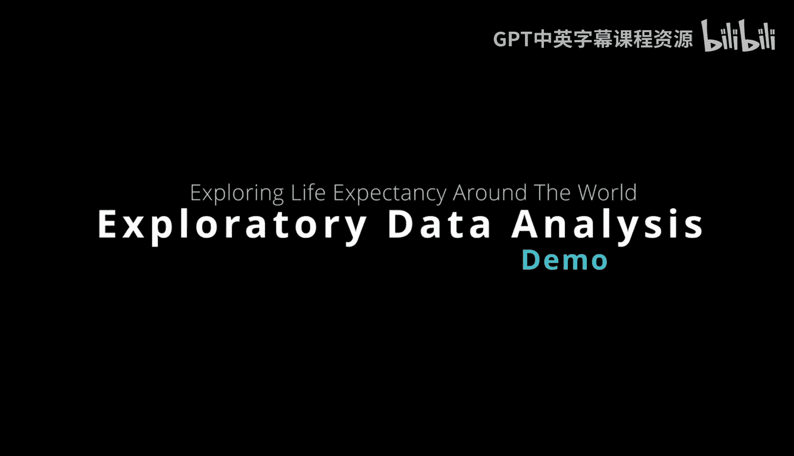
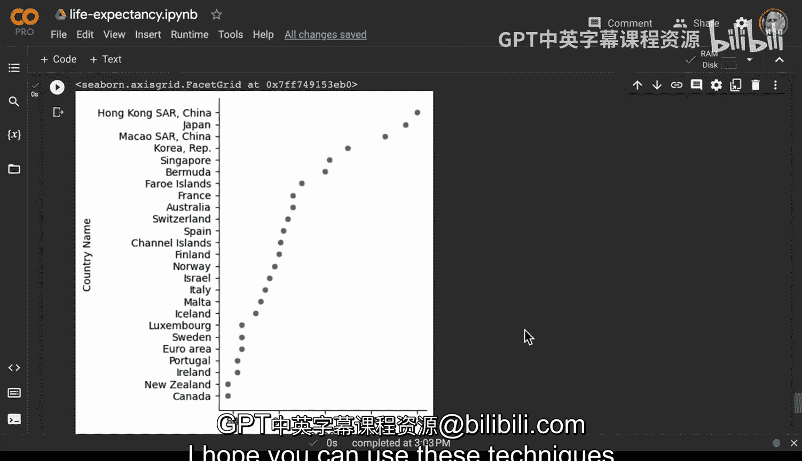

# 杜克大学《Rust编程2-3（数据工程、DevOps）｜Rust programming》中英字幕 p55 55_03_05_笔记本中探索预期寿命数据.zh_en -BV11y411z7Dn_p55-

Here we have a Google coabab notebook， which is a great place to explore data。

 One of the nice things about coabab notebook is it has many features that help you do things at a professional level。

 So this proversion here， for example， one of the things I can do is I can go to change runtime。

 and if I wanted to I could use GPU or TU inside and I also could even use highRA if I needed to actually access a larger data。

 What I typically do is create a structure and you can see here I've got ingest。

 I have Eda I might even have a modeling section。 and this allows me to easily navigate or even share sections of the notebook with colleagues。

 If we look at this right here in this table of contents。

 notice how I can easily go to visualize or I can go to ingest or I can go to exploratory data analysis。

 What we're gonna cover first here is exploratory data analysis which is getting an idea of what it is you're doing。

 that's really the purpose。 So let's first take a look at ingest here。 and run pan。😊。

Does and then go through here and load some life expectancy data。

 Let's say I'm a data scientist and I'm wanting to understand what's happening in terms of life expectancy around the world。

 and especially my home country of the United States and kind of dig into the details a little bit。

 So the first thing I need to do is connect to the workspace here we can see here we can say connect to hosted runtime and all we do once we connect to the hosted runtime is we can see how much Ram of've got available and also what type of compute。

 for example， GPU or CPU or even TU。 Once I've run this。

 now I can go ahead and load the next step here， which is load pandas and then look at this life expectancy data now you can see here that it's not great in terms of understanding what's happening because I've got data from 19601964。

 all these different countries， I need to actually dig into the details a little bit more and check out what's happening。

 So if we go through here。And I look at this other data set as well。

 one of the things I might want to do is pull in the columns and when we look at the life expectancy data。

 this gives us more of an idea of what's happening so you can see I've got a country name I have a country code I have an indicator name an indicator code and here I might want to just sort through this and get a more limited group of data to look at in this case if I just look at the country name in 2020 I want to look at the recent data here and I also want to sort those values by the 2020 row。

And I want to look at ascending and look at the first 25。All of a sudden。

 I can get an exploration of the data that makes a lot of sense。 We can see here that， in fact。

 Hong Kong is leading the world by life expectancy， also Japan， right the same portion of the world。

 there's a lot of great stuff going over there， China， Korea。

 a lot of people are living a very long life in those countries。 And if we look at France as well。

 European Australia， Switzerland， Spain， we can see that Europe and Asia have amazing life expectancies。

And also Israel， Italy， Malta， Iceland， Portugal， lots of countries， even Canada。

 a neighbor the United States， people are living for quite some time。

 And if we go through here and we explore a little bit more。

 we can even look at some descriptive statistics。 for example。

 we could look at what is the median according to different years and we see here that life expectancy around the world is going up and up and up and up and you can see some of the descriptive statistics。

 if I wanted to drop some values， I could also go through here and drop some values。

 And then finally， if I wanted to， again， look at the different countries I could go back and look at the index。

 Now， in this case。One of the things that we may want to do is we kind of pull through this data again and sort through this is could we also sort it by just female right if I want to look at life expectancy for female data。

 what could I do， I could look at this and I could see that in fact the top 10 here include Japan。

 Spain， Switzerland， France， Italy， and if I do a describe here。

 this gives us a lot better overview of what's happening amongst some different countries。

And if I want to go through here and look at just at the United States。

 we can see here that there's something going on with the United States， right， in this case。

 even though these other countries， Japan， Spain， Switzerland， Singapore， France， Italy。

 really Europe， Australia and Asia appear to have just amazing numbers here for life expectancy if we go down here。

 we look at the United States， we can see it's much， much lower。

 so there's something unique about the United States that we may want to dig into。

If we want to look at the G20 countries， Argentina， Australia， Brazil as well。

 we can see here that in this particular scenario here， the United States is again far。

 far behind other countries like Japan， Australia， Italy， France。

 and it's really at the bottom of the pack， very close to countries that are in South America。

 Brazil， Saudi Arabia， Mexico。And then if we want to go through here and describe this further。

 we can go through here and describe it further。If I wanted to go through and sort five countries with similar life expectancy。

 we could also do something like this， right， I could go through here and say， hey。

 I want to find some similar countries with life expectancy。

And I also could look at the top 25 and pull in a different data set right so these are some of the things you typically do when you're pulling the data out and looking at it in exploratory data analysis to maybe build a machine learning model finally for visualization I can import the Seaborne library right here and if I want to do a plot we've got a plot here that shows us all of the different countries。

 the top 25 countries here and again you can see here that there's just a very unique difference here between all these modern countries have 85 to 88 here but the United States is way。

 way down here dragging behind here， so this might be something that data scientists would want to dig into and really dig into the factors of why is it that people aren't living as long as these are the other countries in the United States。

 even though the wealth that the United States has so that's a good overview of exploratory data analysis and I hope you can use these techniques as well when you're exploring data。

