# 杜克大学《Rust编程2-3（数据工程、DevOps）｜Rust programming》中英字幕 p62 62_03_04_Rust使用GCP Cloud Shell.zh_en -BV11y411z7Dn_p62-

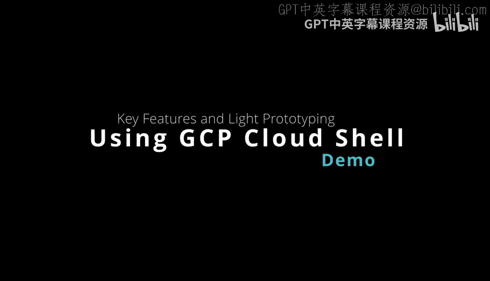

Here we have the Google Cloudhell， which is a very interesting environment to do both systems administration tasks like talking to storage or controlling applications。

 but also doing light development。 So let's take a look at some of the things that you can do First step here。

 you have the project window。 So if you go here， you can look at existing projects。

 or you could create a new project。 You also could open up a fullfledged editor。

 We won't do that for now， but you could open up a development environment that has better code completion。

 You also could send key combinations。 You can go to terminal settings and go through and change the theme。

 the text size， other things like that。 You also can preview a running web application which we'll do in a second。

 you can also look at the session information for example， how much quota you've used。

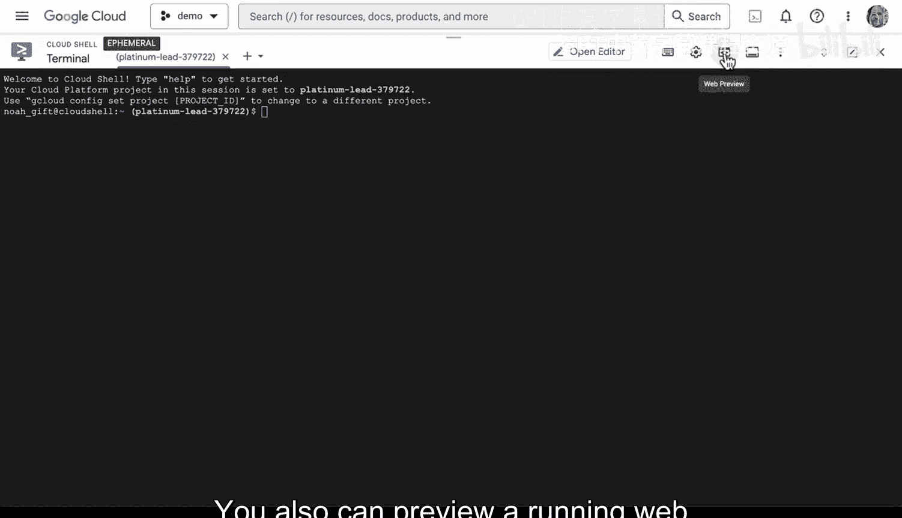

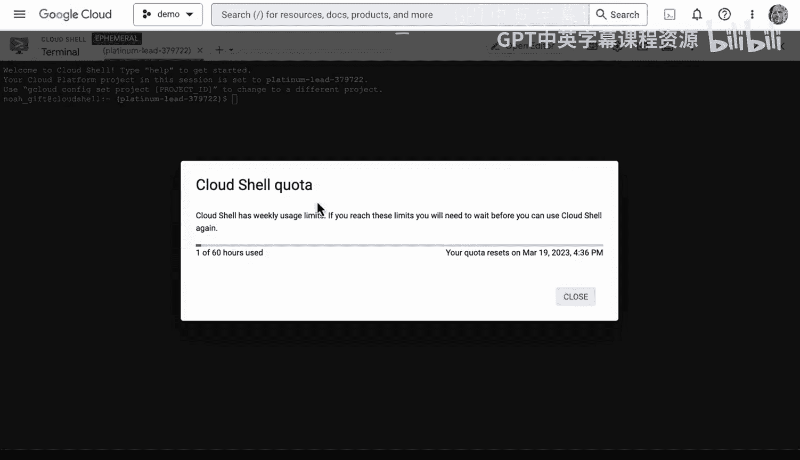

We also can upload or download a file。 So let's go ahead and take a look at this。 if we did an LS。

 you can see there's a readme here。 if I wanted to download that， I could select download。

And it's going to transfer everything that's in my directory Now I also can individually download something if I toggle through and I select an individual file。

 it'll also do that as well。 So there is a way to go back and forth and as well upload files directly into the Cloud shellll environment。

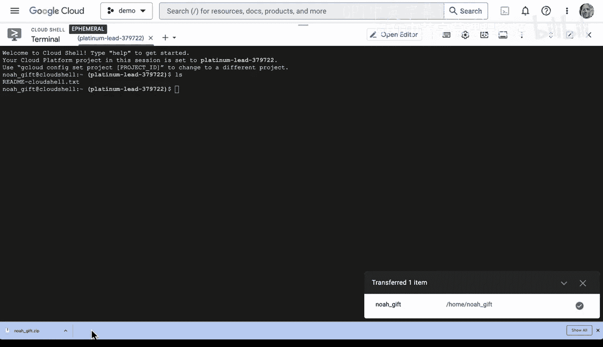

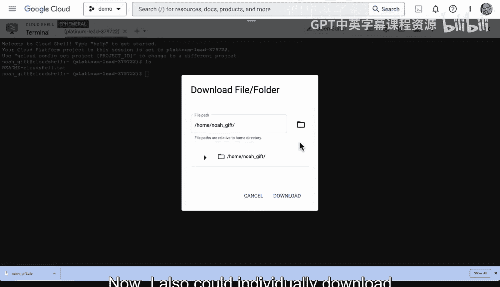

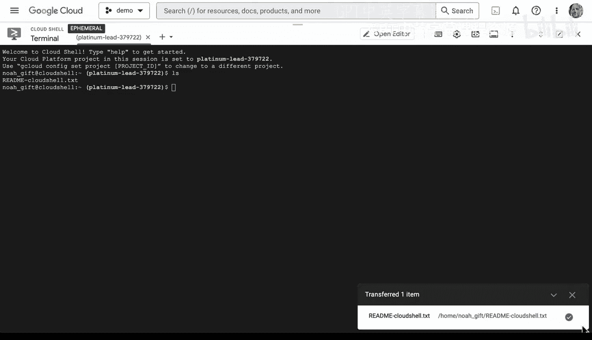

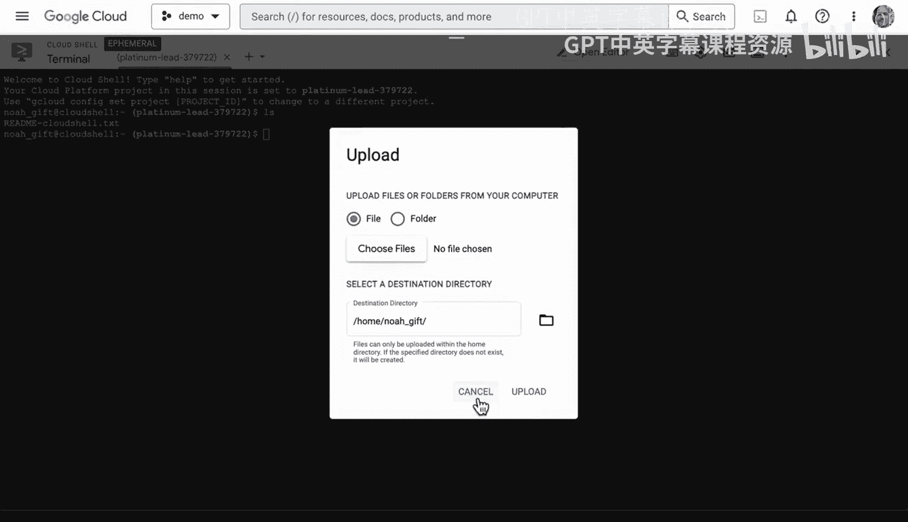

Now another thing to be aware of that's a little bit interesting is that you can do light development inside of this environment。

 So what I'm going to do first is I'm going to go to rust up and I'm going to install rust inside of this environment。

 so we'll go ahead and curl this and it will proceed。

Whenever I install something new like a new development environment。

 I often will have to then edit the Bsh RRC file so that it is a convenient reload。

 I don't have to source something over and over again so we'll see that in this particular situation the same thing will occur you can see that it have it installed automatically and if I go through here and I look at this it will source the cargo environment and if I go to my Bsh RRC file here you'll see that that we also have it loaded inside of the Bsh RRC though so this gives us the ability to always have this cargo tool available which is the tool for building new projects and rust。

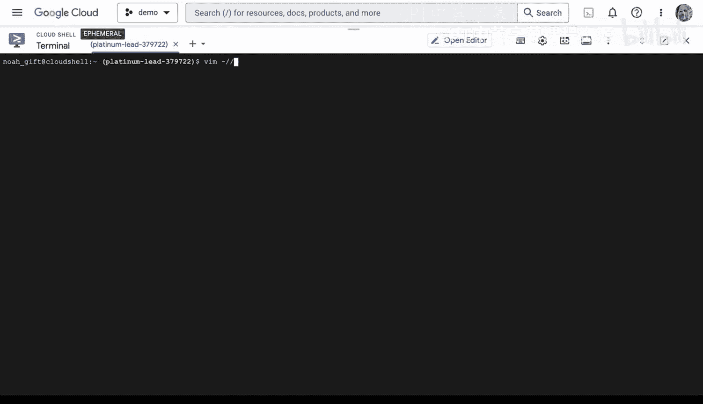

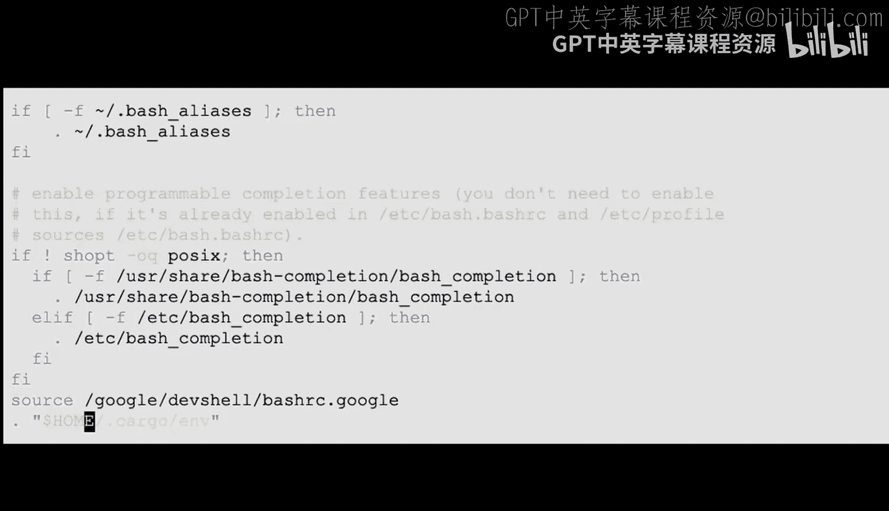

And then put in a name and we can call this web and that'll put it in the current working directory so it really depends on what it is you're trying to do in this case。

 let's go ahead and use the root directory here and then if I go into this cargo file I'll need to change it and we can look at it's 431 so let's go ahead and put that in。

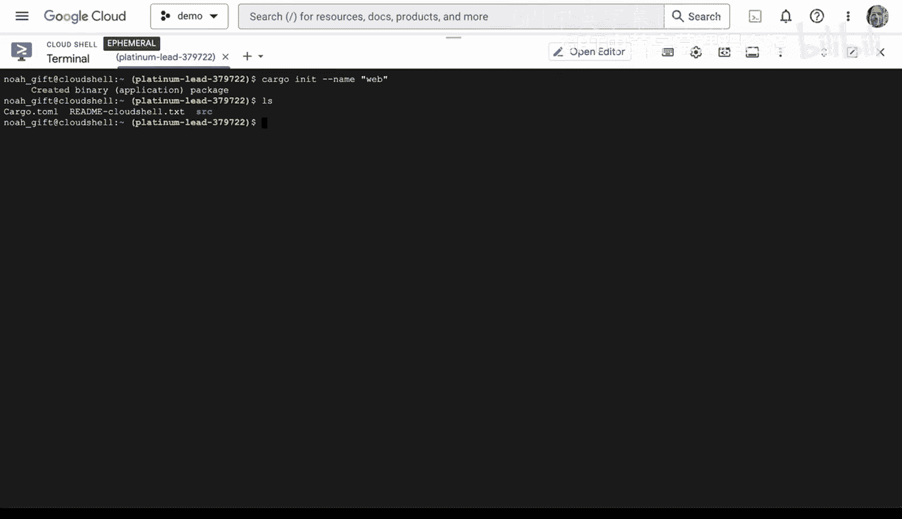

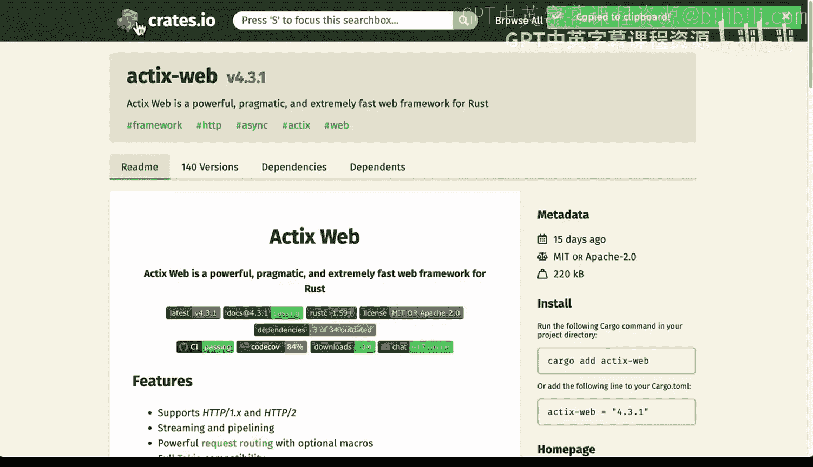

We'll just say equals。4，3，1。Perfect， now that we've got that set up。

All we have to do is edit the source file inside。 So we'll say source mean。

Then we just need to put a hello world in there， and so I'll just grab a simple hello world here。

And we'll just do a set paste。And throw this in。All right。

 now we've been able to get this to run by using cargo run and I would just go over to the web preview menu here and we look at this。

 I'm able to see this Ho world application。 so it's actually not a bad environment for doing quick prototyping。

 And if we want to go into the code itself and change it a little bit。

 let's go into the code here and just change it so that we know that we can easily do modifications。

 We can say hello world。

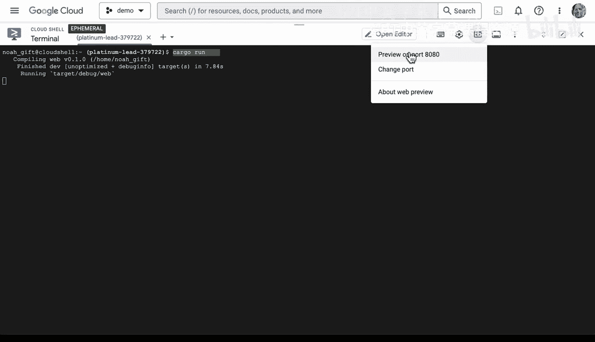

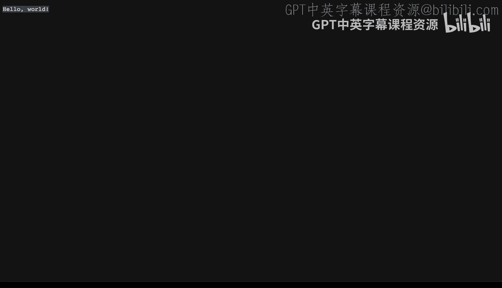

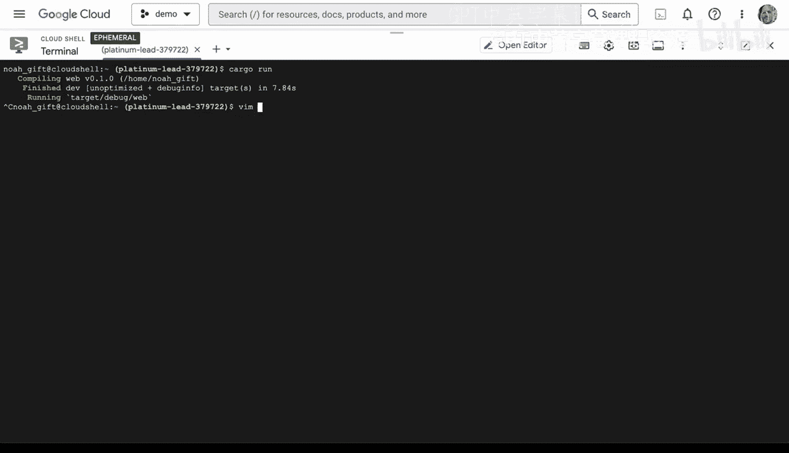

exploringing。Cloud。Xiao。All right， let's go ahead and save it。 We'll type in cargo run again。

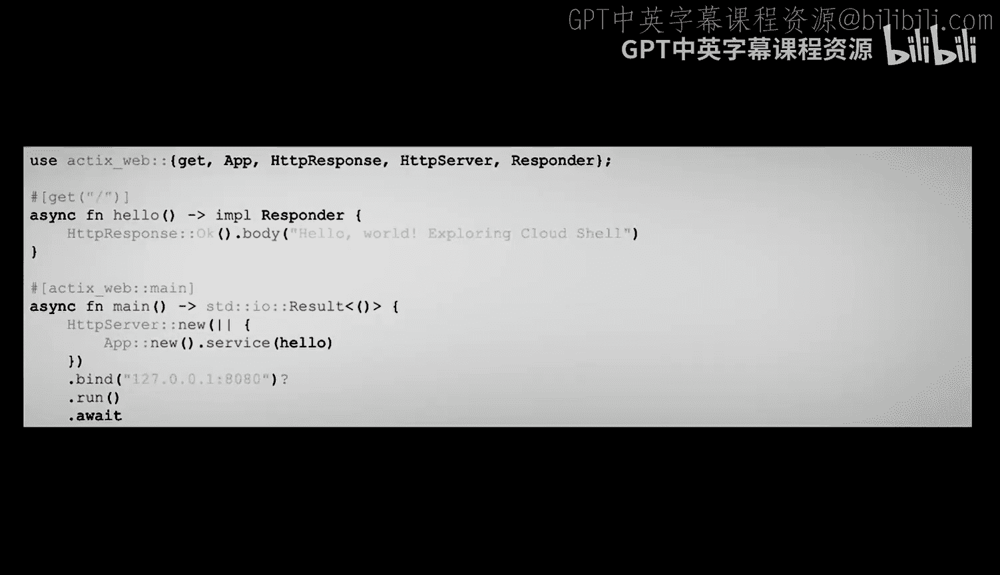

It builds it again。 And of course， all we have to do is go to Web preview。 preview on port 880。

 There we go。 Hello world exploring Cloudhell。 So in a nutshell。

 the Cloudhell is a great lightweight development environment to do commands also to do a little bit of prototyping。

 and you can also customize your environment by editing your bash R C。😊。

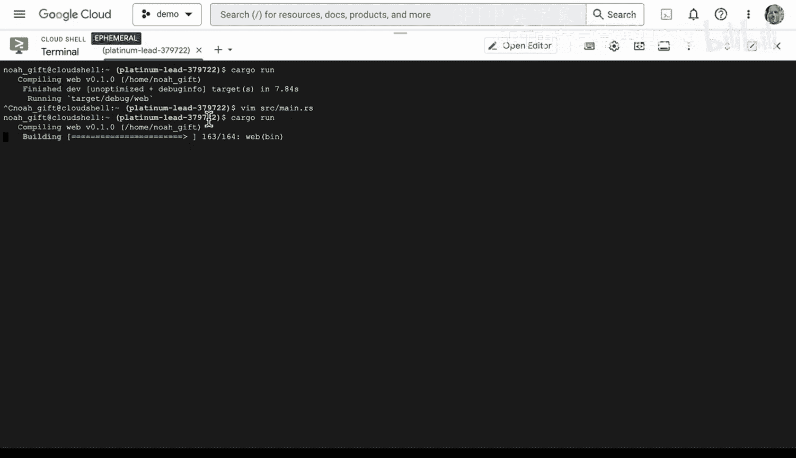

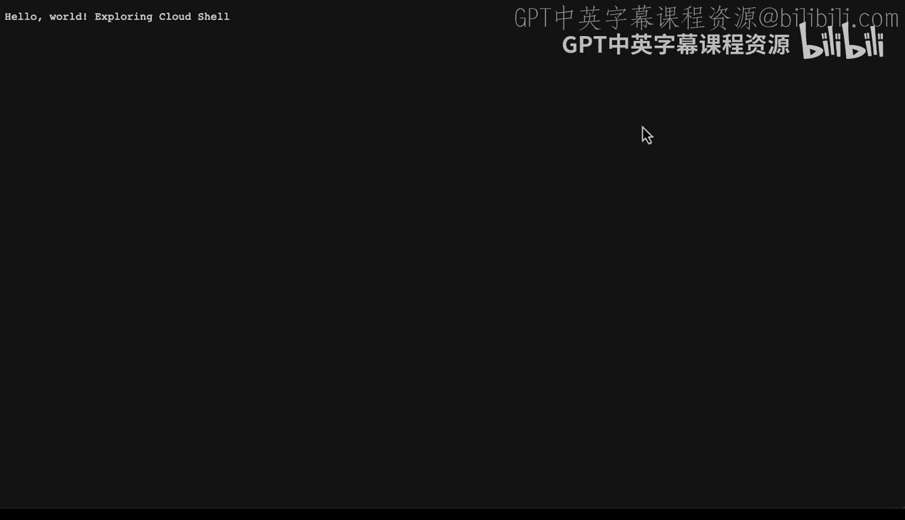

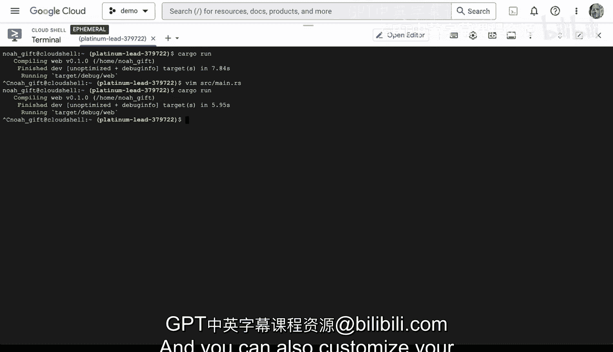