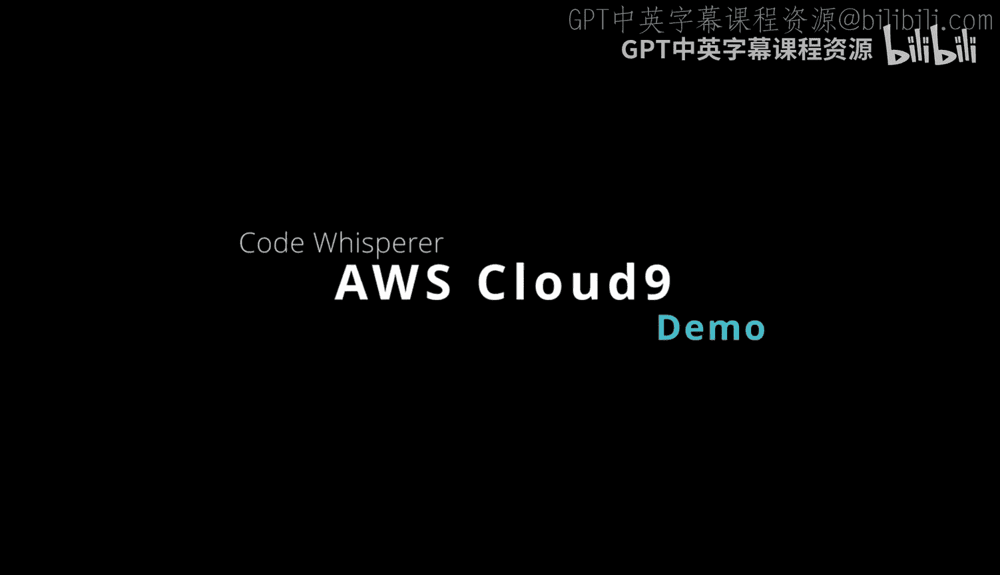
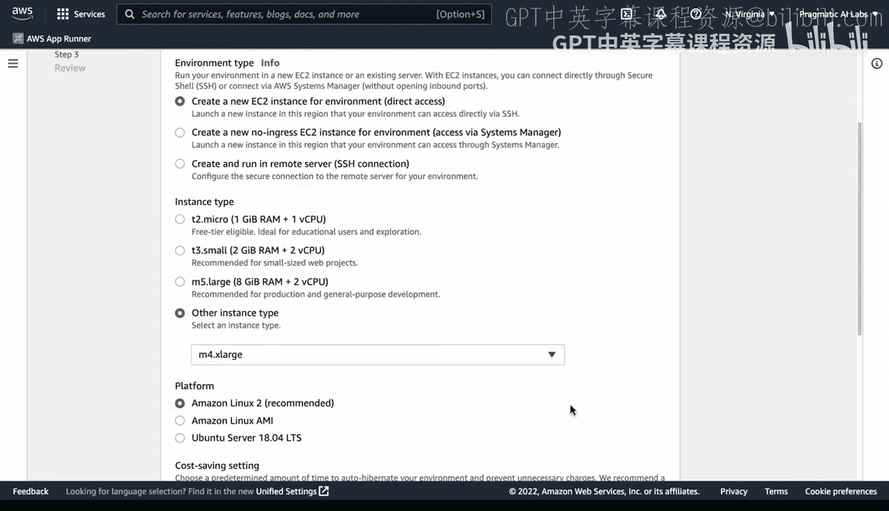
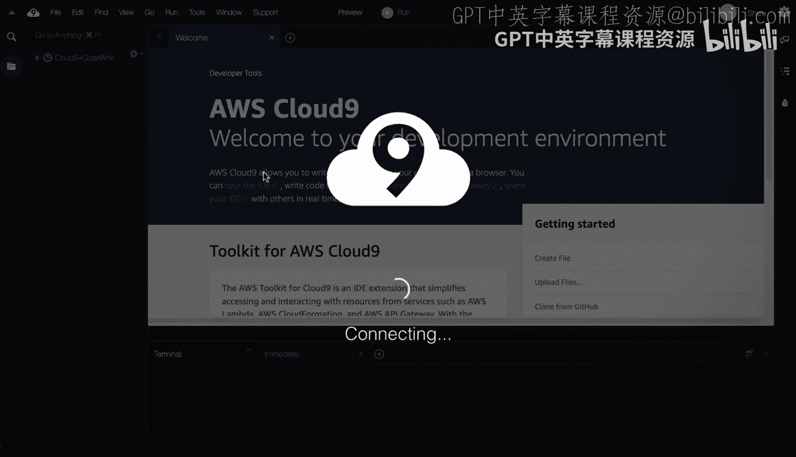
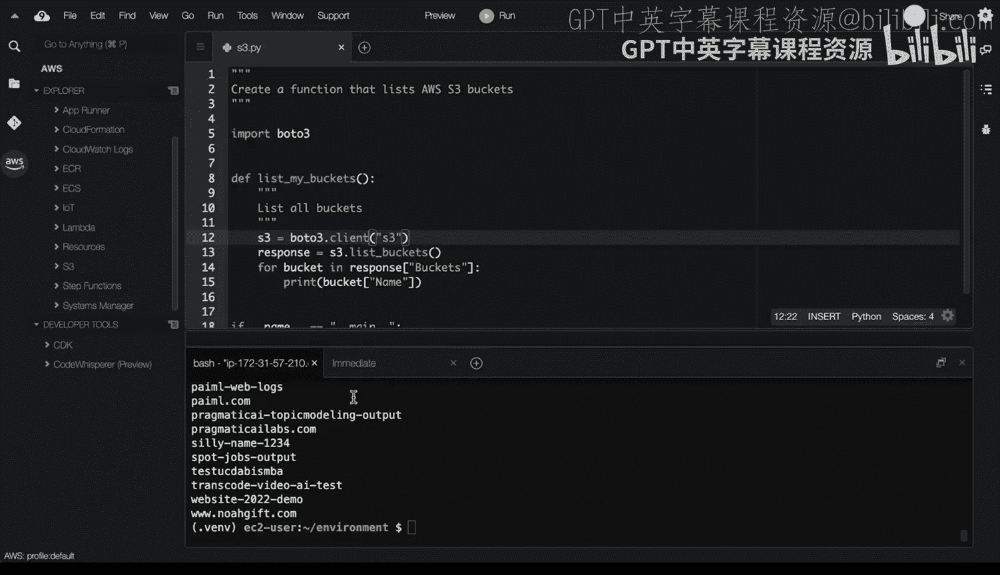

# 杜克大学《Rust编程2-3（数据工程、DevOps）｜Rust programming》中英字幕 p65 65_03_07_Cloud9集成CodeWhisperer.zh_en -BV11y411z7Dn_p65-

A great place to get a better idea about cloud 9 is to look at the official documentation。

 You can see here AWS documentation， AWs Cloud 9。 and it shows you how to work with environments in AWs Cloud 9 as new features are developed。

 You'll see more and more documentation。 There's a lot of resources here。

 including how to access the AWS toolkit。 So let's go ahead and dive into this resource here。

 I'm going to go to cloud 9。 And the first place that I think is a good place to start is to make sure that you're in the right region。

 So there's lots of different regions you can create cloud 9 resources in。

 I'm going to select the North Virginia region。 And then I'll go ahead and create a new environment。

 In this case， we can call this cloud 9。😊，Plus， code。Whisper。Maybe I could put a description。

 this is for a demo。And if I needed to， I could pull that information from a query from a command line tool。

It's always a good idea to pick a size that is appropriate for the problem you're solving in general。

 if you're just toing around， you can leave everything by default and also include the Amazon Linux 2 in this scenario。

 though， I'm going to grab a slightly larger instance。

 grab one that has 16 gigs of Ram and  four CPUs。

And then I'll go ahead and say create environment。Once you've gone through and created your environment。

 it actually launches fairly quickly。And it'll give you access to this interface here and you can see here as this is loading up that there is a welcome screen that tells you a little bit more about the environment。

 there's also resources here where you can actually share this with other people to do pair programming。

There are settings here on the right in this little gear tab here。

 and also you can see that you could debug your code by selecting this icon。

The other thing that's important to be aware of is that this file menu here has various different features that'll help you work。

 including things like code folding or shifting your code to the left or to the right。

One of the most important things to first get started with， though。

Is to play around with the terminal。 This is really where all of the power starts。 And in particular。

 one of the best ways to show what you can do is if I typed in AWS S3 L S。 and I did help。

 You can see that I've actually got a hope menu here that I can actually play around with。

 and it'll tell me exactly what it is that my particular tool will do。

 So all of the AWS tools are installed inside of this environment。And if I wanted to。

 I could actually do more， right， I could， I could go through here and say AWS S 3。

L S to list all of the buckets I have and then do a word count to actually count how many buckets are available。

 So this is really a depot where you could play around with every single resource from the command line and even copy data back and forth inside of this environment。

 So， for example， if I wanted to upload something。 I could just say upload local file。

 grab something from my my file system like whatever it is， I'm going to do。

And noticeice I uploaded a screenshot there or could be a piece of code or some other thing I needed to synchronize with S3 and then I could put this as a copy command。

 right if I could type in AWS S3 and then do a CP command and then copy that into a bucket that I cared about。

The other thing to point out in addition to the terminal is that you also can access inside of this tab here。

 the file system access to source control。And also access to the AWS toolkit。 Now。

 the AWS toolkit is probably the most useful component here。

 because if you look in this region you get access to。

Lots of different services with deep integrations。 And this means that I could invoke one of these services here。

 if I wanted to， I could even deploy a service。 I could say， create a new service here and deploy it。

I could look at my container registry， Io T， Lambda。

 and I have the ability to interact with all of these different resources。 So， for example。

 if I took a look at one of these， I could say invoke on AWS。 and I could。

 I could actually send a payload over to that Lambda。

 or I could even download it and play around with it locally。

 So there's a lot of great right click type integration built into cloud 9。

 The other thing that's pretty cool is that。😊，It has the cloud development kit loaded。

 and it also has the ability to do code completion。 In this case， this is called code whisperhis。

 so it's AI pair programming。And a good way to play around with that would be to set up a virtual environment first。

 let's go ahead and do that。 We'll go ahead and say Python 3， dash M V E and V。

 and I'm going to source this virtual environment。 and then I'm going to do a Pip install。Of Bodo 3。

And I'll also do a Pip install of a formatting tool called Python Black。

 I found that formatting tools are really helpful when you're working with a AI pair programmer。

 So we'll say Pip install black。 and this will allow me to also format code Now that I've got that set up。

 what I can do is go back to the file tree view and I can actually create a file called S3 do Py to try out this code peer programming tool here。

 And if I right click。Right here， we can open it up。 And then from here。

 I can actually set the stage for what I want this tool to do。

 And what's really powerful about this new way of working is that you can actually set up a prompt here that that says what it is your intention is。

 So we'll say create a。Function that lists AWS S3 buckets。 Here we go。

 And now it knows a little bit more about what it is。 I'm trying to do。

 And so I'm I'm going actually let it prompt me and tell me more things to do。

 So in this case we'll say import Bodo3。 I saw that。

 and then we can actually say de list buckets right So it's smart enough to know that I'm going to try to list a bucket。

 And if I go through here， itll it'll give me all of the information I need。 In fact。

 it's pretty nice it is able to actually give me some some good suggestions。

 You do have to make sure that you're on your toes a little bit。

 and you make sure that you're following the language best practices。 In fact。

 this is why I like to do a formatting tool。So this Python formatting tool。

 I can just do this and I'll just clean it up a little bit to make sure that I've got everything I need。

 Now all I need to do is tell it to help me build out the last part。

 which is that's exactly what I want to do and notice here that is's going to give me a suggestion。

That。I'll need to make an instance of S3， and then I'll pass it into this list buckets。

 and then I'll go ahead and。Run this piece of code。 So now that I've got that， and I don't need that。

Particular part。What I can do is again， do a formatting。

Command here if I want to just make sure it's formatted。

And then let's go ahead and run it and we see Python S3。It says this has no service attribute here。

 so it means I need to clean it up a little bit。And so in order to do that。

I think a better way to list this code。Would be to tweak a little bit。

 and we can actually go through here。And。And say。S 3 is equal to。Bta 3 dot resource S 3。

 And then in this particular scenario， I can get rid of this now。

And we can actually say this print message。And we see that S3 service resource has no access。

 so what we need to do is change this to a client。And， and now we should be able to。Get this to work。

 There you go。 So things aren imp perfectf when you're using a code AI pair programme or just like a regular human。

 But if you are able to use what it is good at and also use external tools， at the same time。

 you can get some good feedback， so。The Cloud9 environment and CodeWhisper environment are great tools to use when you're playing around with a AWS toolkit and it's really a great integration here to be able to use things like the AWS toolkit and also use CodeWhisper。

 this is in preview， it's going to get better and better。

And build out solutions that are deeply integrated and customized for your AWS workflow。

