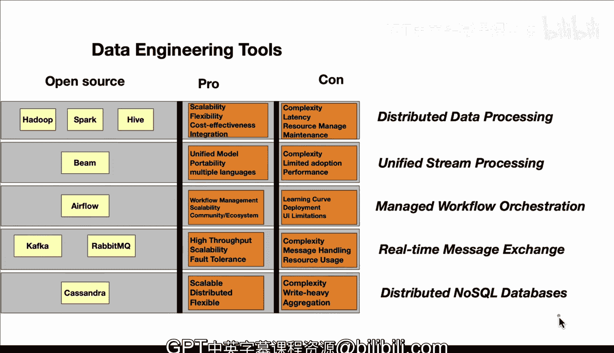

# 数据工程工具：04：开源数据工程工具的优缺点

在本节课中，我们将学习业界常用的开源数据工程工具，并分析它们各自的优点和缺点。了解这些工具的利弊，有助于我们在实际项目中做出更合适的技术选型。

## Hadoop/Spark/Hive生态系统

首先，我们来看Hadoop、Spark和Hive组成的生态系统。

以下是该生态系统的一些主要优点：
*   **可扩展性**：这些工具可以处理海量数据。
*   **灵活性**：它们能够处理多种数据类型和结构，包括半结构化或非结构化数据。
*   **成本效益**：可以使用商用硬件来构建集群。
*   **集成性**：例如，可以使用SQL来完成许多数据处理任务。

上一节我们介绍了该生态系统的优点，接下来看看它的一些缺点：
*   **复杂性**：这些工具本身较为复杂，需要处理许多配置和管理问题。
*   **延迟**：在处理实时数据流时可能存在延迟问题，需要额外的工作来规避。
*   **资源管理**：让所有组件完全按照预期协同工作可能非常困难。
*   **维护**：这些系统需要大量的手动维护工作，并且需要具备相应的运维能力，才能使其在所需规模上稳定运行。

## Apache Beam

现在，我们来看看Apache Beam。

以下是Apache Beam的一些优点：
*   **统一模型**：这意味着你可以使用同一个管道来处理批处理和流处理任务，并能组合不同的工作负载。
*   **可移植性**：它可以在多种不同的运行时上执行，例如Flink、Google Cloud Dataflow或Spark等。
*   **多语言支持**：你可以使用Go、Python、Java等多种编程语言来开发。

了解了Beam的优点后，我们再来看看它的缺点：
*   **复杂性**：使用Beam具有一定的复杂性。
*   **采用率有限**：其运行器（如Beam Runner）并未被广泛采用。
*   **性能问题**：对于某些特定用例，它的性能可能不如专门的批处理或流处理系统那样优化。

## Apache Airflow

接下来，我们讨论另一个非常常见的工具——Apache Airflow。

以下是Apache Airflow的一些优点：
*   **工作流管理**：它提供了强大的工具来定义、执行和监控复杂的数据管道。
*   **可扩展性**：具有良好的可扩展性。
*   **社区与生态**：围绕Airflow有一个庞大且活跃的社区和生态系统。

然而，Airflow也存在一些缺点：
*   **学习曲线陡峭**：这个系统的学习难度较大。
*   **部署与维护**：在分布式环境中，其部署和维护可能成为问题。
*   **用户界面**：其UI在作为托管工作流编排工具时，可能无法完全满足所有用户的需求。

## Kafka与RabbitMQ

现在，我们来谈谈Kafka和RabbitMQ的优缺点。

以下是它们的一些优点：
*   **高吞吐量**：能够处理巨大的数据量。
*   **可扩展性**：系统本身设计为可扩展。
*   **容错性**：具备良好的容错能力。这些是它们在实时消息交换方面的优势。

当然，它们也有一些缺点需要注意：
*   **消息处理**：如何高效地处理消息顺序可能是一个问题。特别是在某些传递系统中，可能会出现消息乱序或延迟处理的情况。
*   **资源管理**：资源管理也可能是一个需要关注的缺点。

## Apache Cassandra

最后，我们来看一下Apache Cassandra。

以下是Cassandra作为NoSQL数据库的优点：
*   **高可扩展性**：它专为分布式NoSQL设计，具有出色的可扩展性。
*   **数据结构灵活**：它能够处理半结构化数据、结构化数据等多种类型。

其缺点包括：
*   **使用复杂**：Cassandra本身极其复杂。
*   **读写负载不均衡**：它非常适合写入密集型的工作负载，但对于读取密集型的工作负载，则可能会遇到性能问题。
*   **缺乏聚合功能**：聚合功能的缺失也可能是一个问题。

在本节课中，我们一起学习了多种主流开源数据工程工具的优缺点，包括Hadoop/Spark/Hive生态系统、Apache Beam、Apache Airflow、消息队列（Kafka/RabbitMQ）以及Apache Cassandra。重要的是要认识到，在数据工程领域，没有一种工具是适用于所有场景的完美解决方案，尽管这些工具在业界非常常见。理解它们的利弊，将帮助我们在实际项目中根据具体需求做出明智的选择。