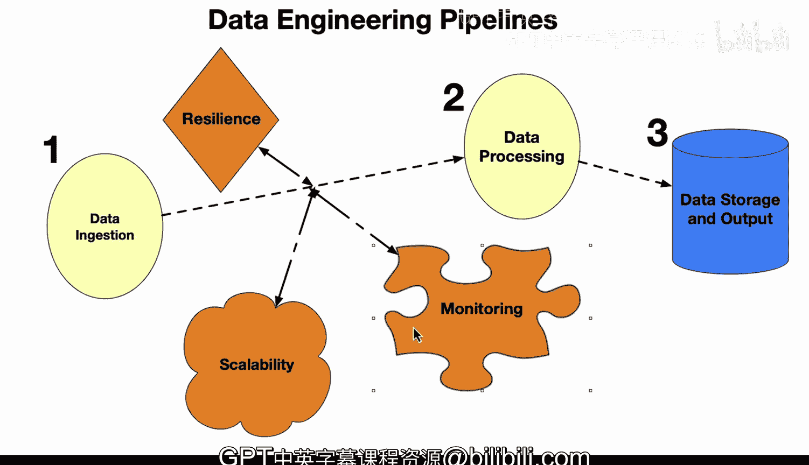

# Rust编程2-3（数据工程、DevOps）：70_04_04_数据工程管道核心组件 📊

在本节课中，我们将学习数据工程管道的核心组成部分。我们将一个典型的管道分解为三个主要阶段，并探讨贯穿整个管道的几个关键支撑原则。理解这些组件是设计和构建高效、可靠数据系统的基础。

## 数据工程管道的三大核心阶段 🧩

上一节我们了解了数据工程管道的整体概念，本节中我们来看看构成管道的三个核心阶段。一个标准的数据工程管道通常包含以下三个部分：数据摄取、数据处理和数据存储。

以下是这三个核心阶段的详细说明：

1.  **数据摄取**
    这是数据管道中最重要的部分。其核心在于能否成功获取数据并使其开始工作。数据可以来自多个源头，例如数据湖，甚至是实时数据流。此阶段的任务是从数据收集的角度来处理这些数据。

2.  **数据处理**
    此阶段涉及将数据转换为更可用的形式。这包括对数据进行清洗、验证或格式化。它确保你能够实际构建聚合、摘要等。我们在这里会看到许多工具，例如 Spark，它可以执行处理和其他 ETL 类型的操作。

3.  **数据存储与输出**
    在此阶段，管道会以合适的方式存储处理后的数据，以便进行进一步分析。例如，存储目的地可以是数据仓库，也可以是仪表板等。这是管道的最终端点。

## 贯穿管道的支撑原则 ⚙️

在了解了管道的三个阶段后，我们还需要关注贯穿整个管道的几个关键支撑原则。这些原则对于任何投入生产环境的数据工程管道都至关重要。

以下是这些支撑原则的详细说明：

*   **可扩展性**
    可扩展性非常关键，因为要构建能够在生产环境中运行的系统，你必须能够实现垂直或水平扩展。这意味着你可以向系统添加节点或增加系统的规模。

*   **弹性**
    弹性意味着系统即使在出现错误时也能继续运行。例如，如果是一个事件触发了管道，而该事件本身存在问题，系统仍然可以向你发出警报并告知问题所在；或者，系统可以运行在不同的节点上，即使其中一个节点发生故障，部分系统仍能继续运行。

*   **监控与维护**
    监控与维护使我们能够观察数据流和系统性能，并在管道出现某种问题时发出警报。

## 总结 📝

本节课中我们一起学习了数据工程管道的核心组件。整体来看，当你思考数据工程管道时，这些将是关键组成部分：第一步数据摄取，第二步数据处理，第三步数据存储。而弹性、可扩展性和监控这些内在原则不仅始终存在于数据工程管道中，也同样存在于生产软件工程系统中。