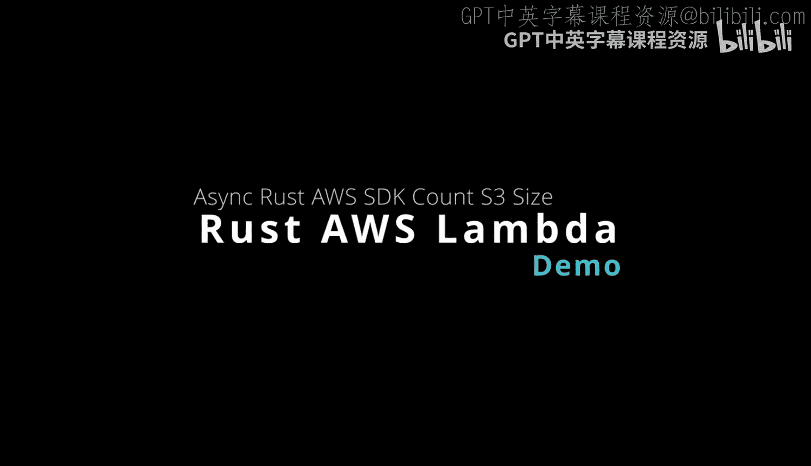
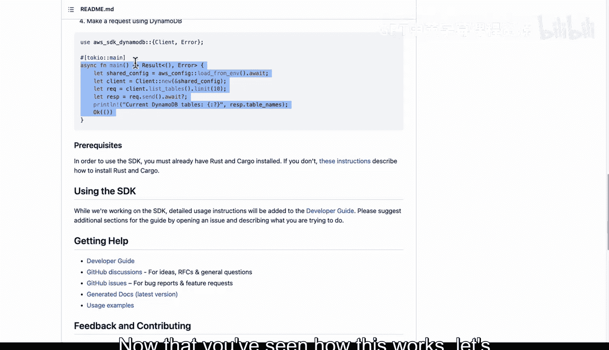
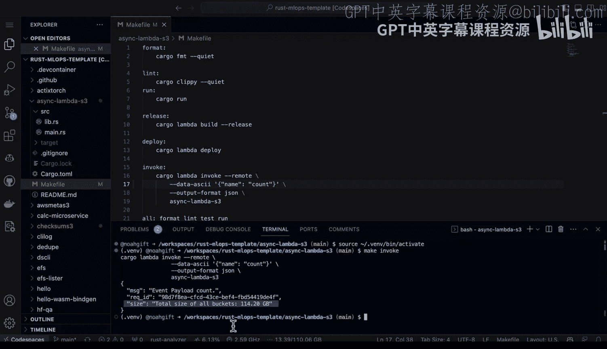
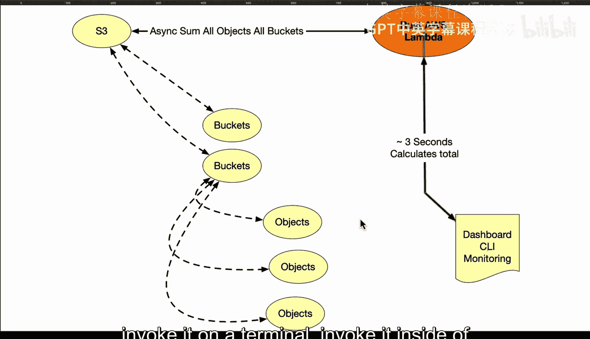

# Rust编程2-3（数据工程、DevOps）：72：使用Rust构建异步AWS Lambda S3容量计算器 🚀



在本节课中，我们将学习如何使用Rust和AWS SDK构建一个高性能的、异步的AWS Lambda函数。这个函数的核心功能是异步地与Amazon S3服务通信，遍历所有存储桶中的对象，并计算它们的总存储容量。我们将看到如何利用Rust的异步编程能力来高效处理可能包含成千上万个文件的任务。

## 架构概述 🏗️

这是一个系统编程类型的AWS Rust Lambda函数。它的架构设计使其能够异步地与S3通信。S3中可能包含数千、数万甚至数十万个文件。该Lambda可以异步地遍历所有存储桶，检查每个存储桶中的每个对象，然后执行特定操作。

在这个特定的监控Lambda中，它会计算每个对象的大小并汇总成总量。根据我的存储桶配置，运行大约需要三秒钟。之后，可以将结果输出到仪表板、命令行工具，或集成到某种监控和/或计费系统中。这一切都得益于异步Rust SDK的强大功能。

## 代码解析：异步SDK与S3交互 💻

上一节我们介绍了Lambda的整体架构，本节中我们来看看具体的代码实现，特别是如何使用AWS SDK进行异步操作。

首先，我们使用AWS SDK。以下是一个示例，展示了如何异步列出AWS环境中的所有表。你需要使用SDK的特定组件和Tokio异步运行时库。

```rust
// 示例：使用AWS SDK异步列出资源
use aws_sdk_s3 as s3;
use tokio; // 异步运行时
```

现在你已经了解了基本工作原理，让我们继续查看实际的代码。

## 核心功能实现 🔧

如果进入Github代码空间，可以看到一个名为`async_aws_lambda`的项目。以下是部分关键代码。

首先，我声明使用AWS SDK S3并创建一个S3客户端。



```rust
use aws_sdk_s3 as s3;
let s3_client = s3::Client::new(&aws_config);
```

然后，我定义了一个异步函数来列出所有存储桶。

```rust
pub async fn list_all_buckets(s3_client: &s3::Client) -> Result<Vec<String>, Error> {
    // 异步列出存储桶的逻辑
}
```

`async`关键字赋予我们在网络I/O中进行异步操作的能力。最后，我通过汇总存储桶中每个对象的大小来计算存储桶的总容量。

```rust
pub async fn calculate_bucket_size(s3_client: &s3::Client, bucket_name: &str) -> Result<u64, Error> {
    // 异步计算存储桶总大小的逻辑
}
```

## Lambda函数处理程序与集成 🧩

最后，我使用`list_buckets`函数获取账户中所有存储桶的列表，然后遍历它们以创建存储桶容量列表。

在`main.rs`文件中，代码使用`lambda_runtime`来创建一个易于使用的辅助方法。函数处理程序能够运行我们之前设置的代码，并返回响应。

在这个特定的`main`方法中，它会调用上述的其他方法。以下是函数处理程序的简化结构：

```rust
async fn function_handler(event: LambdaEvent<Value>) -> Result<Value, Error> {
    // 1. 初始化S3客户端
    // 2. 调用 list_all_buckets
    // 3. 为每个存储桶调用 calculate_bucket_size
    // 4. 汇总并返回结果
}
```

## 项目依赖与部署 📦

现在，让我们看看`Cargo.toml`文件。在这个依赖文件中，可以看到以下关键库：

以下是项目的主要依赖项：
*   `serde`：用于序列化和反序列化数据。
*   `tokio`：Rust的异步运行时库。
*   `aws-sdk-s3`：AWS S3服务的官方Rust SDK。
*   `lambda_runtime`：用于构建AWS Lambda函数的Rust运行时。
*   `humansize`：一个用于将字节数转换为人类可读格式（如KB， MB）的库。

至于`Makefile`，我们可以看到为了调用这个Lambda，可以直接运行make命令。例如，我们可以执行`make invoke`来本地测试函数。



## 运行与测试 🧪

在实际操作中，我们需要确保环境已配置好`cargo-lambda`等工具。通过运行命令，Lambda函数大约会在三秒内执行完毕，并同步计算所有存储桶的总存储量。例如，在我的配置中，它计算出了总共114GB的存储空间。

我们也可以直接在AWS Lambda控制台中测试它。转到Lambda控制台，找到对应的函数，点击“测试”。可以使用一个简单的有效载荷（例如`{"name": "run"}`，甚至是一个空对象`{}`）来触发函数，并观察其运行。

## 应用模式与优势总结 ✨

这是一个使用Rust构建高性能系统监控Lambda的绝佳模式。这个例子计算的是所有存储桶的大小，但你可以很容易地联想到如何构建与其他组件通信的工具，例如：
*   **Amazon EFS**（弹性文件系统）
*   **Amazon EMR**（弹性MapReduce）
*   所有**EBS**（弹性块存储）卷的监控
*   任何需要高效、低延迟运行的系统监控工具

在本例中，函数仅用了大约2.5秒就完成了执行，并且可以在最低配置层级运行，这意味着内存使用率非常低。

总而言之，使用Rust构建高性能系统工具非常简单。在本例中，我们成功将其集成到Lambda中，并可以通过多种方式调用它：
*   从命令行工具调用
*   在终端中直接调用
*   由事件触发（例如，每日一次的定时器事件）
*   将结果集成到仪表板中



本节课中我们一起学习了如何利用Rust的异步特性和AWS SDK构建一个高效的S3容量计算器Lambda。我们涵盖了从架构设计、代码实现、依赖管理到测试部署的完整流程，展示了Rust在云原生系统编程中的强大潜力。