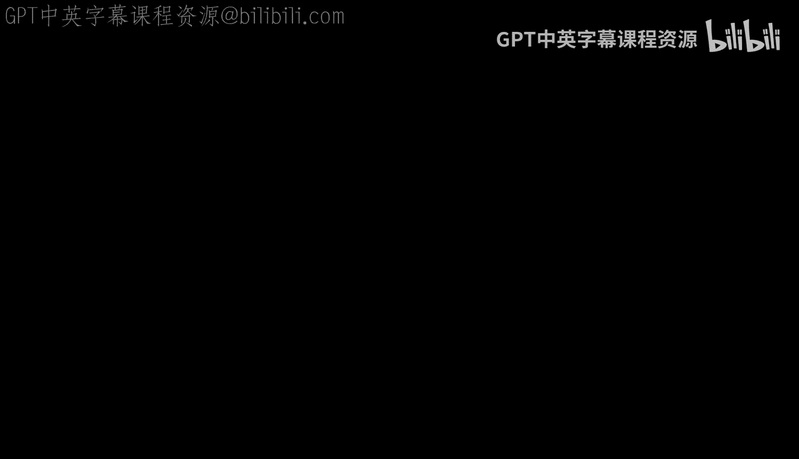
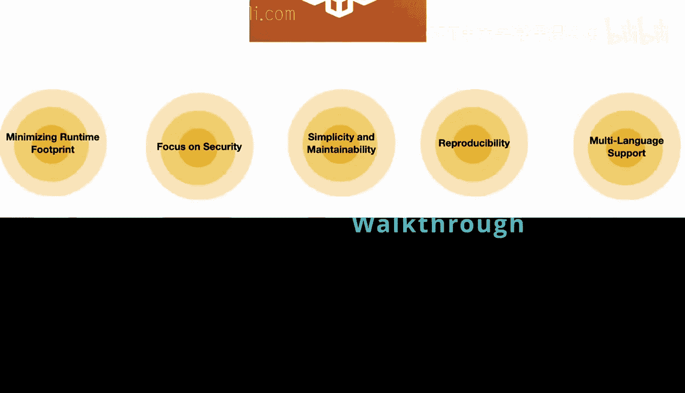
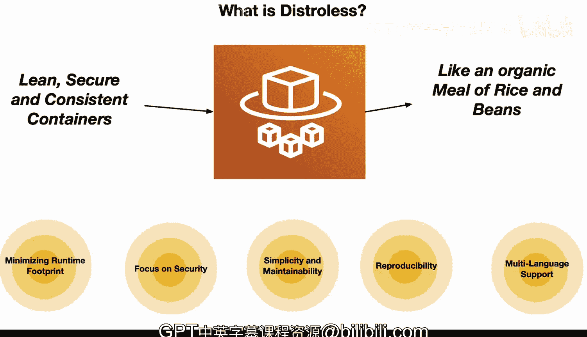

# 杜克大学《Rust编程2-3（数据工程、DevOps）｜Rust programming》中英字幕 p73 73_04_07_Distroless技术解析.zh_en -BV11y411z7Dn_p73-

So what is distreils， One of the ways to think about distres is it is a lean。

 secure and consistent container。One way to think about it as an analogy is it would be like a meal that's organic。

That is composed of just rice and beans。 Rice and beans is a complete protein when combined together。

 but also very healthy， because it contains simple ingredients。

 including fiber and complete proteins。 So let's go ahead and break this down component by component。

 First up， we have minimizing runtime footprint， diststrilous containers。

 like a meal of rice and beans only includes the most essential elements。

 You don't need fancy ingredients to make a nutritious meal just like distreilous containers。

 only require the necessary components to run the application， keeping it lean and efficient。Also。

 a focus on security， A simple meal of rice and beans reduces the risk of a food allergy。

 Similarlyly， diststrilous containers reduce potential security vulnerabilities by cutting out nonessential software that could be exploited。

 in terms of simplicity and maintainability。 It's a straightforward way to prepare rice and beans and clean up is a breeze。

 Likewise， distreous containers are simple to manage because there's less that can go wrong。

 and any issue is easy to trace ensuring a smooth operation。 Finally， in terms of reproducibility。

 It's easy to replicate a meal of rice and beans。 Diststrilous containers are reproducible due to the simplicity。

 This consistency ensures that all developers work with the same runtime environment。

 Minmizing discrepancies and confusion。 Finally， with multi languagegu support。

 much like the meal of rice and beans that provides a complete。Protein source for anyone。

 regardless of dietary preferences， distous containers can host applications written in various programming languages。

Offering a versatile platform for developers， really in a nutshell。

 Google distous containers is a lot like a simple， yet complete meal of rice and beans。

 offering everything needed and nothing more。 They're a secure， maintainable。

 reproducible and inclusive environment for deploying applications。

 making them a nutritious and budget friendly choice for your software diet。😊。

