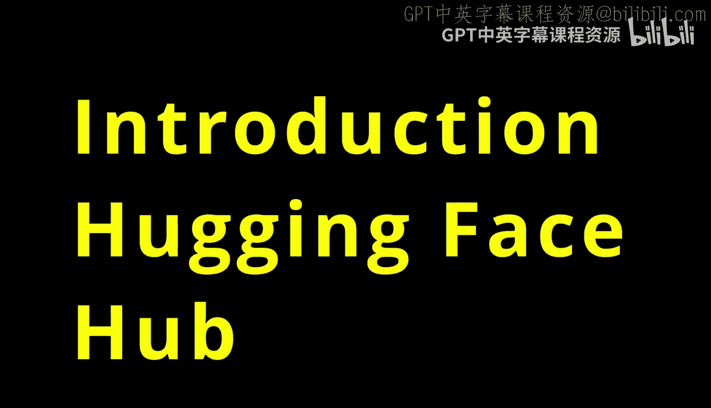
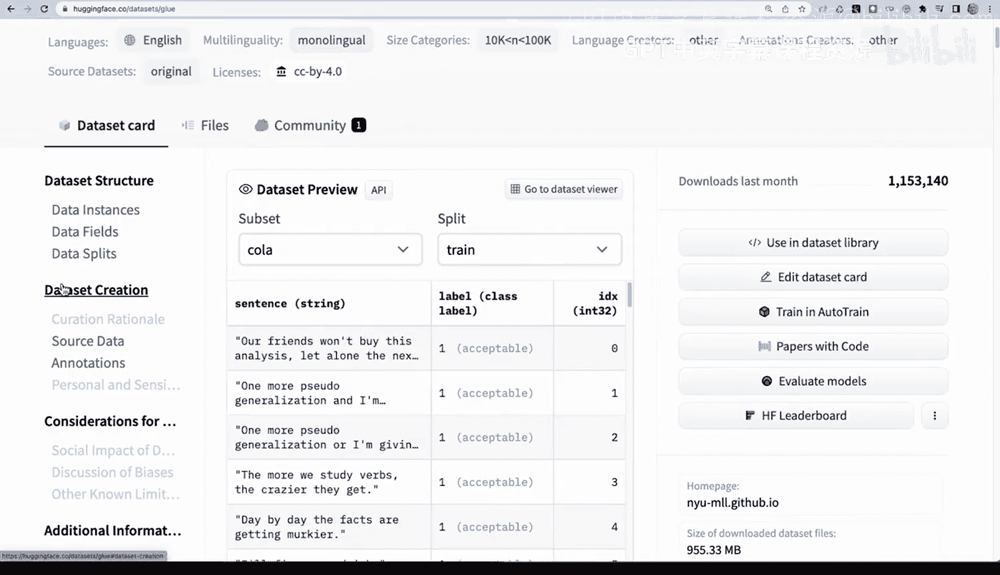
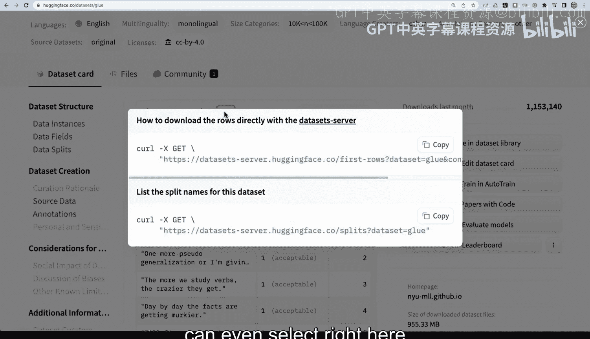
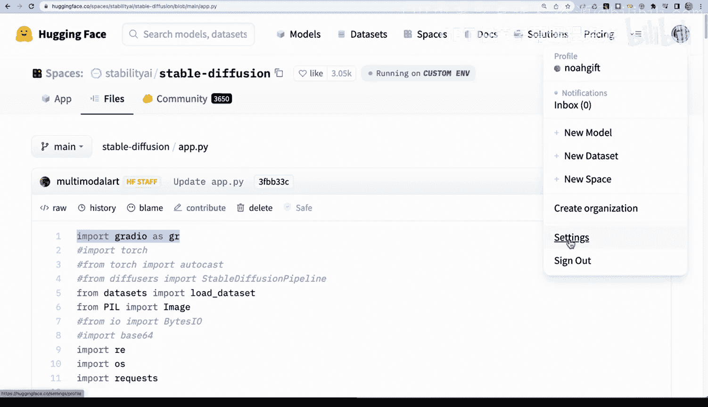

# Rust编程2-3（数据工程、DevOps）：75：Hugging Face Hub平台介绍 🧠

在本节课中，我们将要学习Hugging Face Hub平台的核心组成部分。Hugging Face Hub主要围绕几个关键产品构建，包括账户与令牌管理、模型库、数据集以及Spaces应用部署。掌握这些内容将帮助你有效地利用该平台进行机器学习项目开发。

## 账户与访问令牌 🔑

首先，你需要登录并创建一个账户。在个人资料页面，除了填写姓名和主页等信息外，最重要的设置是创建一个访问令牌。

访问令牌允许你以编程方式与Hugging Face Hub进行交互。这意味着你可以从GitHub Actions推送构建产物到Hugging Face，在开发环境中读写数据，或者配置Spaces应用。

以下是创建和使用访问令牌的核心步骤：
1.  在账户设置中生成一个访问令牌。
2.  将此令牌安全地保存在某个地方。

## 模型库 🤖

接下来需要了解的是模型库。模型是当前Hugging Face平台的核心组成部分，目前拥有超过80,000个模型，并且数量还在持续增长。

模型按多种任务进行分类，例如图像分类、翻译等。你还可以浏览更高级别的类别，如计算机视觉或自然语言处理。

在模型库中，你可以按下载量等指标进行排序，这有助于你在处理特定类别任务时选择合适的模型。例如，近期热门的OpenAI Whisper模型就可以通过Hugging Face集成到项目中进行语音转录。

## 数据集 📊

Hugging Face平台另一个重要的组成部分是数据集。平台上有大量数据集，这些数据集对于微调预训练模型非常有用，可以使模型针对你正在解决的特定问题变得更加精确。

数据集涵盖语言建模、多类别分类等细粒度任务。每个数据集页面都提供了数据结构信息、数据预览功能，甚至可以直接复制API调用代码在终端中进行查询。此外，你还可以在Hugging Face环境中直接使用这些数据进行训练。

总的来说，数据集是Hugging Face平台非常有用的一个方面，并且你也可以上传自己的数据。

## Spaces应用部署 🚀

最后一个关键组件是Spaces。Spaces是用于构建和分享机器学习应用程序的一种简便方式。

创建一个新的Space非常简单：只需提供Space名称并选择想要使用的技术栈，例如Streamlit、Gradio或静态HTML。你还可以为应用选择特定的开源许可证。

浏览他人创建的Spaces是熟悉各种技术的绝佳途径。例如，你可以查看“Stable Diffusion Demo”这个Space，了解其应用文件构成以及它如何使用Gradio框架。

## 总结 📝

本节课我们一起学习了Hugging Face Hub平台的四个核心部分。首先，我们介绍了如何创建账户和访问令牌以实现编程交互。接着，我们探索了庞大的模型库及其分类方式。然后，我们了解了数据集如何用于模型微调以及如何查询和使用它们。最后，我们介绍了Spaces作为部署和分享机器学习应用的平台。

要编程化地使用这个平台，你需要创建一个个人资料，在设置中配置API密钥，然后就可以充分利用模型、数据集和Spaces的强大功能了。