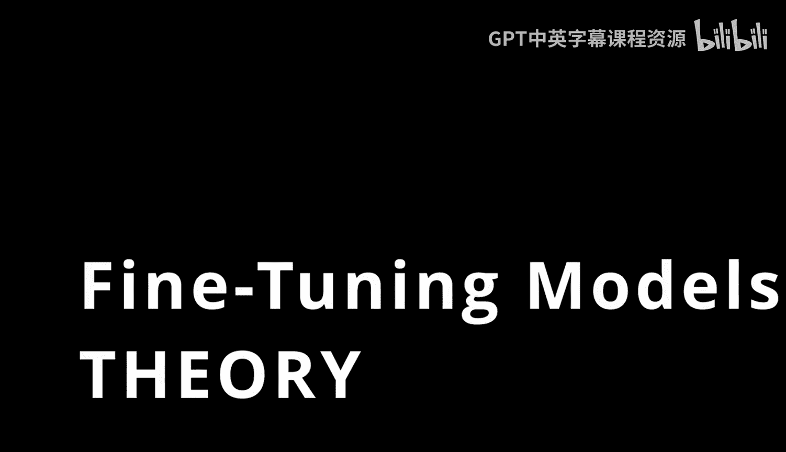
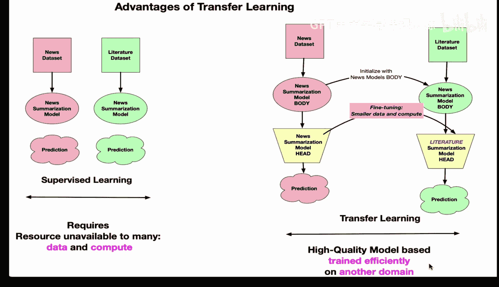

# Rust编程2-3（数据工程、DevOps）：79：模型微调理论基础 🧠

在本节课中，我们将学习迁移学习与模型微调的核心理论基础，特别是它们在自然语言处理领域的应用，并与传统的监督学习进行对比。

---

## 迁移学习的优势

上一节我们介绍了模型微调的概念，本节中我们来看看迁移学习相比其他机器学习方法有哪些具体优势。

一种非常经典的机器学习类型是监督学习。许多人听说过它，它本质上是利用历史数据训练一个模型，然后进行预测。例如，根据球员的数据点预测其未来的薪资，这就是一个经典的监督学习问题。

在自然语言处理领域，你可以看到，你会拥有一些新闻数据，然后创建一个摘要模型。这个模型可能在大量数据上进行训练，可能是一个拥有数十亿参数的大语言模型，其创建过程会非常昂贵。

如果你遇到另一种NLP问题，并且数据属于不同的领域，例如一个文学数据集，你就必须重复相同的过程，创建一个不同类型的新闻摘要模型。这个模型也可能有数十亿参数，并且非常昂贵。

这里的问题是，对于许多人和组织来说，他们既没有足够的原始数据作为起点，也没有计算资源来进行这种全局规模的监督学习。

幸运的是，这正是迁移学习的用武之地，也是Hugging Face平台的优势之一。你可以利用在特定领域（例如新闻数据）上预训练的模型主体，然后替换其“头部”。在这个例子中，就是新闻摘要模型的头部。你可以用较少的数据对这个头部进行微调，然后用于预测。

同样，你也可以在一个完全不同的领域上微调模型。假设一个模型是在新闻数据上训练的，你可以将其用于文学数据。你利用的模型主体可能包含数十亿参数，并且是由世界顶尖的机器学习工程师和研究人员训练的。然后，你只需要少量新数据，创建一个评估指标，用这些新数据微调该任务的“头部”，之后你就能进行预测了。

因此，核心思想是：你可以创建高质量的模型，这些模型训练效率极高，并且能应用于新领域。这就是迁移学习的关键优势，以及它如何应用于Hugging Face平台。

---

本节课中我们一起学习了迁移学习相比传统监督学习的核心优势，即能够高效地利用预训练模型的知识，通过少量数据和计算资源，在特定任务或新领域上获得高性能的模型。