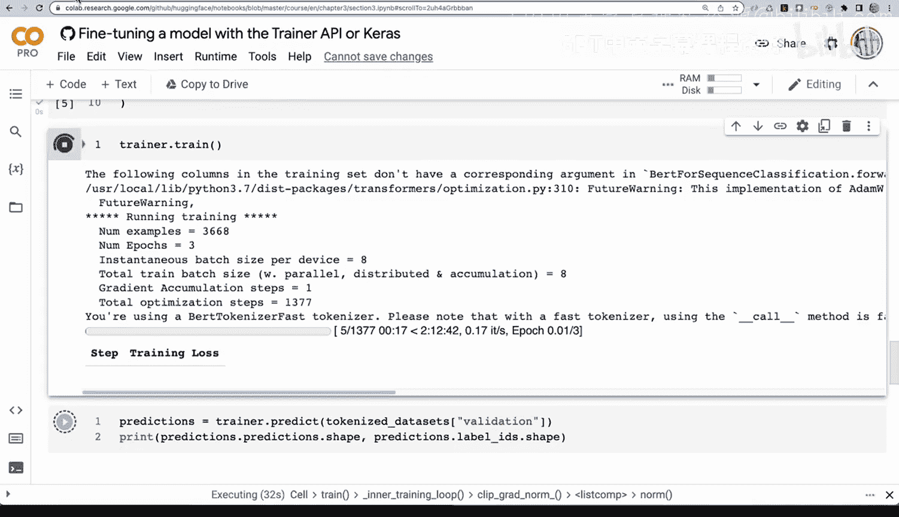
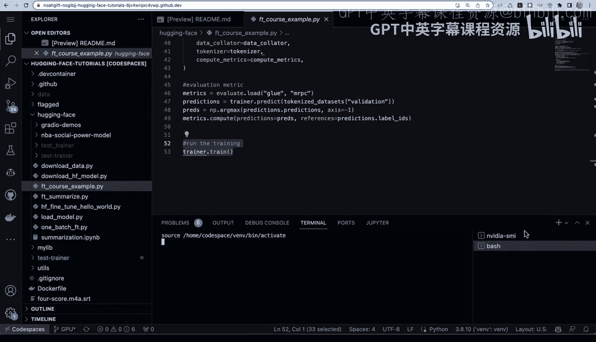
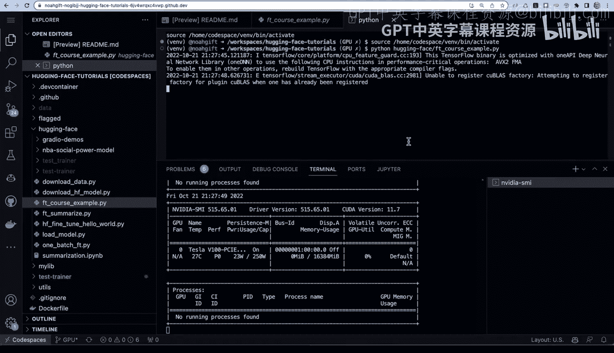
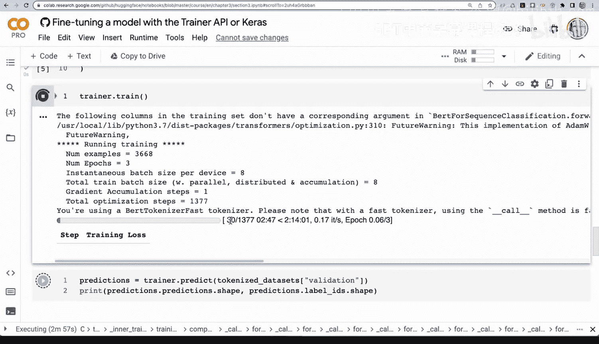
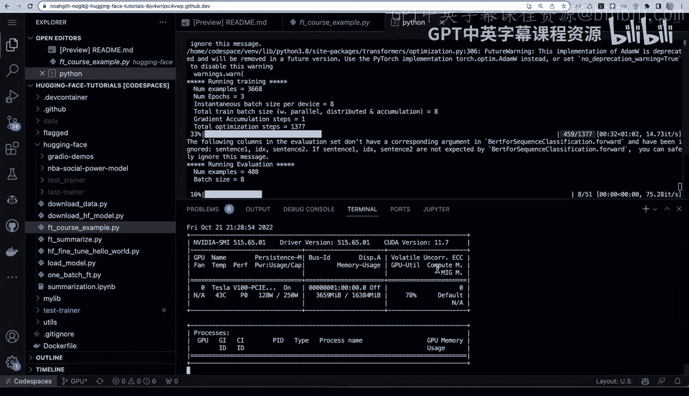
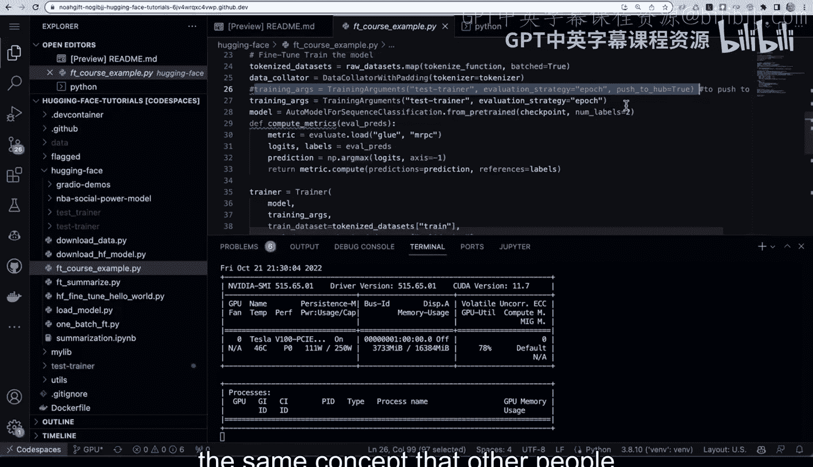
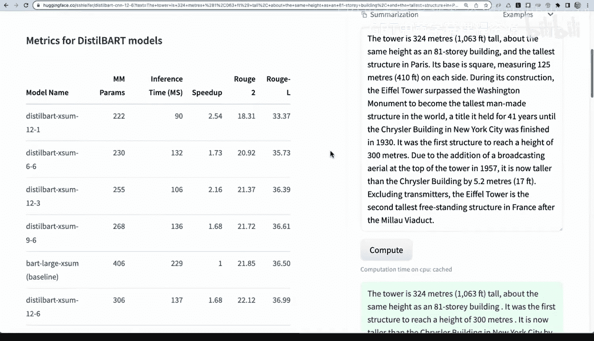
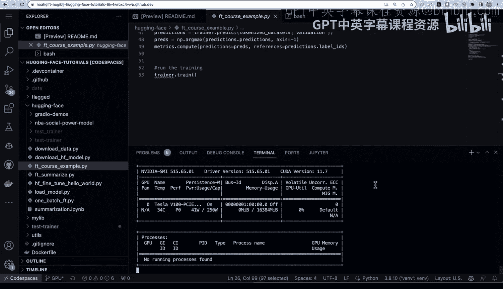

# 杜克大学《Rust编程2-3（数据工程、DevOps）｜Rust programming》中英字幕 p80 80_04_07_模型微调实践.zh_en -BV11y411z7Dn_p80-

Let's go ahead and take a look at the official huggingface documentation here and take a look at this course。

 you can see there's lots of different useful things in this course。

 but I want to take a look at the fine tuning section here。

 fine tuning and pretrain model and take a look at how I could actually implement that myself so I'm going to go ahead and select this button here and one of the nice things about this course is it opens up a coabab notebook and it gives us a nice overview of the sections as well so we can see here it's not a lot of code here。

 it's just a section here that install some software it then goes through and has a tokenized function it then has a trainer which goes right here and then we go ahead and we do a train and it will actually do the finet operation and then show us exactly what's happening。

Now， if I wanted to run this myself and get better and better accuracy。

 what I could do is use the collab environment here now。

 what's nice about this is if I connect to the runtime by default。

It's going to connect to a CPUbased runtime here and we can actually verify that if I say change runtime type notice I don't have any hardware acceleration。

 What's nice about this is it allows me to benchmark what would happen if I needed to fine tune a model by training it with a CPU and so we can actually go through here and say runtime run all and this will actually allow me to go through and kick off a installation first。

 and we can see that it does take a little bit of time when you're using coabab to install software because of the fact that it is not preloaded on this machine。

 unlike your own workspace or something like Github codespaces next， if we scroll down here。

 it's going through and it's running the next section， which is loading this data。

 which could take a little bit of time here。And then once it's gone through and loaded the data set。

 the next thing that it's going to do it's going to go through here。And set up the the training job。

 So give us a second here。 We can go through here。 We can get the pretrain model right here。

 That's the next step that's happening。AndOnce this is complete。

 then we can actually go through the fine tuning step here。

This is a good benchmark here to show what would happen if we were going to fine tune a model using more of like commodity type hardware。

 a CPU or a coabab notebook that only has CPU available。

 What would we get and here we go we can actually go into transformers here。And take a look at this。

And we can see here that it is， in fact， doing three epochs and。

We can actually see that it will take quite some time。 You can see here， this is the training job。

 It's going to take a while right to run this。 And in fact， it's of the 13。

77 steps It's only done for so far right so we can probably extrapolate that could take us who knows maybe 20 30 minutes to get this running。

 So I'm going to leave this running， and if I go back to that same code here and I take a look at running it inside of a Github code space with GPU enabled what we can do is is basically implement the same code。

 So I'm going to say from datas， import loaded load datas。

 grab the transformer pieces of code that I need like the training sets and then I'm going to go through here and I'm going to download the data that I'm going to use。

 which in this case would be the glue data， create a tokenized function and then in here I would just set up all of the different things I would need for my model。

 So in this case I could create my own compute metrics section and then I would just tell the trainer itself what is my data that I'm going to use and again it the data that we。

Loaded earlier， and then。I can go through here and say here's my evaluation metric。

 And then let's go ahead and run it。 So what's great is I can actually do invidia。😊。

SMI L1 to kick off the GPU monitoring。 and then next I can actually go through here。

And pop this on the screen above and actually run the training job。 So let's go ahead and do this。

 We'll，'ll go ahead and say。Python。Huggging face， FT we'll say fine tuning course example。

 So I'm going to take the example from the official documentation。

 I'm going to run it inside of this particular environment So there will be some things that will take a little bit of time。

 For example， anytime you need to download data that'll take a little bit of time but because we have these GPU resources available it should significantly change what's happening。

 and we can actually do a comparison against that fine tuning job that's running in coab。

 So here we go， we found a cache data set。 So this is again。

 a huge advantage of having your own environment。 and we're going to now train this fine tune model and and get better accuracy。

 So let's go ahead and run this。 Here we go。 It says number of examples for a wait epoch。

 you can see here。 it's just。

Really running through this very， very quickly。 And look。

 we can see that the GPU is actually being hit。 And if we go back to coab here， look at this。

 It's still stuck on。

You know， basically step 30 here。 And， and here we see it's just， it's just you know。

 grinding you through all of the different steps that are necessary。 And also。

 we can see here it's saturating this particular GP， which is a Tesla V 100。A very nice。

 powerful machine here and we as we're training the fine tuning job。

 we can actually get whatever metric we're caring about。

 maybe it's the F1 score is what we're caring about is that we want this F1 score to get better and better so that we're able to have the metric that we're optimizing for improved。

And as we improve this metric， this will help us build out really a fine tune model that's using custom data right so this is a good example of some of the advantages of having your own GPU available and fine tuning you can get your own improved accuracy look you can see here this was this was maybe the baseline and now here's our new improved accuracy and if we needed to as well。

 what we could do as we could actually push this change。

 every time it makes a new improvement we could actually tweak the code a little bit right here under training arguments and we could say look I want to push this to hugging face into a new model that's hosted and you can see this is kind of the same concept that other people have done on hugging face。

 So if we go back to hugging face real quick and we look at models and let's take a look at summarization you can take a look。

This is similar to what potentially people have been doing here， right in this particular model here。

 you can see that， in fact， it's based on。The the original Facebook model。

 but it's been fine tuned it's been pushed into this particular directory right so you can do the same thing yourself by doing fine tuning and again。

 if you're using these GPU resources here， look， it's already done， it's complete。

 it's a great way to experiment with fine tuning your own models。

