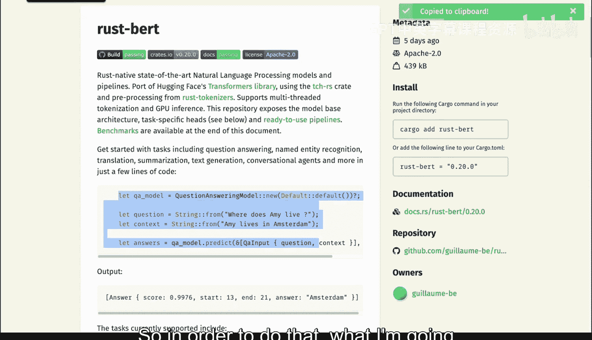
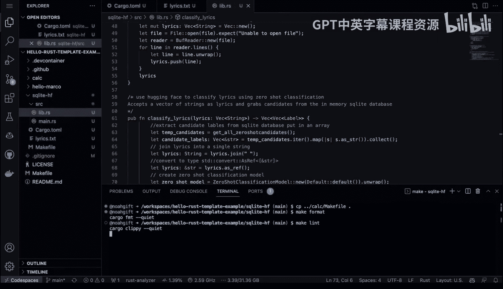
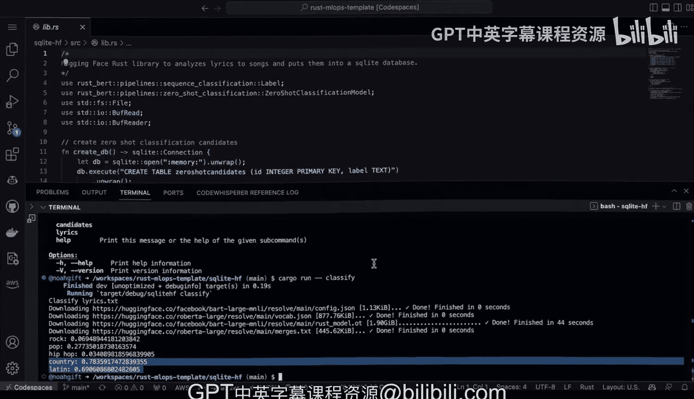

# Rust编程2-3（数据工程、DevOps）：82_04_03_Rust SQLite与Hugging Face零样本分类器 🚀


## 概述

在本节课中，我们将学习如何利用Rust构建一个高效的生产级机器学习应用。具体来说，我们将创建一个歌词分析器，它能够从文件中读取歌词，使用Hugging Face的零样本分类模型进行分析，并将结果存储到SQLite数据库中。我们将探讨为何Rust是MLOps（机器学习运维）的理想选择，并逐步实现一个可扩展的原型。

---

## 为什么选择Rust进行MLOps？⚡

上一节我们概述了课程目标，本节中我们来看看为什么Rust在机器学习运维领域具有独特优势。

许多人认为Python是机器学习的主导语言，但Rust同样是一个出色的候选者，尤其是在生产部署方面。Rust的核心优势在于其**性能**和**生产优先**的设计理念。

*   **卓越的性能**：Rust在许多操作上可比Python快**高达70倍**，并且能高效利用多核CPU进行并行计算。
*   **生产优先**：Rust允许你将模型打包成独立的**二进制文件**直接部署到生产环境，无需复杂的依赖环境，实现了真正的二进制可移植性。
*   **能效与资源利用**：Rust程序消耗更少的能源和计算资源，这对于需要处理海量数据（例如分析数百万首歌曲）的任务至关重要。

因此，对于构建需要高性能、高并发和高效资源利用的MLOps流水线，Rust是一个理想的选择。

---

## 项目架构设计 🏗️

了解了Rust的优势后，我们来看看如何设计一个真实的歌词分析系统。假设我们是一家音乐公司，拥有数百万首歌曲，希望用现代LLM技术对曲库进行分类，以用于推荐引擎或商业分析。

以下是该系统的核心架构流程：

1.  **SQLite数据库**：存储预先定义好的歌曲分类候选标签，例如：`摇滚`、`流行`、`嘻哈`、`乡村`、`拉丁`。
2.  **歌词转录**：高效地遍历文件系统，将数百万首音频文件转录为文本。Rust的高性能和多线程能力在此环节至关重要。
3.  **零样本分类**：使用Rust的Hugging Face绑定库，将转录后的歌词文本送入预训练模型进行分类。
4.  **结果回写**：将分类结果写回数据库，完成整个分析流程。

这个架构代表了一个真实、可投入生产的世界级系统。

---

## 开始编码：环境与依赖设置 💻

现在，让我们开始动手构建这个项目。我们将使用GitHub Codespaces作为开发环境，并借助Cargo生态系统来管理项目。

首先，创建一个新的Rust项目：

```bash
cargo new sqlite_hf
cd sqlite_hf
```

接下来，我们需要配置项目的依赖项。编辑 `Cargo.toml` 文件，添加必要的库。

以下是项目所需的依赖项：

*   `rust-bert`：用于加载和使用Hugging Face的预训练模型。
*   `rusqlite`：用于操作SQLite数据库。
*   `tokio`：用于编写异步代码（如果需要处理高并发I/O）。
*   `anyhow` 和 `thiserror`：用于优雅的错误处理。

```toml
[dependencies]
rust-bert = "0.21.0"
rusqlite = { version = "0.29.0", features = ["bundled"] }
tokio = { version = "1.0", features = ["full"] }
anyhow = "1.0"
thiserror = "1.0"
```

Rust拥有丰富的MLOps库生态系统。例如，`rust-bert`库提供了即用型的NLP管道和语言模型，其底层的`tokenizers`库正是因为**Rust实现而速度极快**。这证明了Rust在性能关键型MLOps能力中的核心地位。

---

## 构建核心库代码 📚

依赖设置完成后，我们开始编写核心逻辑。首先在 `src` 目录下创建 `lib.rs` 文件。

我们将实现以下几个主要功能：

### 1. 初始化数据库与候选标签

首先，我们需要创建一个SQLite数据库并在其中插入零样本分类的候选标签。

```rust
// src/lib.rs
use rusqlite::{Connection, Result};

pub fn initialize_database() -> Result<Connection> {
    // 在内存中创建数据库（生产环境应持久化到磁盘）
    let conn = Connection::open_in_memory()?;

    conn.execute(
        "CREATE TABLE IF NOT EXISTS zero_shot_candidates (
            id INTEGER PRIMARY KEY,
            label TEXT NOT NULL UNIQUE
        )",
        [],
    )?;

    // 插入预定义的分类标签
    let labels = ["摇滚", "流行", "嘻哈", "乡村", "拉丁"];
    for label in &labels {
        conn.execute(
            "INSERT OR IGNORE INTO zero_shot_candidates (label) VALUES (?)",
            [label],
        )?;
    }

    Ok(conn)
}
```

这段代码创建了一个内存数据库，建立了一张表，并插入了我们预设的音乐流派标签。`rusqlite`的API非常直观，与Python中的SQLite操作类似。

### 2. 从数据库读取候选标签

接下来，编写一个函数从数据库中查询所有候选标签。

```rust
pub fn get_candidates(conn: &Connection) -> Result<Vec<String>> {
    let mut stmt = conn.prepare("SELECT label FROM zero_shot_candidates")?;
    let label_iter = stmt.query_map([], |row| row.get(0))?;

    let mut candidates = Vec::new();
    for label in label_iter {
        candidates.push(label?);
    }
    Ok(candidates)
}
```

这个函数执行一个简单的SELECT查询，并将结果收集到一个`Vec<String>`（可变的字符串列表）中返回。对于Python开发者来说，`Vec`类似于`list`。

### 3. 从文件读取歌词

我们需要从文本文件中读取歌词。创建一个 `lyrics.txt` 文件并粘贴一些歌词内容。

```rust
// src/lib.rs
use std::fs;
use anyhow::Result as AnyResult;

pub fn read_lyrics_from_file(file_path: &str) -> AnyResult<Vec<String>> {
    let content = fs::read_to_string(file_path)?;
    // 假设每行歌词是一个独立的字符串，或根据实际情况分割
    let lines: Vec<String> = content.lines().map(String::from).collect();
    Ok(lines)
}
```



这个函数读取指定文件的内容，并按行分割成字符串向量。注意`let`关键字用于声明**不可变变量**，这是Rust保证内存安全和代码健壮性的核心机制之一。

---

## 集成Hugging Face进行零样本分类 🤖

核心数据准备就绪后，本节我们来看看如何集成机器学习模型。我们将使用`rust-bert`库调用Hugging Face的零样本分类管道。

首先，在 `Cargo.toml` 中确保已添加 `rust-bert` 依赖。

以下是进行分类的核心函数：

```rust
// src/lib.rs
use rust_bert::pipelines::zero_shot_classification::ZeroShotClassificationModel;
use anyhow::{Result, Context};

pub fn classify_lyrics(lyrics: Vec<String>, candidates: &[String]) -> Result<Vec<String>> {
    // 加载预训练的零样本分类模型
    let model = ZeroShotClassificationModel::new(Default::default())
        .context("Failed to load zero-shot classification model")?;

    // 对每一段歌词进行分类
    let mut results = Vec::new();
    for lyric_chunk in lyrics {
        // 模型返回每个候选标签的置信度分数
        let output = model.predict(
            vec![lyric_chunk.as_str()], // 输入文本
            candidates.to_vec(),         // 候选标签
            None,                        // 假设标签互斥
            1,                           // 返回top-k个结果
        )?;

        // 获取置信度最高的标签
        if let Some(best_label) = output[0].get(0) {
            results.push(best_label.text.clone());
        }
    }

    Ok(results)
}
```

这段代码完成了以下工作：
1.  初始化一个零样本分类模型。
2.  遍历输入的歌词片段。
3.  对于每段歌词，模型会计算其属于每个候选标签（如“摇滚”、“流行”）的置信度。
4.  选择置信度最高的标签作为分类结果。

`rust-bert`的API设计清晰，使用起来与Python版的Hugging Face Transformers库非常相似，体现了Rust在保持高性能的同时，也兼顾了开发者的使用体验。

---

## 整合与运行：主程序 🎯

最后，我们将所有模块在 `src/main.rs` 中整合起来，形成一个完整的可执行程序。

```rust
// src/main.rs
use sqlite_hf::{initialize_database, get_candidates, read_lyrics_from_file, classify_lyrics};
use anyhow::Result;

#[tokio::main]
async fn main() -> Result<()> {
    println!("🚀 开始歌词分类分析...");

    // 1. 初始化数据库并获取候选标签
    let conn = initialize_database()?;
    let candidates = get_candidates(&conn)?;
    println!("📋 候选分类标签: {:?}", candidates);

    // 2. 从文件读取歌词
    let lyrics = read_lyrics_from_file("lyrics.txt")?;
    println!("📄 读取到 {} 段歌词", lyrics.len());

    // 3. 使用Hugging Face模型进行分类
    println!("🤖 正在使用零样本模型进行分类...");
    let classifications = classify_lyrics(lyrics, &candidates)?;

    // 4. 输出结果
    println!("✅ 分类完成！");
    for (i, label) in classifications.iter().enumerate() {
        println!("  歌词片段 {} -> 分类: {}", i + 1, label);
    }

    // 5. (可选) 将结果写回数据库
    // ...

    Ok(())
}
```

运行程序：
```bash
cargo run
```

如果一切顺利，你将看到程序成功读取歌词，并通过Hugging Face模型输出了每一段歌词最可能的音乐流派分类。

---

## 总结

本节课中，我们一起学习并实践了如何使用Rust构建一个完整的MLOps应用原型。我们：

1.  **探讨了Rust在MLOps中的优势**：包括其卓越的性能、生产优先的二进制部署以及高效的资源利用。
2.  **设计了系统架构**：从SQLite数据库、歌词转录到零样本分类的完整流程。
3.  **实现了核心功能**：
    *   使用`rusqlite`操作数据库。
    *   使用标准库进行文件I/O。
    *   集成`rust-bert`库调用Hugging Face的零样本分类模型。
4.  **整合并运行了完整应用**：将各个模块串联，实现了从歌词文件到分类结果的端到端分析。





这个原型虽然简单，但其架构和使用的技术栈（Rust + SQLite + Hugging Face）具备处理**海量数据**的潜力。通过利用Rust的并发特性，你可以轻松地将其扩展为能够并行处理数百万首歌曲的高性能生产系统。这充分证明了Rust是构建下一代高效、可靠MLOps工具链的强大语言。