# 杜克大学《Rust编程2-3（数据工程、DevOps）｜Rust programming》中英字幕 p83 83_04_04_BigQuery提示工程.zh_en -BV11y411z7Dn_p83-

Welcome to Open AI。 You can see here that inside of Open AI， we can start doing prompt engineering。

 The idea here is that if we go through and look at some of these examples。

 there are many different ways to get code out of a large language model If we go to SQL translate。

 this is a good example， I could go through here， open up a playground。

 go ahead and submit it and try to get some SQL answer。

 So this is the idea here is that you prompt the program to give you some code and you go back and forth。

 So how do we actually do this with a platform like Big query。 Well。

 let's go ahead and try look at how we can do this。 So let's go ahead and view this data。

And if we go through here， we view this data， you can see that this is rising trends here for the Google Cloud。

 and if we go through and we look at the Google trendss。

 you can see there's things like top rising terms， for example。

 and if I wanted to go ahead and look at one of these queries I could actually open this up。

And close these tabs here and make this bigger and select some term here and start to do a query。

 But what if I don't know exactly how to format or how to make things perfect。

 obviously like a format like this， but I want to add more context。 What can I do， Well。

 an easy way to deal with this is to actually grab a query and put it into chat GBT。

 So if we go through here and I say， you know， I need。

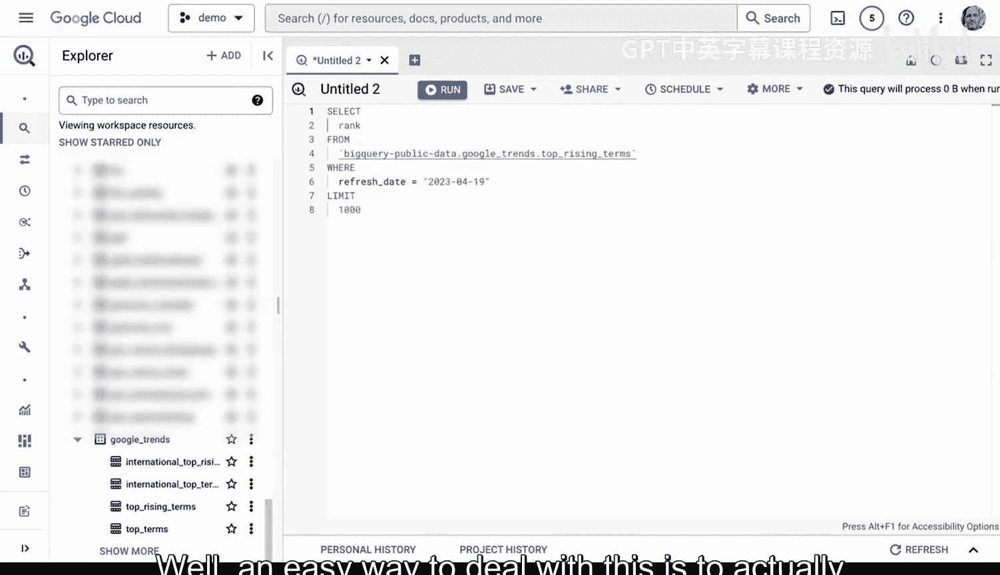

You to explain this Google big query query for me。Right we go through here。

 we throw it inside and it's going to say this Google Bigque is designed to extract the top 100 rising terms from the Google trends data set for a specific date range。

 Here's a breakdown of the query。 So this is one of the best ways to get started when you're looking at you know building things out is you could ask for some kind of explanation about what it is you're doing。

 Now， if I wanted to to actually run this query Now。

 let's go ahead and throw this in there and run this query。

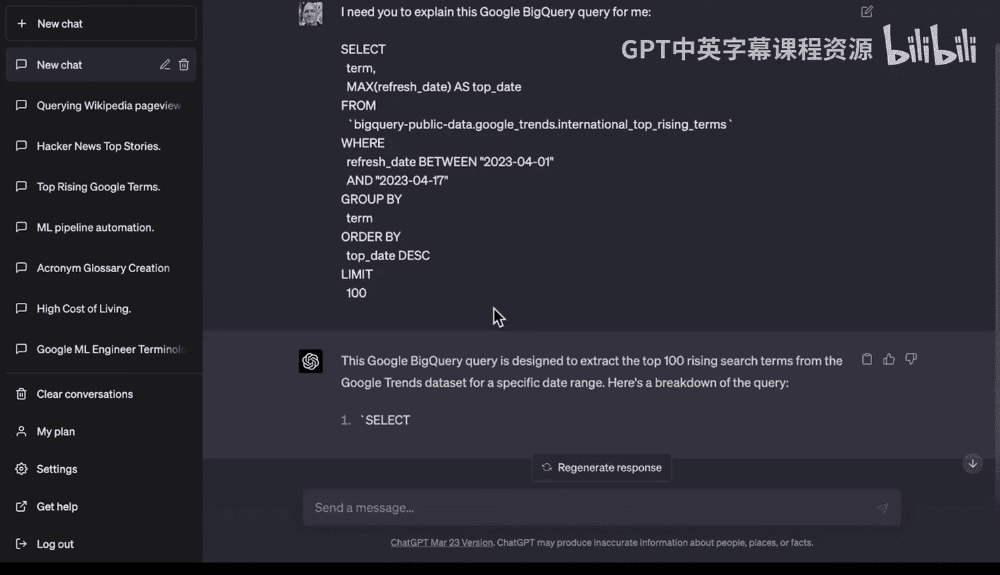

What you'll see is that this one goes through and it shows us these you know top rising queries here of all the different things from Google on the date 417。

 What if I wanted to do something a little bit trickier trickier here and ask it to tweak it。

 So let's let's say， you know， can you make this query。

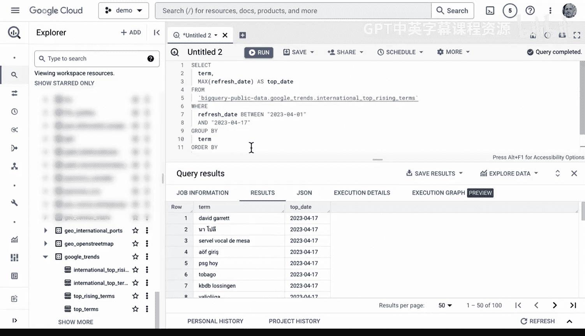

Show。Only。The top。10 results。 So let's say that you were trying to figure out how to actually get the top 10 results。

 We could go through here and say， here's my code。And we can say change this query to get the top 10 only。

There we go。And we can actually modify the query to get the top 10。

 So this is a great way to use prompt is to try something out。

Try to get a tweaked version of it and get a code sample and then try out that version。

 So let's go ahead and do this。 And look， it actually gives us a nice explanation of the code。

 We go back here。 We throw it in。

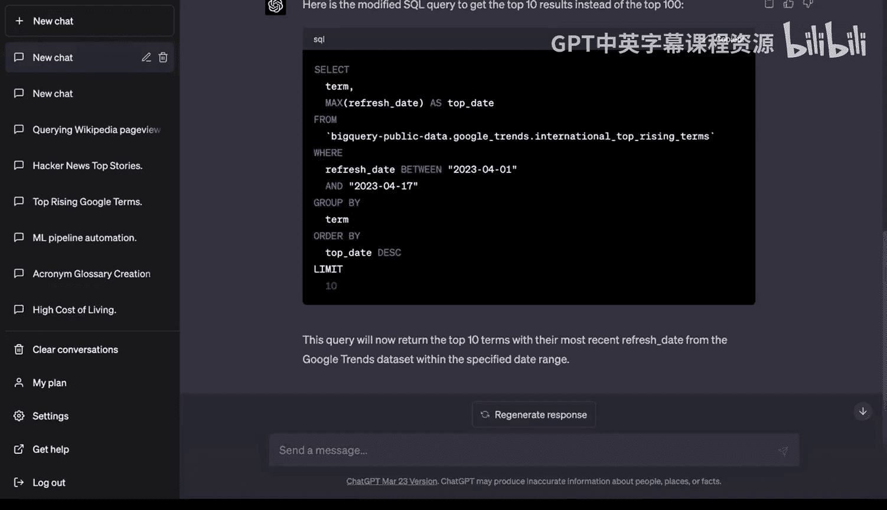

And we paste it in here。And if we go ahead and we run it again。We can see that in fact。

 we're able to get only 10 results， which is exactly what we wanted to。

 What if I wanted to change this so that all of the results were capitalized instead， Well。

 let's go ahead and ask if we can do that。 let's say you know， thank you。 that was perfect。

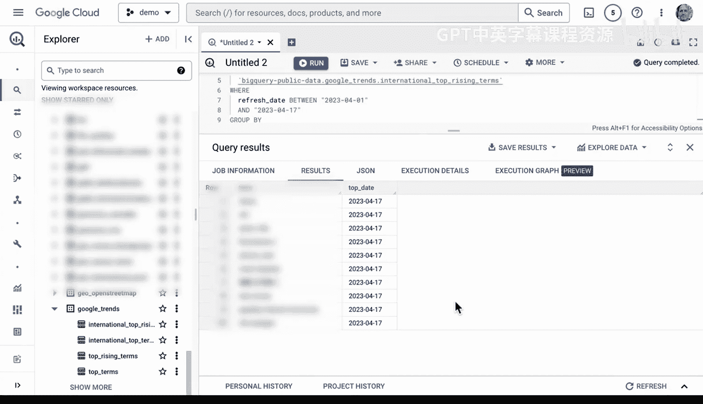

Now I need the results， all caps。Okay， let's see what happens to get the result with all caps you can just do upper。

 right。It really is like being with a database expert that sits right next to you。

 and can go through here and。Ask them what it is that you can build。

 So let's go ahead and go to copy code， go back here， scroll down again。

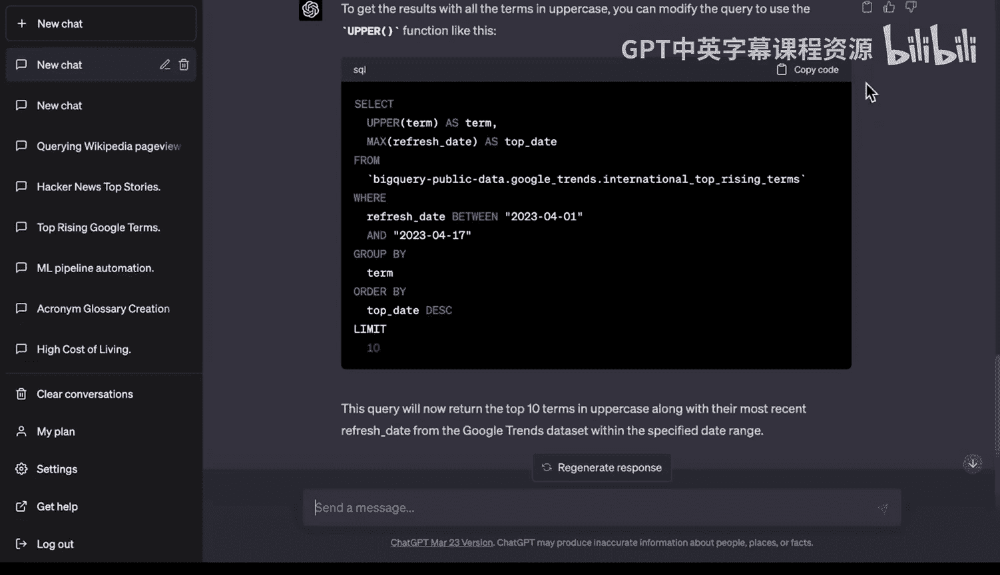

Paste it， and then we can go ahead and see if we can get all CAPS results here。There we go。 In fact。

 it is all caps perfect。 Now， what if I want to say tweak again。

 because let's say I'm doing some kind of particular kind of you know script is let's actually replace the spaces with an underscore thanks this is perfect。

 Now let's move all of the spaces to use underscores。

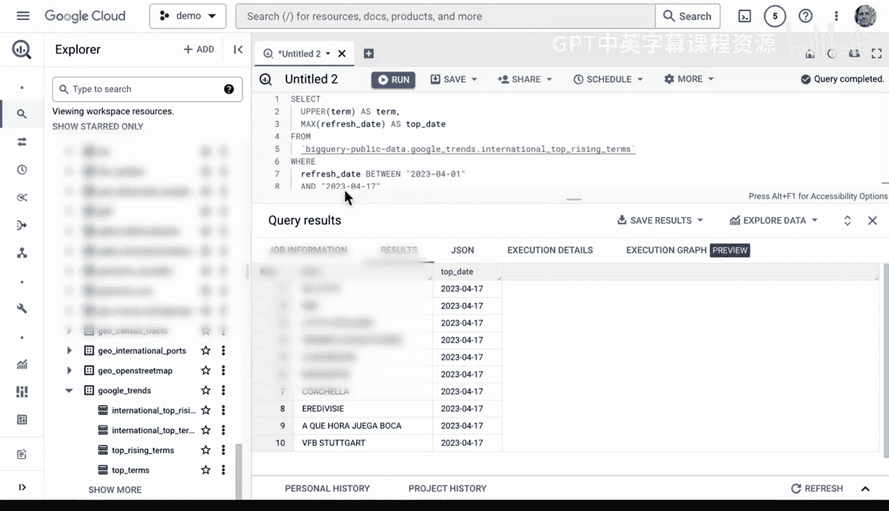

There we go and let's go through and let's see what assessed says to replace the spaces with underscores you can do replace perfect and again this is a starting point so if I wanted to I could even change their code and tweak it or if I didn't want an underscore I could change it to some other kind of character replacement。

 but again we can go ahead and we can try this result。

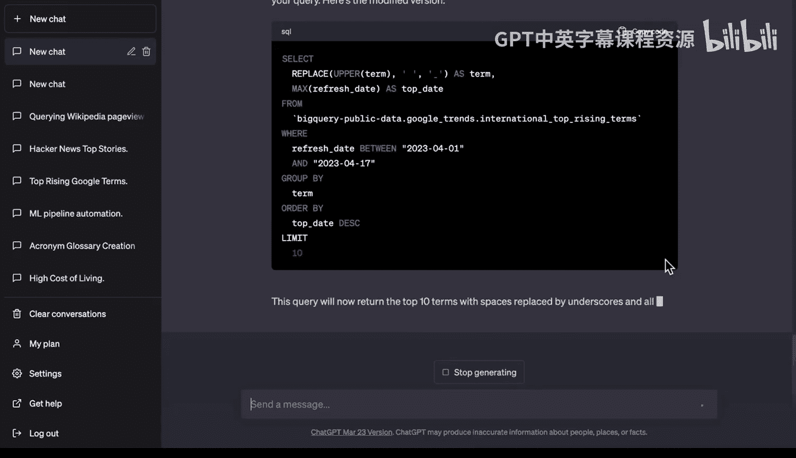

And we can go through here and do that。 so in my opinion。

 using a tool like BigQury is already a very powerful tool。

 but if you use prompt engineering as well to help you out。

 you can see here that there's some really cool things that you can do to get result changes now let's go ahead and look at this particular query again and if we look here this is international top rising terms and we can see what else we have in here we have the country。

 the country name so I'm going to go ahead and ask ChadtBT to include that thanks that was perfect。

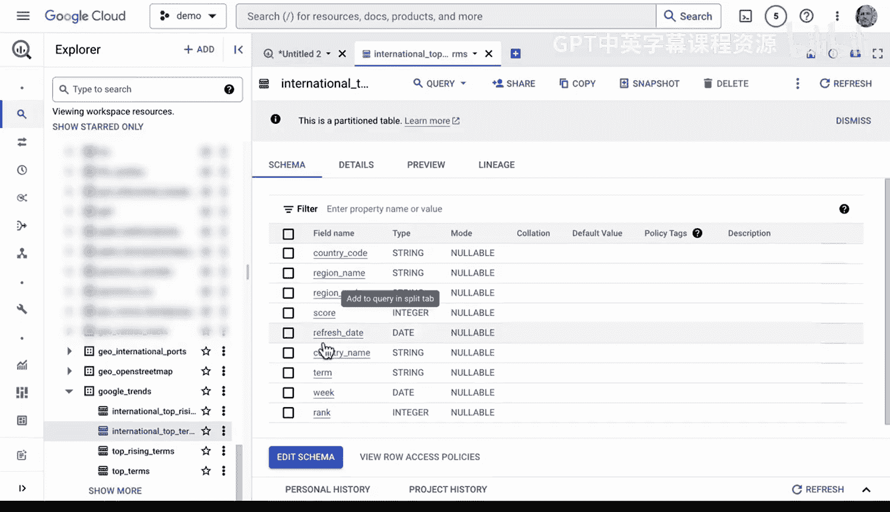

Thanks， that was perfect。I also need you to add the country code。

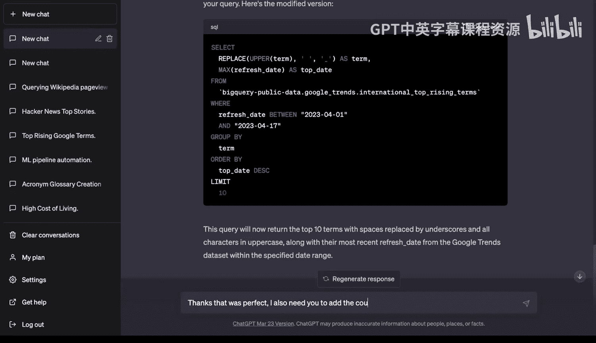

The country name to the query。And let's go ahead and make sure we have the right name， which is say。

 yeah， country country name to the query。

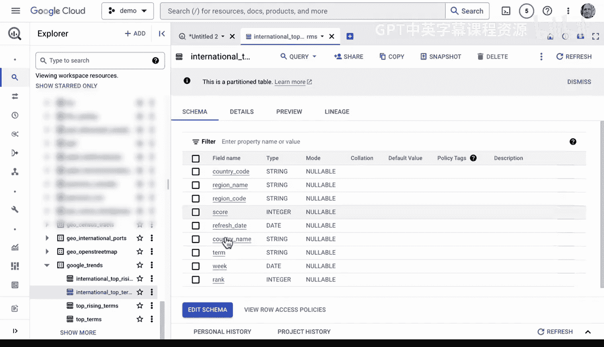

Okay， let's go ahead and do that to include the country name the query。

 you need to add it to the select cause。Cluse and add the group by clauses。 There we go。

 we're still leaving our replace。 We're still doing this。

 So really doing incremental results when you're prompt engineering is one of the best ways to get results。

 Let's go back here and let's throw this query inside。

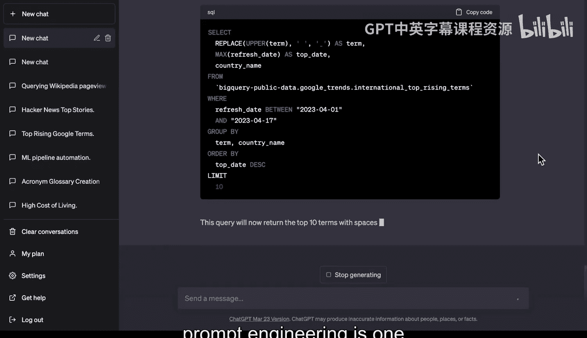

And let's do it one more time。 There we go。 And of course， we're getting some nice results here。

 and we can see here that we've got actually South Korea， Netherlands。 Now。

 one of the things that we may want to do to do our final result here is we may want to count keep another。

Column here。 that keeps count of each of the countries that's listed and expand it to maybe the top 50。

 So let's go ahead and do that。 So let's say that was perfect。

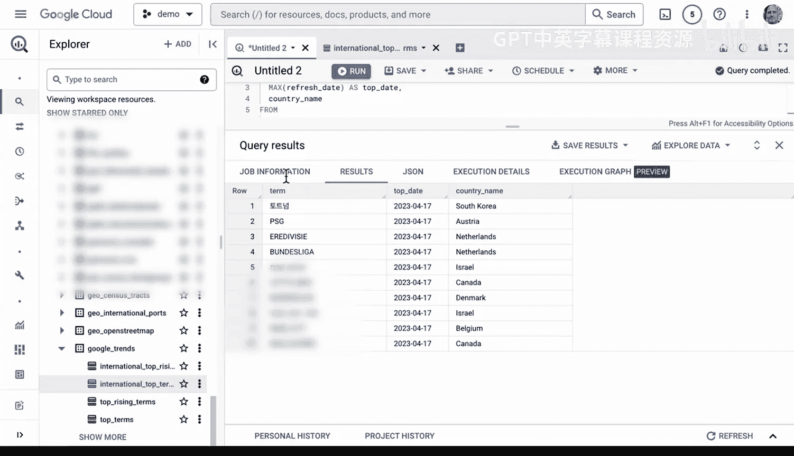

That was perfect。Thanks。Now， let's expand。Our query to  50。Results。And add a another column。

That we generate ourselves。呃。M。That counts the number of occurrences。Of a result by country。

And include。This in the output。In the output。 Okay， let's see what happens。

 Let's see if it understands a pre complex natural language processing query to expand it to return the 50。

 include a generator column。 that count the number of occurrences of a term。

 You can use count function。 There we go。 country name， count number of occurrences。

And this is going to again look at the state 2023 and we're going to expand it。

 this will return the top 50 terms and we can go ahead and throw this in， all right。

 fingers crossed we're again doing a reasonably complex operation and let's see if chatTBT is successful and let's go ahead and query our result。

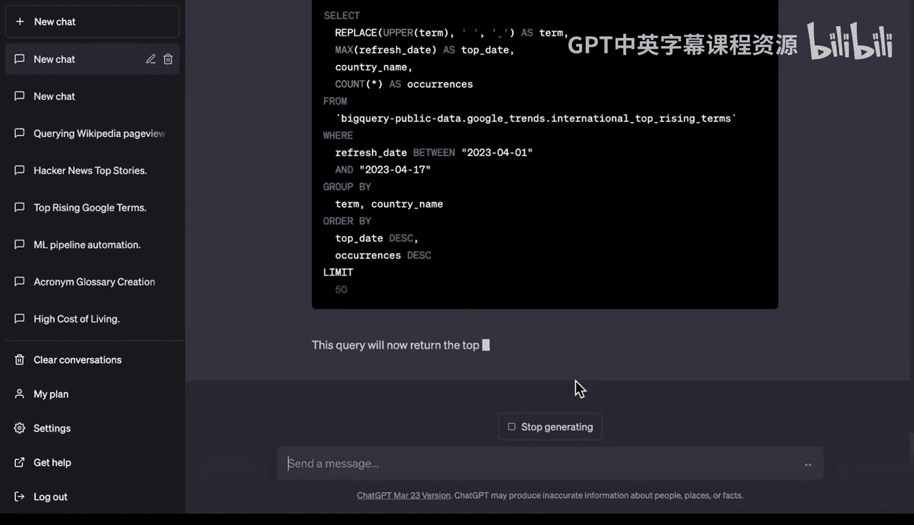

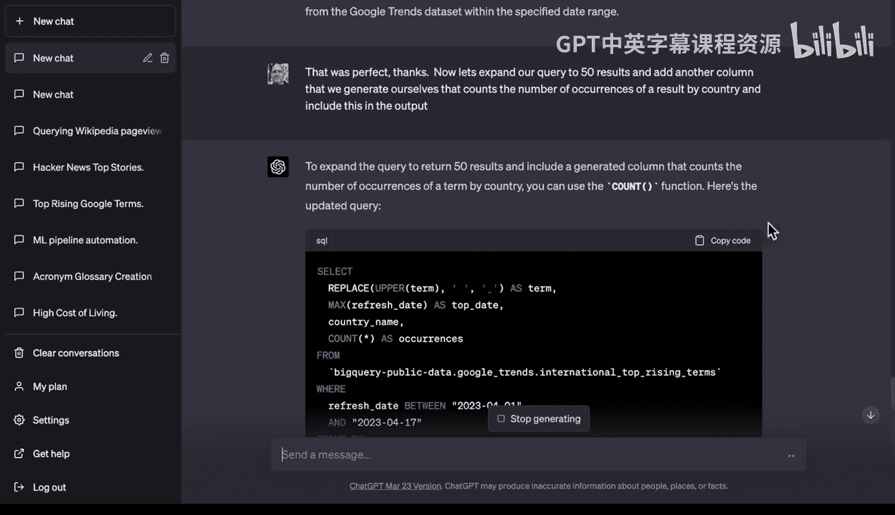

Here we go， Looks like it's working so far， awesome。

 we can see that in fact the number of occurrences are Turkey here， Thailand， Vietnam。

 Turkey right so we are able to again do this query and actually get the number of occurrences of that country name so you know we could probably tweak things make it more understandable but really this is a great way to use a tool like BigQury to set up things for maybe training a machine learning model in the future by going back and forth with prompt engineering with chatt GT for。

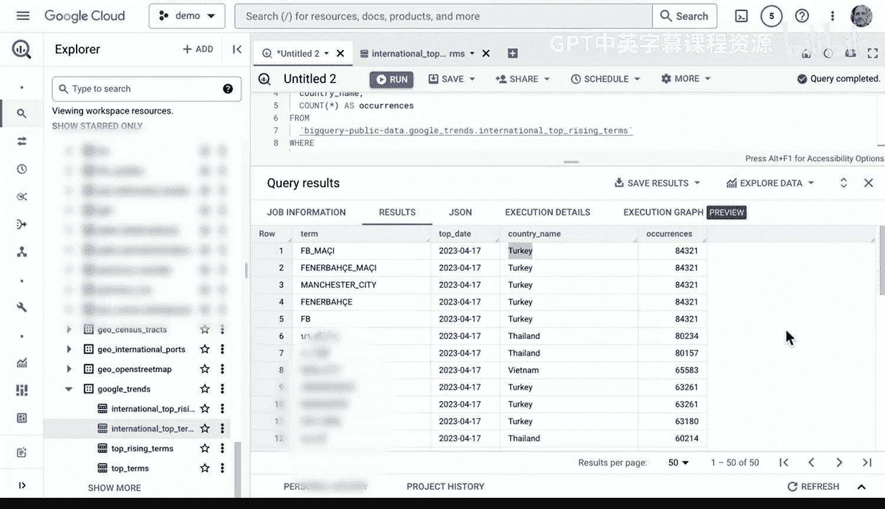

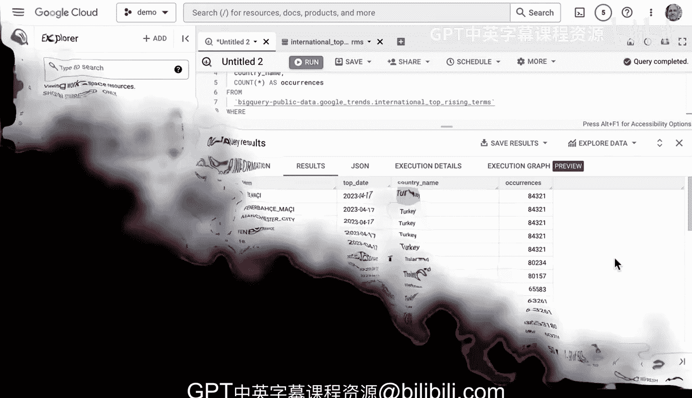