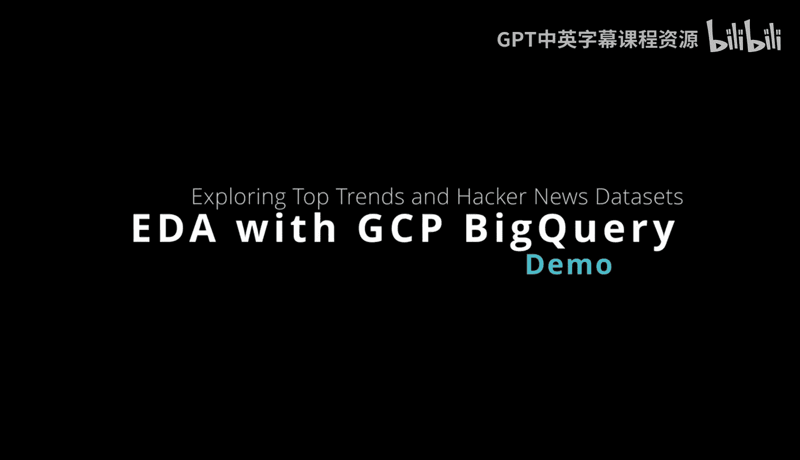
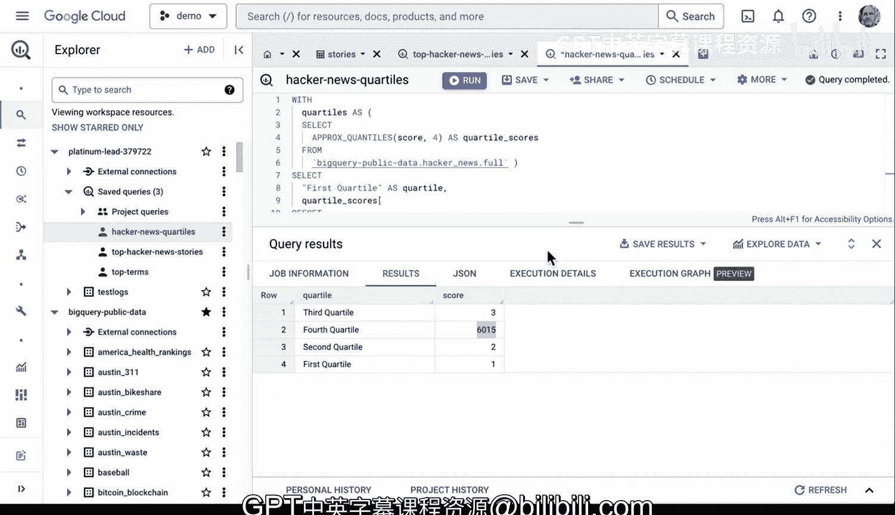

# 数据工程与DevOps：2-3：使用BigQuery进行数据探索 🧭



在本节课中，我们将学习如何使用Google Cloud平台上的强大工具——BigQuery来探索和分析数据。我们将从访问公共数据集开始，逐步学习如何编写查询、理解数据模式，并利用可视化工具进行深入分析。

---

## 探索BigQuery界面与公共数据集

上一节我们介绍了课程目标，本节中我们来看看BigQuery的基本界面和如何利用其公共数据集。

BigQuery是Google Cloud平台上用于探索数据的强大工具。查看此处的概览，可以看到可以编写新查询、添加数据，甚至上传本地文件。因此，有很多简单的方法可以开始使用，但最强大的方法之一可能是使用公共数据集。

如果我们查看一个现有的Google趋势数据集，这是深入了解如何使用特定数据的好方法。我通常会做的第一件事是查看有关此特定数据的元数据。可以看到它最后修改于2022年9月20日，这是一个Google趋势数据集。

---

## 编写并运行SQL查询

了解了数据集的基本信息后，接下来我们学习如何编写和运行查询来获取数据。

如果想继续查询，一个好方法是转到切换节点，可以看到此特定数据的不同部分。例如，假设我想查看一些热门词汇，我可以查看词汇、周度分数、排名等信息，以确定我实际想做什么。事实上，如果我只选择这个“词汇”字段，它会尝试自动为我构建查询。因此，实际上我不需要做太多工作来查询，例如，查看热门词汇并查看此特定数据集中的前10个项目。可以看到，由于湖人队正在参加季后赛，目前“Lakers”在词汇中非常流行。同样，如果我想查看分数、排名等，也可以做同样的事情。

我们可以从这里开始，创建一个能显示更多细节的查询。让我们关闭这个，然后在这里格式化一个查询，显示不同的热门词汇，甚至可能使其更清晰一些。

以下是构建查询的步骤：

1.  使用 `SELECT` 语句选择字段。
2.  使用 `WHERE` 子句指定条件。
3.  使用 `LIMIT` 子句限制返回的行数。

```sql
SELECT term, refresh_date AS top_date
FROM `bigquery-public-data.google_trends.top_terms`
WHERE refresh_date BETWEEN '2023-04-01' AND '2023-04-17'
LIMIT 100
```

此外，如果转到“更多”选项，甚至可以格式化查询。如果想保存查询，这通常是个好主意，也可以另存为。这很好，因为可以将其命名为“热门词汇”或任何你想做的，并从此开始，我可以反复使用它。这实际上可能是数据科学家希望定期运行的东西，他们可以调整它以运行。

如果我运行这个查询，可以看到我在此特定日期范围内获得了所有不同的热门词汇。我可以查看历史上的任何时间，可以看到人们感兴趣查看的许多关键词汇，涉及流行文化等领域。

---

## 利用工具进行深入探索与分析

运行基础查询后，数据科学家通常需要更深入地审视数据，而不仅仅是SQL查询。这时，其他功能就派上用场了。

一旦获得这样的数据集，一件有趣的事情就是进一步探索数据。作为数据科学家，如果要构建机器学习模型，很多时候首先需要查看数据，甚至超越SQL查询。这就是这些其他功能发挥作用的地方。让我们点击“探索数据”。注意我有三个选项。电子表格实际上是许多场景下相当不错的选择。我也可以用Coab笔记本打开并进行一些查询，这也是一个非常好的选择。我还可以使用仪表板类型的工具查看它。让我们先看看Looker Studio。如果我深入研究这个Looker Studio，它会给我一些默认查询，我实际上可以查看不同的字段和词汇等，并从那里查询。如果我愿意，也可以保存它并与其他人分享。因此，对于进行探索性数据分析来说，这是一个非常全面的流程。

---

## 查询其他数据集并组合数据源

除了探索单一数据集，我们还可以查询其他数据集，组合不同来源的信息以获得新见解。

接下来我要做的是查看其他数据集。注意，在这个公共数据集中，我处于Google趋势中，正在查看热门词汇，但国际热门词汇或热门上升词汇呢？嗯，我已经有一个查询，我将把它放入这个窗口，放在这里，实际上我要保存这个查询，我将其命名为“热门词汇”。如果我运行它，可以看到这实际上是一个国际热门词汇查询，再次看到这是来自4月17日，可以看到这里所有不同的热门词汇，结果非常不同。同样，如果我想把它放到Looker Studio中，这将是一个好方法。

然而，除了这个特定的数据集，我们还可以查看其他数据集，寻找关于它的新信息，并可能组合这些不同的来源。你可以在这里浏览。有很多不同的数据集可供使用：Google广告、Google Cloud发布、政治趋势等。我将选择一个有趣的数据集，即Hacker News。如果我们查看Hacker News，可以看到这些数据包含自2006年以来Hacker News的所有故事和评论。这是一个较小的聚合器，聚合故事，很多技术人员对这个特定数据感兴趣。可以看到它也比较新，最后修改于2022年9月20日。因此，我们应该能够找到一些非常酷的信息。假设是故事，如果我在这里查看，我可以再次看到字段。因此，首先查看模式，看看有哪些不同的字段名称是我需要关心的，这总是很重要。例如，故事分数可能是一个好字段，比如特定分数的强度如何，了解有史以来最受欢迎的故事是什么，它们实际得分是多少。中位数分数是多少？第25百分位数是多少？第75百分位数是多少？所有这些描述性统计在初次查看事物时都很有帮助。

所以这是我要在这里查询的字段。我将转到查询，让我们把它放到一个新标签页中，再次，它给了我们一个默认查询。但我已经有一个查询要开始。我想查看Hacker News上有史以来创建的热门故事。让我们查询这个。

```sql
SELECT id, title, author, score, timestamp
FROM `bigquery-public-data.hacker_news.full`
WHERE type = 'story'
ORDER BY score DESC
LIMIT 10
```

再次，我可以格式化它以确保一切看起来都很好。通常，确保语法正确是个好主意。同样，我可以保存这个，我们可以保存查询，我们可以称之为“热门Hacker News故事”之类的。我们可以继续保存它，接下来，我选择运行。再次，它将在这里运行并给我们这个很好的查询。现在，如果我要进行一些自然语言处理，这个查询会更丰富，因为我们这里有作者。我们还有分数，现在变得非常有趣，我们看到这里有6000，4000，甚至可以看到这些前10名分数之间的一些非常大的差异，这似乎有点不寻常。注意，作为数据科学家，我们看到一个趋势，我们看到斯蒂芬·霍金去世了。这是有史以来最热门的故事之一。史蒂夫·乔布斯去世了，也是有史以来最热门的故事之一。如果我们看看人们离开公司，可以看到有一种特定的风格，也许人们正在查看故事，如果我们看更多，让我们看看100个故事，我们是否能看到更多我们可以深入研究的信息，我们可以看到谷歌搜索正在消亡，所以基本上这里有一些非常有趣的故事，你可以深入研究。

---

## 进行描述性统计与数据可视化

为了更深入地理解数据分布，我们可以计算描述性统计量并创建可视化图表。

让我们继续进一步探索这些数据，我将在这里查看10个，然后再次运行该查询。然后我将继续用Looker Studio探索数据。从这里，我也可以更深入地研究细节，我可以查看特定字段或寻找操作数据的方法。例如，现在是作者，但ID没有给我们任何信息，这不是我们关心的。所以，如果我们想向下滚动到这里，上面写着一些I，这没有意义，我们实际上可能更关心分数的总和，这可能是我们更关心的，所以我可以继续更改该查询，并在此可视化中获得不同的结果。同样，如果我想更改这个，也许我会在这里更改，而不是按ID，也许我会按其他字段更改。所以你可以在这里查询不同的字段，使用这个非常容易地创建不同的可视化，并再次与他人分享。

但这让我思考，既然我们看到这些是这里的分数，如果我们想创建一个预测模型，我们对此特定数据集了解多少？分数之间存在线性关系吗？还是像幂律分布，有非常受欢迎的故事和不受欢迎的故事？因此，我们接下来可以做的一件事是回到这个Hacker News查询，让我们实际拉出一个查看四分位数的查询。所以这将是一件有趣的事情。

```sql
SELECT
  APPROX_QUANTILES(score, 4) AS quartiles
FROM `bigquery-public-data.hacker_news.full`
WHERE type = 'story' AND score IS NOT NULL
```

让我们继续找出四个分位数。让我们实际找出第一个四分位数（前25%）、第二个四分位数（中位数）、第三个四分位数和第四个四分位数。让我们看看，什么是查看此特定数据集的好方法。如果我们在这里操作并说保存查询，我们可以查看Hacker News四分位数。从这里，我们得到的结果令人震惊。我们看到这里有一个错误。让我们继续格式化这个。好了。让我们继续运行它。好了。我们得到了一个结果。所以我们在这里看到的是，有点奇怪的是，就第一个四分位数而言，前25%，很多故事分数很低。中位数也非常低，典型的故事，即50%低于此值，这些分数实际上也很低。甚至75%的故事分数为3。但在这前25%中，你可以看到，只有非常小比例的故事获得了非常高的分数。因此，当我们想要创建一个模型，甚至以寻找热门故事的方式建模时，我们可能会考虑这些信息，如果我们打算使用这些数据做一些其他类型的预测模型。

---

## 总结与回顾



本节课中我们一起学习了如何使用Google Cloud上的BigQuery引擎。我们首先学习了进行SQL查询，来回迭代修改它们，然后还进入了像Looker这样的工具。接着保存这些结果，并与团队中的其他人分享。这确实是在Google Cloud上开始使用BigQuery引擎的好方法。