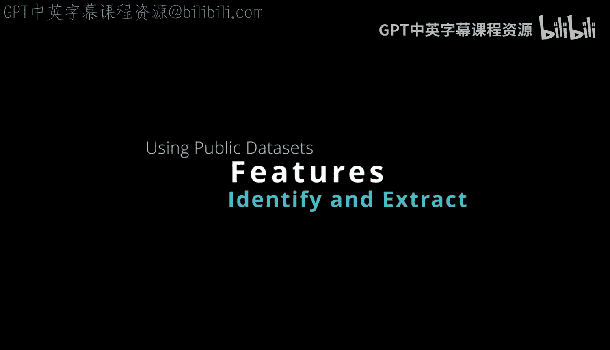
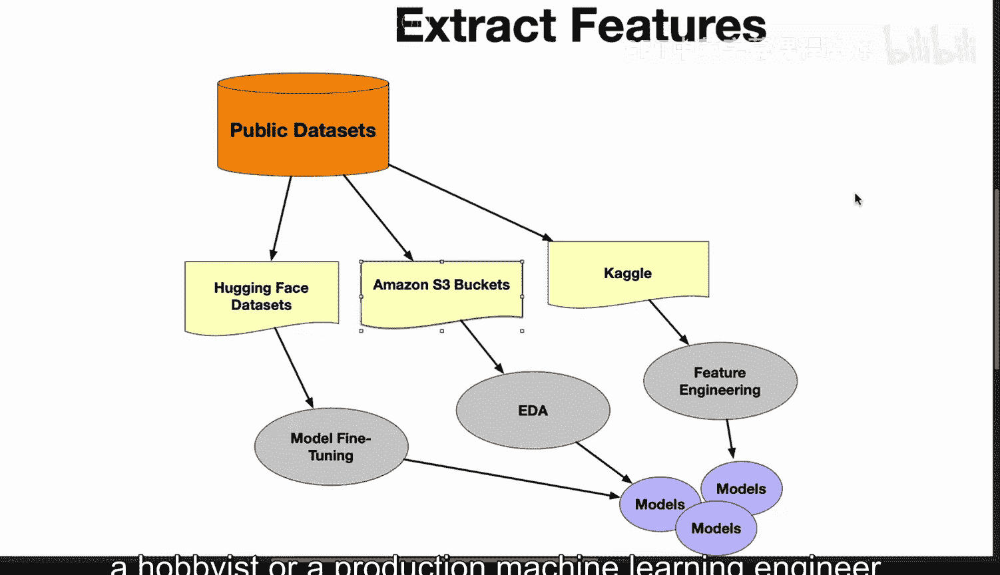

# Rust编程2-3（数据工程、DevOps）：86_04_07_数据科学公共数据集使用 📊

在本节课中，我们将学习如何利用公共数据集来构建机器学习系统。公共数据集是数据科学和机器学习项目的重要起点，它们提供了经过整理和标注的数据，使我们能够快速进行模型训练和实验。

---

构建机器学习系统的一个非常常见的方法是使用公共数据集。

我们来讨论几个可用的常见公共数据集。

一个非常流行的公共数据源是 **Hugging Face Datasets**，你可以用它来微调模型。

假设你从Hugging Face获得一个预训练模型，并在一个启用了GPU的环境中（例如GitHub Codespaces或启用了GPU的Amazon SageMaker环境）使用它。

然后，你可以获取Hugging Face的数据，基于可用的新数据进行微调，接着创建一个新模型，并将其部署到生产环境或重新上传回Hugging Face。

---

同样地，**Amazon S3** 也是一个非常常见的场景，它拥有庞大的公共数据集。

你可以将该数据集拉取到，比如说，一个Jupyter Notebook中，对其进行探索性数据分析。

找出你想要构建的目标，然后基于那个S3数据集创建一个模型。

---

另一个常见的公共数据集是 **Kaggle**。

有许多公共数据集的例子，它们还附带了许多特征工程组件，因此你可以在此基础上进行构建。

利用这些特征工程解决方案，然后创建你自己的定制模型。

---

所以有很多这样的例子，以上只是三个有用的公共数据集，你可以利用它们来构建模型，无论是用于生产环境，还是作为爱好者或生产机器学习工程师进行实验，以开发出更进一步的模型。

---

## 总结

本节课中，我们一起学习了在机器学习项目中利用公共数据集的重要性。我们介绍了三个主要的公共数据源：Hugging Face Datasets、Amazon S3和Kaggle，并概述了如何在这些平台上获取数据、进行探索性分析、微调模型以及进行特征工程。掌握这些资源的使用，是高效开展数据科学和机器学习工作的关键一步。