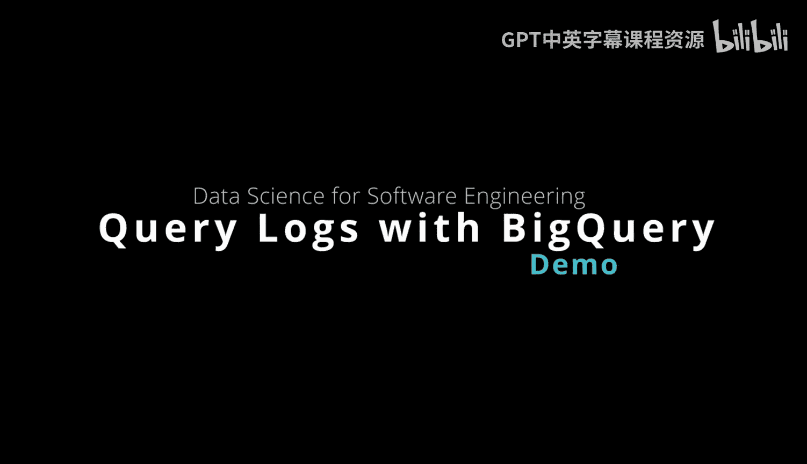
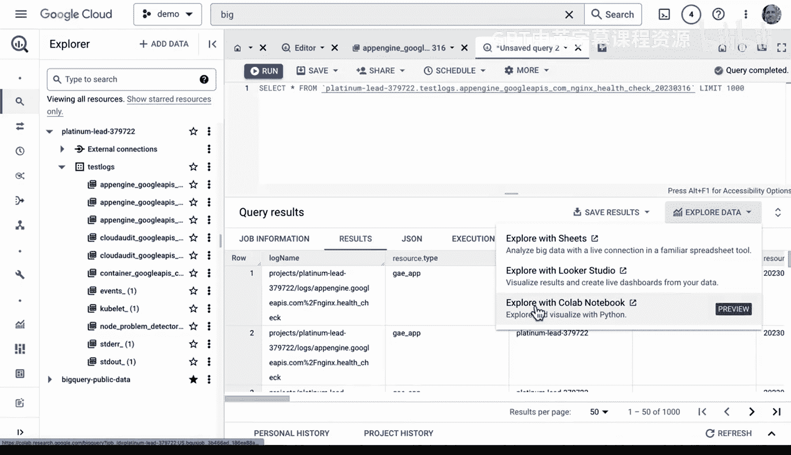
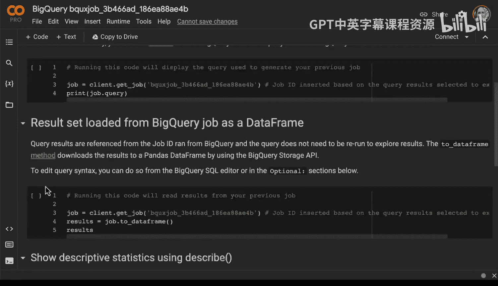
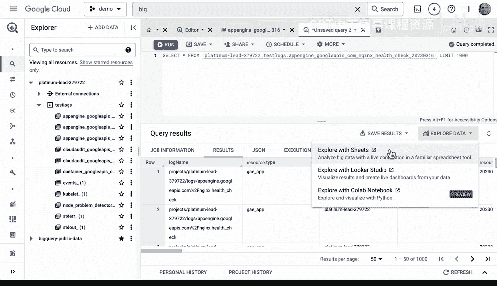
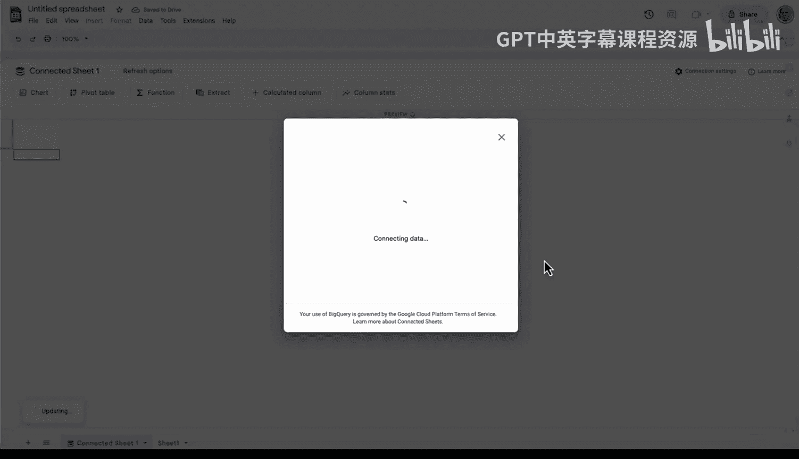
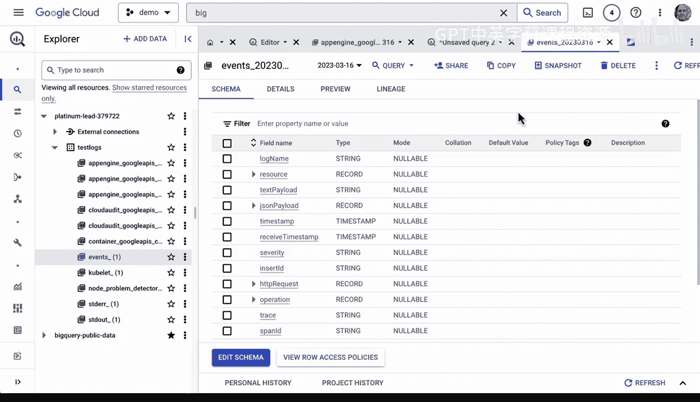

# 杜克大学《Rust编程2-3（数据工程、DevOps）｜Rust programming》中英字幕 p87 87_04_08_BigQuery查询日志文件.zh_en -BV11y411z7Dn_p87-

Let's dive into how to use Big query with logs。 This is really a killer feature of the Google Cloud platform here。

 You can see you can do queries here。 obviously and dive into different things。 for example。

 if I want to look at the Kubernetes container I could click on it， do some queries etc。

 but there's actually an even slicker way to do this， which is if we go over to log router。

 and I go ahead and I create a sync here， this sync could actually have as a destination， Bigquery。

 So I've already set that up you can see here it's right here。

 this big bigque data So all I need to do is actually go over to Big query itself and try it out。

 So let's go ahead and go to Bigque here we go。 and what happens with Bigque is that you can see my project is now included as a data and if we go into test logs we can actually look at all the different logs that have been sent inside of here。

If I wanted to dive into app Engine right here and actually do some kind of a query。

 I could just say query in new tab， go ahead and populate this particular query。

 say I want to look at the health check。And I want to see what's actually the results A。

 so we see these health check results， we see all this information here。

 so a lot of very rich information that I can actually query directly in SQL from BigQu obviously I could even schedule this and do something with a schedule which is actually pretty cool because you can actually do maybe monitoring based on that type of action Now the other one that I really like that's part of BigQu is you can actually do more of like a data science style so I could actually go into Look or studio right here and dive into Look or studio and actually start playing around with some kind of a query and take a look at what's happening inside of here。

 drag things inside for example， HtP status you know go ahead and drag this over here go ahead and see what kind of results I've got and you know build build charts and do all kinds of cool things inside of here。

Right， which which is obviously very useful。 The other thing I can do that's a little less complex is I also could go inside of here。

And click explore the data and actually get into a coab notebook which is pretty neat。

 let's go ahead and try that。 You can see here I could run this query。

 get the results and do some kind of descriptive statistics or even simpler potentially would be just Google sheetets go right inside of Google sheetets and then start putting things together So for example you can see here all kinds of really cool information and I could go into chart and go ahead and say new sheet for a chart here and then go ahead and look at let's say the log name if we go in and we say log name filter we can actually add log name as a access。

 we can also do timestamp as the series and actually go through here and build out some kind of a query So there's many different ways that you can interact with this data once you've got it into Big query and it is actually a very straightforward process to play around with the data。

Obviously you can look at other things as well， other events and do a query。

 so it's a very useful process， especially for companies that have experience with data science。

 you'll feel right at home using the BigQury API。

